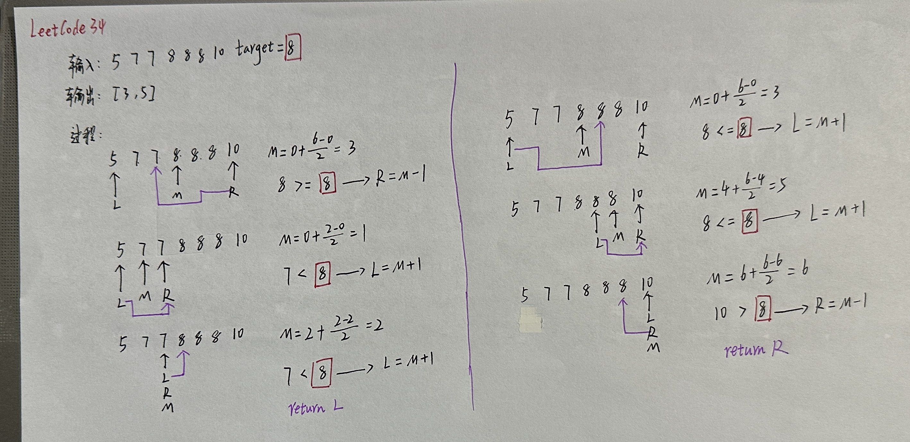
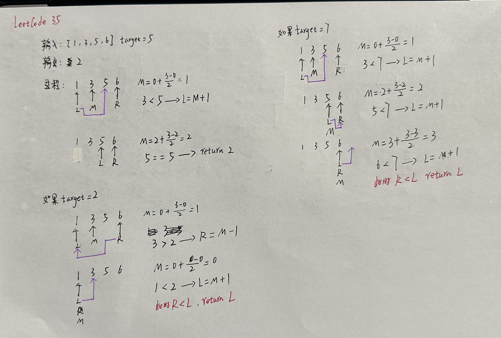
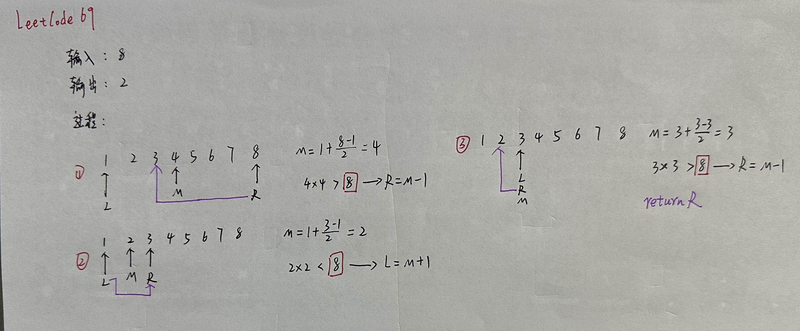
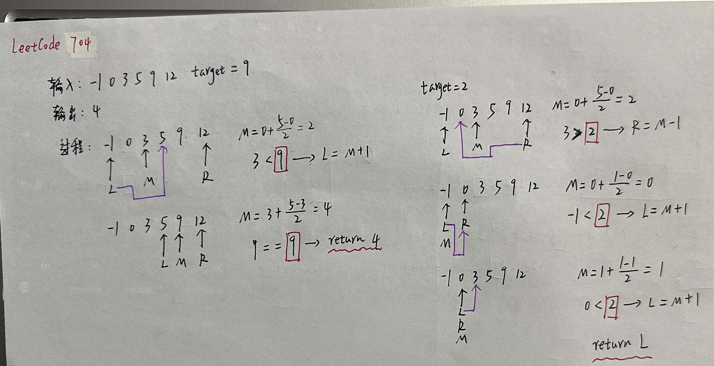

# 数组

## 二分查找

### 34

 

[LeetCode34.cpp](https://github.com/niu0217/Documents/blob/main/Algorithm/Array/LeetCode34.cpp)

### 35

 

[LeetCode35.cpp](https://github.com/niu0217/Documents/blob/main/Algorithm/Array/LeetCode35.cpp)

### 69

 

[LeetCode69.cpp](https://github.com/niu0217/Documents/blob/main/Algorithm/Array/LeetCode69.cpp)

### 367

[LeetCode367.cpp](https://github.com/niu0217/Documents/blob/main/Algorithm/Array/LeetCode367.cpp)

### 704

  

[LeetCode704.cpp](https://github.com/niu0217/Documents/blob/main/Algorithm/Array/LeetCode704.cpp)

## 移除元素

### 26

[LeetCode26.cpp](https://github.com/niu0217/Documents/blob/main/Algorithm/Array/LeetCode26.cpp)

### 27

[LeetCode27.cpp](https://github.com/niu0217/Documents/blob/main/Algorithm/Array/LeetCode27.cpp)

### 283

[LeetCode283.cpp](https://github.com/niu0217/Documents/blob/main/Algorithm/Array/LeetCode283.cpp)

### 844

[LeetCode844.cpp](https://github.com/niu0217/Documents/blob/main/Algorithm/Array/LeetCode844.cpp)

### 977

[LeetCode977.cpp](https://github.com/niu0217/Documents/blob/main/Algorithm/Array/LeetCode977.cpp)

## 长度最小的子数组

### 76

[LeetCode76.cpp](https://github.com/niu0217/Documents/blob/main/Algorithm/Array/LeetCode76.cpp)

### 209

[LeetCode209.cpp](https://github.com/niu0217/Documents/blob/main/Algorithm/Array/LeetCode209.cpp)

### 904

[LeetCode904.cpp](https://github.com/niu0217/Documents/blob/main/Algorithm/Array/LeetCode904.cpp)

## 螺旋矩阵

### 54

[LeetCode54.cpp](https://github.com/niu0217/Documents/blob/main/Algorithm/Array/LeetCode54.cpp)

### 59

[LeetCode59.cpp](https://github.com/niu0217/Documents/blob/main/Algorithm/Array/LeetCode59.cpp)

