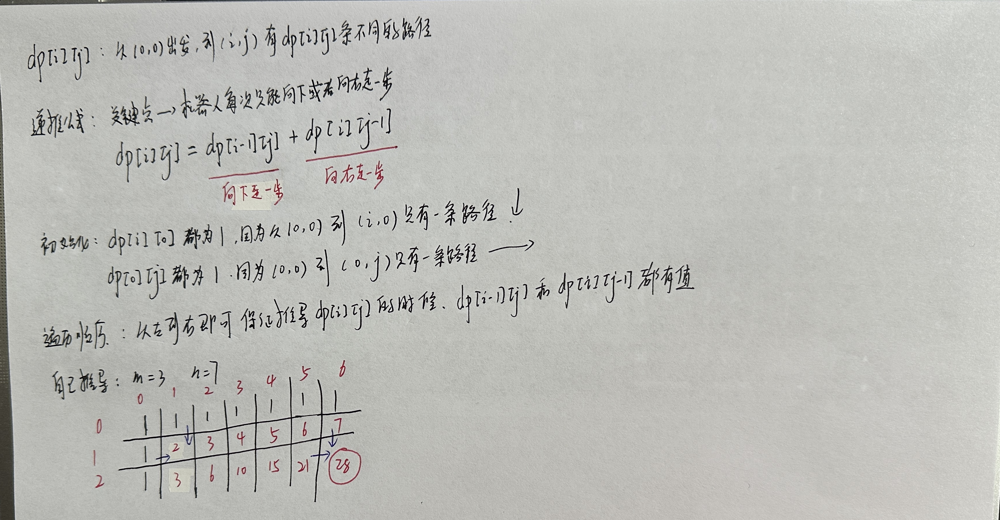
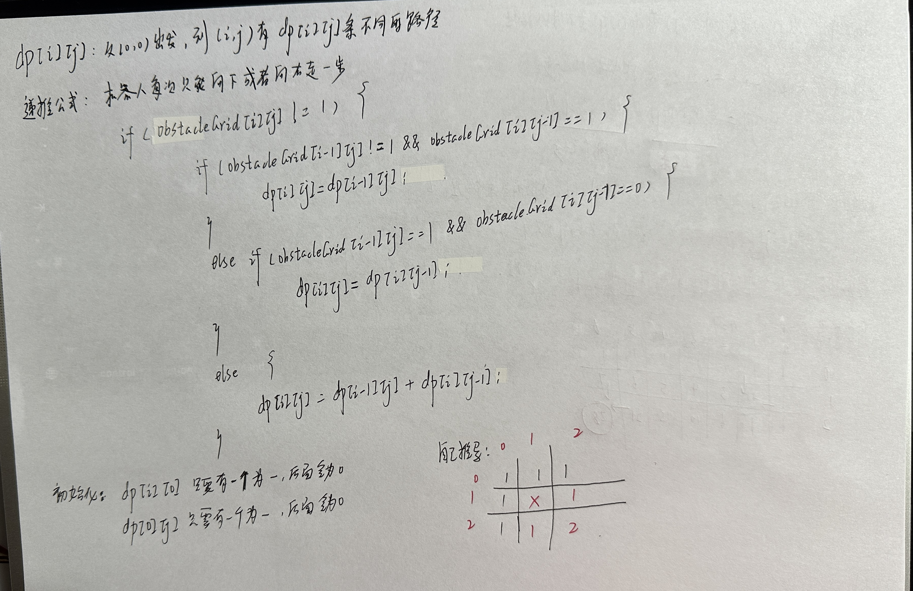
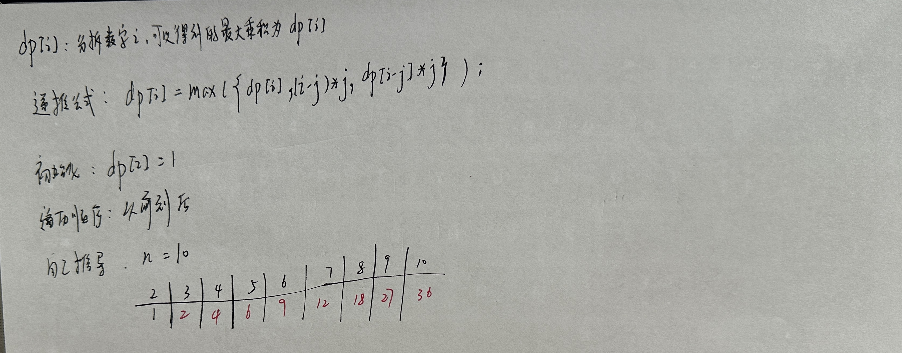
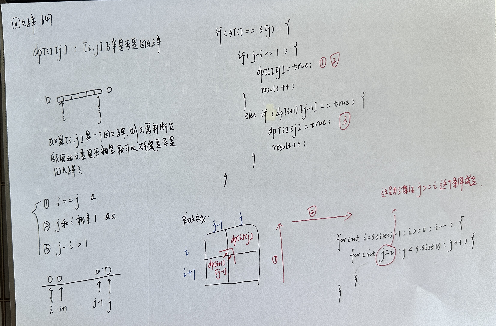
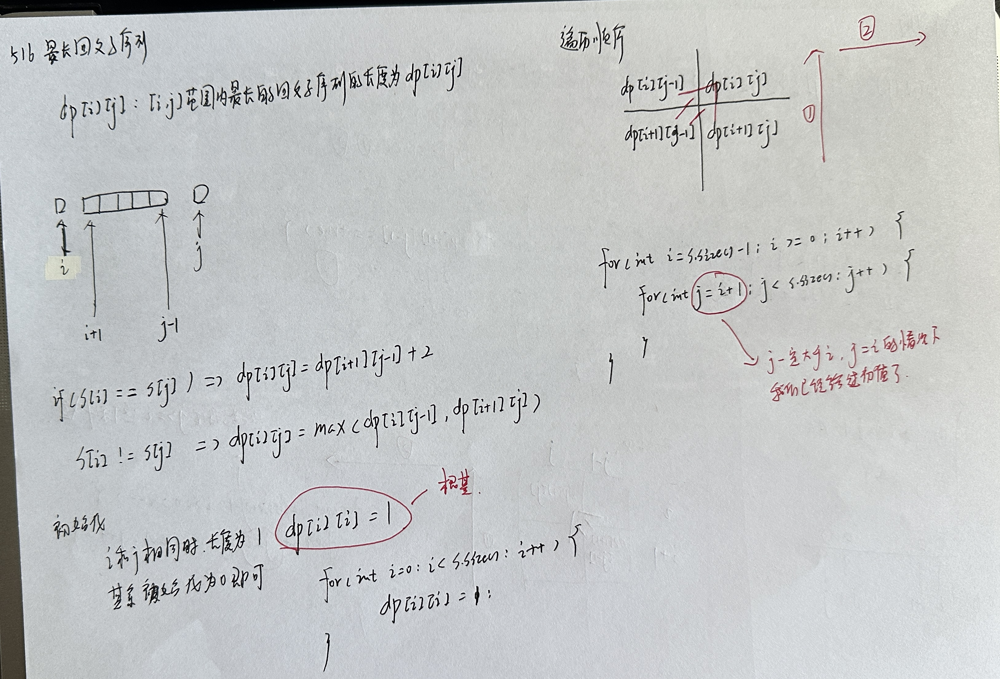
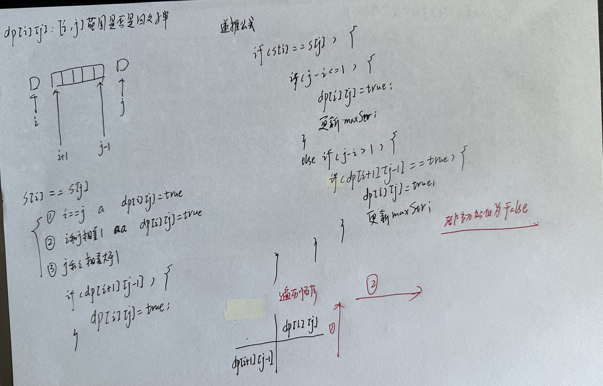

# 动态规划

## 1. 理论

 

## 2. 基础题目

### 509 斐波那契数

[LeetCode509.cpp](https://github.com/niu0217/Documents/blob/main/Algorithm/DynamicProgramming/LeetCode509.cpp)

### 70 爬楼梯

[LeetCode70.cpp](https://github.com/niu0217/Documents/blob/main/Algorithm/DynamicProgramming/LeetCode70.cpp)

### 746 使用最小花费爬楼梯

[LeetCode746.cpp](https://github.com/niu0217/Documents/blob/main/Algorithm/DynamicProgramming/LeetCode746.cpp)

### 62 不同路径

[LeetCode62.cpp](https://github.com/niu0217/Documents/blob/main/Algorithm/DynamicProgramming/LeetCode62.cpp)

 

### 63 不同路径II

[LeetCode63.cpp](https://github.com/niu0217/Documents/blob/main/Algorithm/DynamicProgramming/LeetCode63.cpp)

 

### 343 整数拆分

[LeetCode343.cpp](https://github.com/niu0217/Documents/blob/main/Algorithm/DynamicProgramming/LeetCode343.cpp)

 

### 96 不同的二叉搜索树

## [3. 背包问题]([背包问题.md](https://github.com/niu0217/Documents/blob/main/Algorithm/DynamicProgramming/背包问题.md))

## 6. 打家劫舍

### 198 打家劫舍

### 213 打家劫舍II

### 337 打家劫舍III

## 7. 股票问题

### 121 买卖股票的最佳时机

### 122 买卖股票的最佳时机II

### 123 买卖股票的最佳时机III

### 188 买卖股票的最佳时机IV

### 309 最佳买卖股票时机含冷冻期

### 714 买卖股票的最佳时机含手续费

## 8. 子序列问题

### 8.1 子序列不连续

#### 300 最长上升子序列

#### 1143 最长公共子序列

#### 1035 不相交的线

### 8.2 子序列连续

#### 674 最长连续递增序列

#### 718 最长重复子数组

#### 53 最长子序和

### 8.3 编辑距离

#### 392 判断子序列

#### 115 不同的子序列

#### 583 两个字符串的删除操作

#### 72 编辑距离

### 8.4 回文

#### 674 回文子串

[LeetCode647.cpp](https://github.com/niu0217/Documents/blob/main/Algorithm/DynamicProgramming/LeetCode647.cpp)

 

#### 516 最长回文子序列

[LeetCode516.cpp](https://github.com/niu0217/Documents/blob/main/Algorithm/DynamicProgramming/LeetCode516.cpp)

 

#### 5 最长回文子串

[LeetCode5.cpp](https://github.com/niu0217/Documents/blob/main/Algorithm/DynamicProgramming/LeetCode5.cpp)

 
