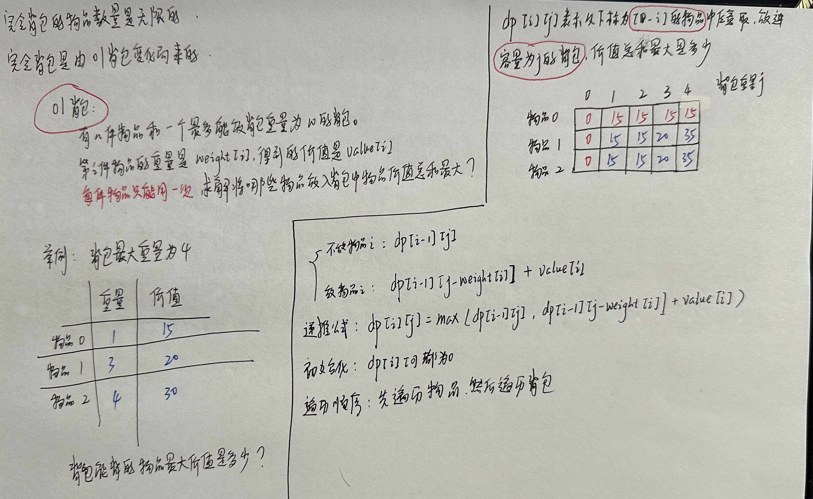
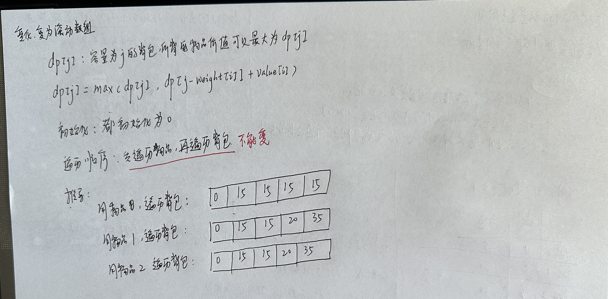
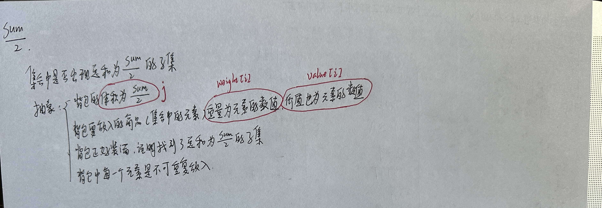
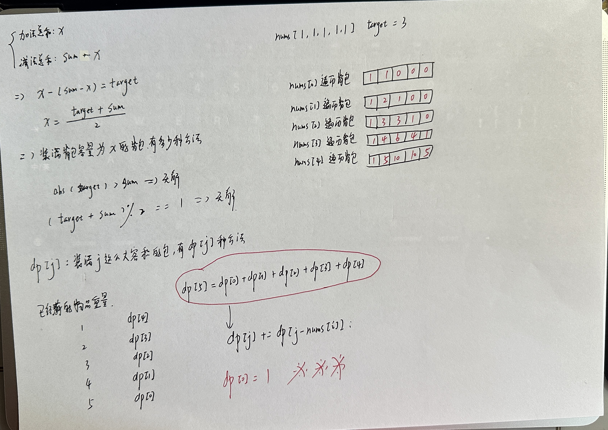

# 动态规划

## 1. 理论

 

## 2. 基础题目

### 509 斐波那契数

[LeetCode509.cpp](https://github.com/niu0217/Documents/blob/main/Algorithm/DynamicProgramming/LeetCode509.cpp)

### 70 爬楼梯

[LeetCode70.cpp](https://github.com/niu0217/Documents/blob/main/Algorithm/DynamicProgramming/LeetCode70.cpp)

### 746 使用最小花费爬楼梯

[LeetCode746.cpp](https://github.com/niu0217/Documents/blob/main/Algorithm/DynamicProgramming/LeetCode746.cpp)

### 62 不同路径

[LeetCode62.cpp](https://github.com/niu0217/Documents/blob/main/Algorithm/DynamicProgramming/LeetCode62.cpp)

 

### 63 不同路径II

[LeetCode63.cpp](https://github.com/niu0217/Documents/blob/main/Algorithm/DynamicProgramming/LeetCode63.cpp)

 

### 343 整数拆分

[LeetCode343.cpp](https://github.com/niu0217/Documents/blob/main/Algorithm/DynamicProgramming/LeetCode343.cpp)

 

### 96 不同的二叉搜索树

## 3. 01背包

### 理论

#### 二维数组实现

 

```c++
#include <bits/stdc++.h>
using namespace std;

int n, bagweight;// bagweight代表行李箱空间
void solve() {
    vector<int> weight(n, 0); // 存储每件物品所占空间
    vector<int> value(n, 0);  // 存储每件物品价值
    for(int i = 0; i < n; ++i) {
        cin >> weight[i];
    }
    for(int j = 0; j < n; ++j) {
        cin >> value[j];
    }
    // dp数组, dp[i][j]代表行李箱空间为j的情况下,从下标为[0, i]的物品里面任意取,能达到的最大价值
    vector<vector<int>> dp(weight.size(), vector<int>(bagweight + 1, 0));

    // 初始化, 因为需要用到dp[i - 1]的值
    // j < weight[0]已在上方被初始化为0
    // j >= weight[0]的值就初始化为value[0]
    for (int j = weight[0]; j <= bagweight; j++) {
        dp[0][j] = value[0];
    }

    for(int i = 1; i < weight.size(); i++) { // 遍历科研物品
        for(int j = 0; j <= bagweight; j++) { // 遍历行李箱容量
            // 如果装不下这个物品,那么就继承dp[i - 1][j]的值
            if (j < weight[i]) dp[i][j] = dp[i - 1][j];
            // 如果能装下,就将值更新为 不装这个物品的最大值 和 装这个物品的最大值 中的 最大值
            // 装这个物品的最大值由容量为j - weight[i]的包任意放入序号为[0, i - 1]的最大值 + 该物品的价值构成
            else dp[i][j] = max(dp[i - 1][j], dp[i - 1][j - weight[i]] + value[i]);
        }
    }
    cout << dp[weight.size() - 1][bagweight] << endl;
}

int main() {
    while(cin >> n >> bagweight) {
        solve();
    }
    return 0;
}
```

#### 一维数组实现

 

```c++
void test_1_wei_bag_problem() {
    vector<int> weight = {1, 3, 4};
    vector<int> value = {15, 20, 30};
    int bagWeight = 4;

    // 初始化
    vector<int> dp(bagWeight + 1, 0);
    for(int i = 0; i < weight.size(); i++) { // 遍历物品
        for(int j = bagWeight; j >= weight[i]; j--) { // 遍历背包容量
            dp[j] = max(dp[j], dp[j - weight[i]] + value[i]);
        }
    }
    cout << dp[bagWeight] << endl;
}

int main() {
    test_1_wei_bag_problem();
}
```

### 416 分割等和子集

[LeetCode416.cpp](https://github.com/niu0217/Documents/blob/main/Algorithm/DynamicProgramming/LeetCode416.cpp)

 

### 1049 最后一块石头的重量II

[LeetCode1049.cpp](https://github.com/niu0217/Documents/blob/main/Algorithm/DynamicProgramming/LeetCode1049.cpp)

### 494 目标和

[LeetCode494.cpp](https://github.com/niu0217/Documents/blob/main/Algorithm/DynamicProgramming/LeetCode494.cpp)

 

### 474 一和零

## 4. 完全背包

### 518 零钱兑换II

### 377 组合总和IV

### 70 爬楼梯

### 322 零钱兑换

### 279 完全平方数

### 179 单词拆分

## 5. 多重背包

## 6. 打家劫舍

### 198 打家劫舍

### 213 打家劫舍II

### 337 打家劫舍III

## 7. 股票问题

### 121 买卖股票的最佳时机

### 122 买卖股票的最佳时机II

### 123 买卖股票的最佳时机III

### 188 买卖股票的最佳时机IV

### 309 最佳买卖股票时机含冷冻期

### 714 买卖股票的最佳时机含手续费

## 8. 子序列问题

### 8.1 子序列不连续

#### 300 最长上升子序列

#### 1143 最长公共子序列

#### 1035 不相交的线

### 8.2 子序列连续

#### 674 最长连续递增序列

#### 718 最长重复子数组

#### 53 最长子序和

### 8.3 编辑距离

#### 392 判断子序列

#### 115 不同的子序列

#### 583 两个字符串的删除操作

#### 72 编辑距离

### 8.4 回文

#### 674 回文子串

[LeetCode647.cpp](https://github.com/niu0217/Documents/blob/main/Algorithm/DynamicProgramming/LeetCode647.cpp)

 

#### 516 最长回文子序列

[LeetCode516.cpp](https://github.com/niu0217/Documents/blob/main/Algorithm/DynamicProgramming/LeetCode516.cpp)

 

#### 5 最长回文子串

[LeetCode5.cpp](https://github.com/niu0217/Documents/blob/main/Algorithm/DynamicProgramming/LeetCode5.cpp)

 
