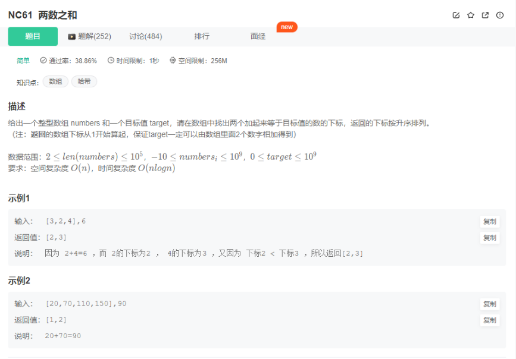

# 基础题目

## 1. 入门级别

### 1.1 输入处理 HJ5.进制转换

[题目链接](https://www.nowcoder.com/practice/8f3df50d2b9043208c5eed283d1d4da6?tpId=37&tqId=21228&rp=1&ru=/ta/huawei&qru=/ta/huawei/question-ranking&tab=answerKey)

题目描述：

```
写出一个程序，接受一个十六进制的数，输出该数值的十进制表示。

数据范围：保证结果在1 <= n <= 2^31 - 1

输入描述：
输入一个十六进制的数值字符串。

输出描述：
输出该数值的十进制字符串。不同组的测试用例用\n隔开。
```

示例1：

```
输入:0xAA
输出:170
```

代码：

```c++
/* ************************************************************************
> File Name:     1_1.cpp
> Author:        niu0217
> Created Time:  Thu 14 Mar 2024 03:26:12 PM CST
> Description:   HJ5 进制转换
 ************************************************************************/

#include <iostream>
using namespace std;

int main()
{
    string s;
    while(cin>>s) {
        int result = 0;
        int factor = 1;
        for(int i = s.size() - 1; i > 1; i--) {
            if(s[i] >= '0' && s[i] <= '9') {
                result += factor * (s[i] - '0');
            }
            else {
                result += factor * (s[i] - 'A' + 10);
            }
            factor *= 16;
        }
        cout<<result<<endl;
    }
}
```

### 1.2 排列组合（牛客搜索）NC61.两数之和

 

代码：

```c++
/* ************************************************************************
> File Name:     1_2.cpp
> Author:        niu0217
> Created Time:  Thu 14 Mar 2024 03:47:33 PM CST
> Description:   两数之和
 ************************************************************************/

#include<iostream>
#include<vector>
#include<unordered_map>

using namespace std;

vector<int> twoSum(vector<int>& nums, int target) {
    //key:   元素
    //value: 该元素的下标
    unordered_map<int, int> umap;
    for(int i = 0; i < nums.size(); i++) {
        auto iter = umap.find(target - nums[i]);
        if(iter != umap.end()) {
            return {iter->second, i + 1};
        }
        umap[nums[i]] = i + 1;
    }
}

int main()
{
    vector<int> nums = {
        3, 2, 4
    };
    int target = 6;
    vector<int> result = twoSum(nums, target);
    for(int num : result) {
        cout<<num<<" ";
    }
    cout<<endl;
}
```

### 1.3 递归：NC68.跳台阶

[题目链接](https://www.nowcoder.com/practice/8c82a5b80378478f9484d87d1c5f12a4?tpId=13&tqId=11161&ru=/exam/oj)

代码：

```c++
class Solution {
public:
    /**
     * 代码中的类名、方法名、参数名已经指定，请勿修改，直接返回方法规定的值即可
     *
     * 
     * @param number int整型 
     * @return int整型
     */
    int jumpFloor(int n) {
        if(n == 1) {
            return 1;
        }
        vector<int> dp(n + 1, 0);
        dp[0] = 1;
        dp[1] = 1;
        for(int i = 2; i <= n; i++) {
            dp[i] = dp[i - 1] + dp[i - 2];
        }
        return dp[n];
    }
};
```

### 1.4 快速排序 HJ3.明明的随机数

### 1.5 哈希表 HJ10.字符个数统计

## 2. 字符串操作

### 2.1 HJ17.坐标移动

### 2.2 HJ106.字符串逆序

### 2.3 HJ33.整数与IP地址间的转换

## 3. 排序

### 3.1 HJ8.合并表记录

### 3.2 HJ14.字符串排序

## 4. 栈

### 4.1 Leetcode1614：括号的最大嵌套深度

## 5. 排列组合

### 5.1 NC17：最长回文子串

## 6. 深度/广度搜索

### 6.1 HJ41：称砝码