# C++链接

## 1. 问题

### 1.1 static问题

```c++
#include<iostream>
using namespace std;

int f() {
    static int x = 0;
    return x;
}

int g() {
    static int x = 1;
    return x;
}

int main()
{
    int f_x_static = f();
    int g_x_static = g();
    return 0;
}
```

在函数f和g中，变量x都是静态局部变量（static local variable），但是它们是两个不同的变量，具有以下不同之处：

1. **作用域（Scope）**：
   - 变量x在各自的函数f和g中具有局部作用域，这意味着它们只能在各自的函数内部被访问。
2. **生命周期（Lifetime）**：
   - 静态局部变量在第一次调用其所在函数时被初始化，并且在其生命周期内一直存在，直到程序结束。因此，对于函数f中的x和函数g中的x，它们的生命周期是独立的，分别与函数f和g的生命周期相关联。
3. **存储位置（Storage）**：
   - 虽然x是在函数内部定义的，但由于它是静态的，所以它不会存储在函数调用栈上，而是存储在程序的数据区域（data segment）中。
4. **初始化和值（Initialization and Value）**：
   - 函数f中的x被初始化为0，而函数g中的x被初始化为1。这两个变量的初始值是不同的。
5. **独立的状态（Independent State）**：
   - 每次调用函数f时，都会返回并可能修改同一个x的值（初始化为0）。
   - 同样，每次调用函数g时，都会返回并可能修改同一个x的值（初始化为1）。

因为函数f和g中的x是两个不同的静态局部变量，它们各自保持独立的状态和值，即使它们具有相同的名称。这意味着调用f()和g()将分别返回和可能修改各自独立的x变量的值。

### 1.2 为什么一个共享库的.text节能被许多进程访问？

在内存中，一个共享库（shared library）的.text节（代码段）能够被多个进程访问的原理基于操作系统的内存管理和进程间共享机制。以下是一个详细的解释：

1. **虚拟内存**： 现代操作系统使用虚拟内存系统，每个进程都有自己的独立地址空间。这个地址空间是由操作系统管理的，并且通过硬件（如MMU，内存管理单元）映射到物理内存。
2. **加载共享库**： 当一个进程需要使用共享库时，操作系统并不会为每个进程单独加载一份库的副本到物理内存。相反，它会创建一个库的单一实例，并将其加载到物理内存的一个区域。
3. **页表映射**： 操作系统维护一个页表（page table）来管理虚拟地址到物理地址的映射。当进程试图访问其地址空间中的某个部分（如共享库的.text节）时，硬件会通过查询页表将虚拟地址转换为物理地址。
4. **内存映射**： 对于共享库，操作系统会将同一份物理内存区域映射到多个进程的虚拟地址空间中。这意味着虽然每个进程看到的是自己的虚拟地址，但这些虚拟地址实际上指向的是同一个物理内存区域。
5. **只读权限**： 通常，.text节是只读的，因为它包含程序的机器指令。操作系统确保所有映射到该区域的虚拟地址都具有只读权限，以防止进程意外修改共享的代码。
6. **写时复制（Copy-on-Write，COW）**： 如果一个进程尝试修改只读的共享库代码段，操作系统会检测到这一情况并采取写时复制策略。这意味着操作系统会创建该内存区域的一个副本，并将尝试写入的进程的虚拟地址重新映射到这个新创建的副本上。这样，其他仍然使用原始代码段的进程就不会受到影响。

通过这种方式，操作系统能够在多个进程中高效地共享和管理共享库的.text节，既节省了物理内存资源，又保证了数据的一致性和安全性。同时，通过虚拟内存和页表映射机制，每个进程都能看到自己独立的地址空间，从而实现了进程隔离。

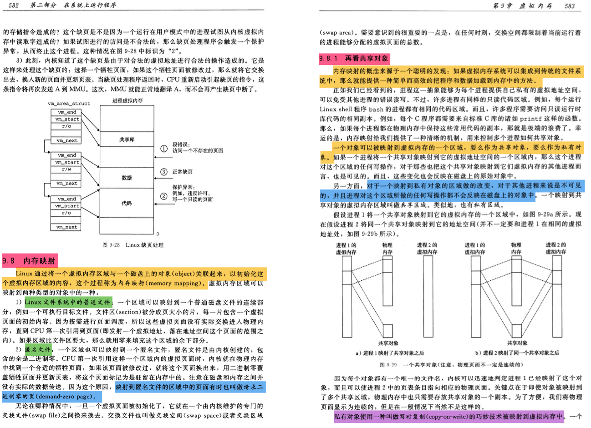 

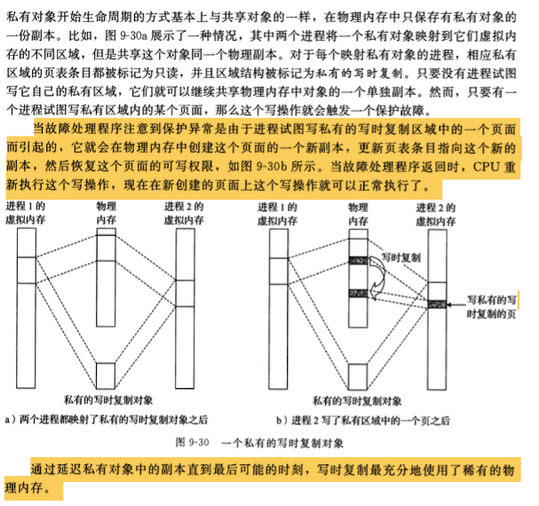 

### 1.3 写时复制会改变磁盘上的文件吗？

写时复制（Copy-on-Write，COW）机制主要应用于内存管理和某些文件系统中，其目标是在修改数据时尽可能地提高效率和资源利用率。对于磁盘上的文件，写时复制的使用方式和影响取决于具体的实现和技术。

在某些文件系统中，如Linux的AUFS（Another Union File System）或Btrfs等，写时复制技术被用于提供文件的分层和快照功能。在这种情况下，当一个文件或目录被修改时，系统并不会立即在磁盘上创建一个新的副本。相反，它会记录下修改的意图，并继续让所有引用该文件的层级共享相同的磁盘块。

直到有实际的写操作发生时，系统才会执行以下步骤：

1. **挂起写操作**：当一个进程尝试修改文件内容时，系统会暂时挂起写操作。
2. **复制磁盘块**：系统仅复制即将被修改的磁盘块到新的位置，而不是复制整个文件。
3. **更新指针**：系统将修改文件的层级或快照的指针指向新复制的磁盘块，而原始的磁盘块保持不变，供其他未修改的层级或快照继续使用。
4. **完成写操作**：现在可以在新复制的磁盘块上进行写操作，而不会影响到原始数据或其他共享该数据的层级。

通过这种方式，写时复制可以延迟磁盘I/O操作，减少不必要的数据复制，并保持磁盘空间的有效利用。然而，需要注意的是，尽管在修改发生时才进行磁盘块的复制，但最终磁盘上的数据确实会发生改变——新的修改会被写入到新复制的磁盘块中，而原始的数据块则保留了修改前的状态。因此，从这个角度来看，写时复制确实会改变磁盘上的文件，但它是通过一种高效且资源友好的方式进行的。

### 1.4 execve函数的原理是什么？

 

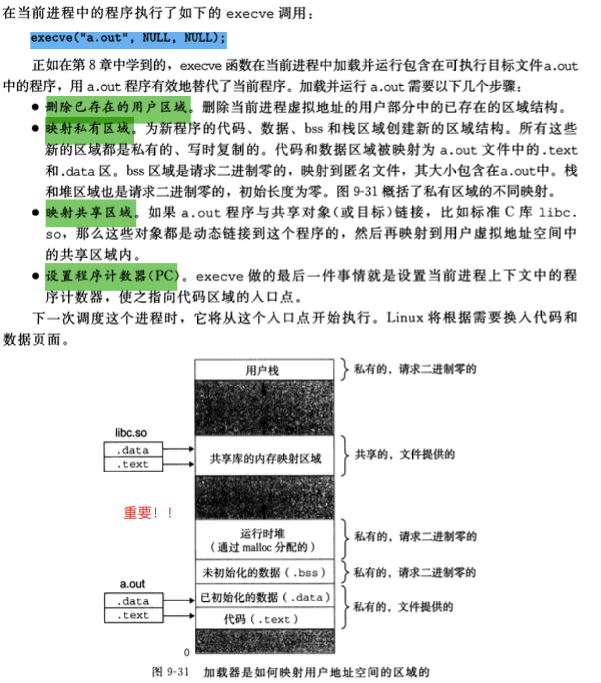 

## 2. 重要概念

### 2.1 库文件

库文件是一种包含预先编译好的程序代码和数据的文件，这些代码和数据可以在多个应用程序中重用。库文件通常包含函数、类、对象、变量等的定义和实现，可以为开发者提供便捷的功能接口，减少重复编写相同或相似功能代码的工作。

根据链接方式和使用方式的不同，库文件主要分为以下几种类型：

1. **静态库（Static Library）**：
   - 静态库文件通常以`.a`（在Unix/Linux系统中）或`.lib`（在Windows系统中）为扩展名。
   - 在链接阶段，静态库中的代码会被复制并整合到最终的可执行文件中。因此，使用静态库生成的可执行文件不依赖于外部库文件就能运行。
2. **动态库（Dynamic Library）**：
   - 动态库文件通常以`.so`（在Unix/Linux系统中，代表Shared Object）或`.dll`（在Windows系统中，代表Dynamic Link Library）为扩展名。
   - 在链接阶段，动态库中的函数和数据的引用会被加入到可执行文件中，但实际的库代码不会被复制。当程序运行时，操作系统会加载所需的动态库文件，并将库中的函数和数据绑定到程序的地址空间。
   - 使用动态库生成的可执行文件依赖于系统中存在的相应库文件，这使得动态库可以被多个程序共享，从而节省内存资源。

库文件的主要目的是提高代码的复用性、模块化和可维护性。通过使用库文件，开发者可以专注于应用程序的核心逻辑，而将一些通用的功能（如字符串操作、数学计算、图形处理等）交给库来实现。此外，库文件还可以帮助保持代码的一致性和可靠性，因为它们通常经过了广泛的测试和优化。

[动态库和静态库.md](https://github.com/niu0217/Documents/blob/main/C%2B%2B/动态库和静态库.md)

### 2.2 目标文件

目标文件的主要特点包括：

- 目标文件不包含完整的可执行程序，而是程序的一部分或模块。
- 目标文件中可能包含未解析的符号引用，这些引用需要在链接阶段由链接器解析。
- 目标文件包含了重定位信息，这些信息描述了如何将目标文件中的地址引用调整为最终可执行文件中的实际地址。
- 目标文件可能还包含了调试信息，如行号、变量名等，这些信息对于调试和符号调试工具非常重要。

在完成所有源代码文件的编译并生成对应的目标文件后，链接器会将这些目标文件以及必要的库文件组合起来，生成最终的可执行文件。在这个过程中，链接器会解决目标文件之间的符号引用，调整地址引用，并确定程序在内存中的布局。

#### 2.2.1 可重定位目标文件

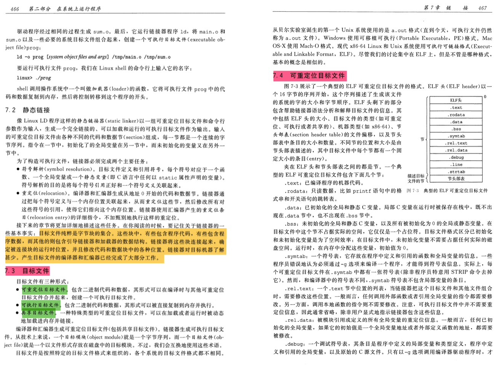 

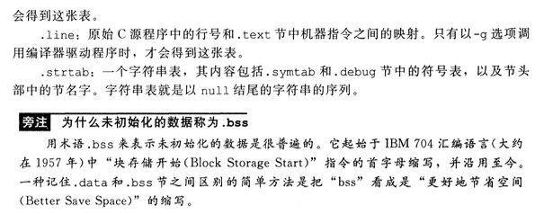 

#### 2.2.2 可执行目标文件

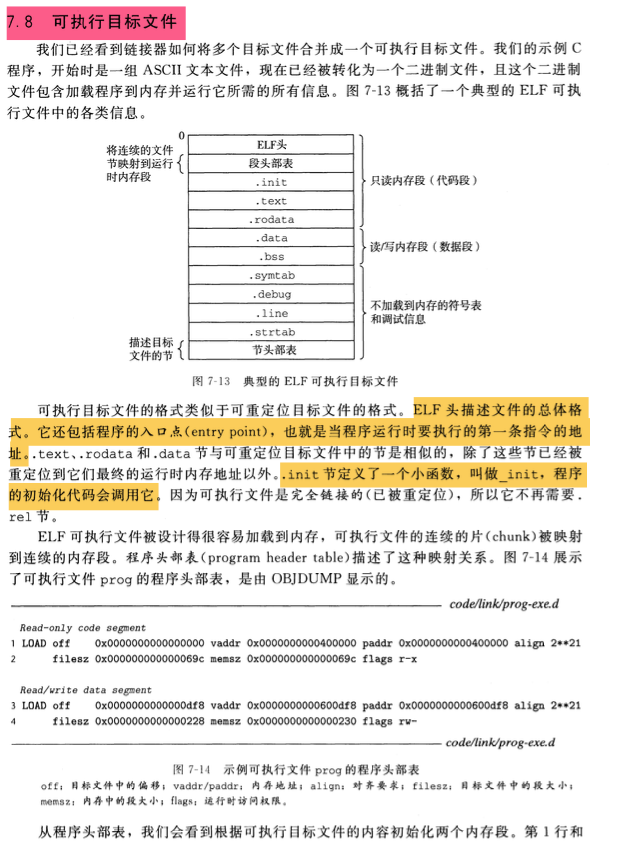 

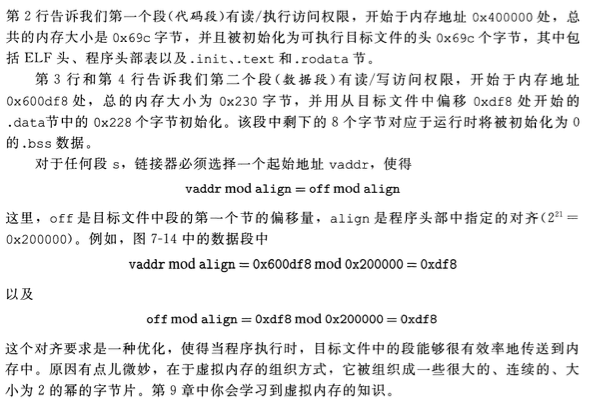 

### 2.3 符号和符号表

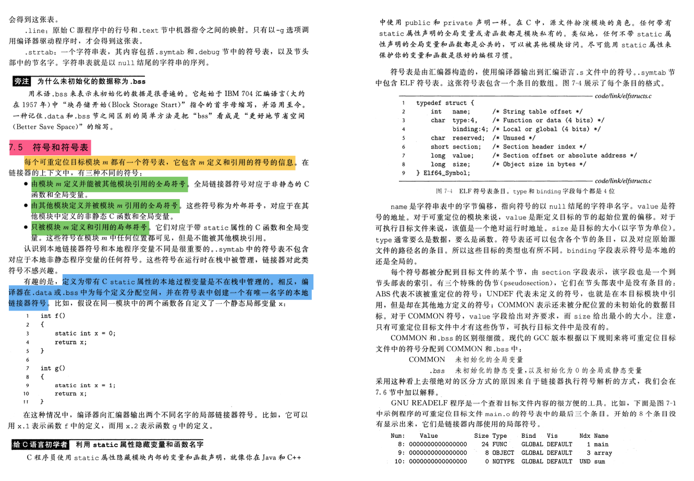 

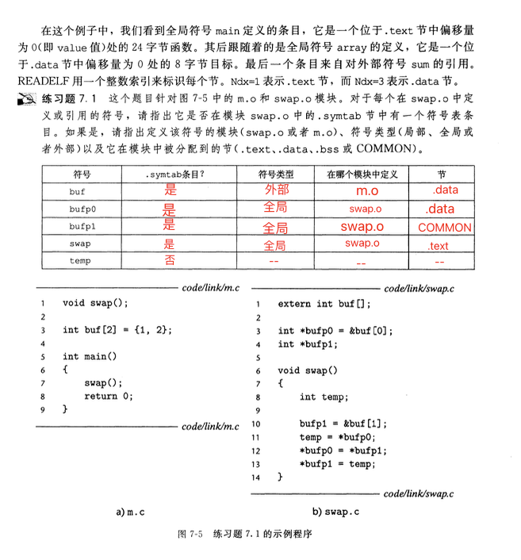 

### 2.4 位置无关代码

[位置无关代码.md](https://github.com/niu0217/Documents/blob/main/C%2B%2B/位置无关代码.md)

### 2.5 库打桩机制

[库打桩机制.md](https://github.com/niu0217/Documents/blob/main/C%2B%2B/库打桩机制.md)

## 3. 简要概述过程

C++链接是将编译生成的目标文件（Object Files）和库文件组合成一个可执行文件或动态链接库的过程。这个过程由链接器（Linker）负责执行，主要包括以下几个步骤：

1. **目标文件收集**：
   - 链接器首先收集所有需要参与链接的目标文件。这些目标文件通常是通过编译源代码文件（`.cpp`）生成的，扩展名为`.o`或`.obj`。
2. **符号解析（Symbol Resolution）**：
   - 在目标文件中，每个函数和全局变量都有一个对应的符号（Symbol）。如果一个函数或全局变量在源代码中被定义，那么它在目标文件中就是一个符号定义；如果它只被引用而没有定义，那么它就是一个符号引用。
   - 链接器需要查找所有未解析的符号引用，并试图在其他目标文件或库文件中找到相应的符号定义。
3. **重定位（Relocation）**：
   - 链接器根据符号定义的位置调整目标代码中的地址引用，确保所有的函数调用和全局变量访问都能正确地指向它们的实际位置。这个过程可能涉及到内存布局的确定和地址计算。
4. **地址空间布局（Address Space Layout）**：
   - 链接器确定程序在内存中的加载位置和布局，包括代码段、数据段、BSS段等。这一步对于程序的运行时性能和安全性都非常重要。
5. **合并目标代码和库代码**：
   - 链接器将所有必要的代码片段（来自目标文件和库文件）组合成一个单一的可执行文件或动态链接库。
6. **静态链接和动态链接**：
   - 静态链接：链接器将所有需要的库代码直接复制到可执行文件中，生成的程序不依赖外部库文件就能运行。这种方式会导致可执行文件较大，但运行时加载速度快，且不需要考虑库的版本问题。
   - 动态链接：链接器只在可执行文件中包含对所需库函数的引用，实际的库代码在程序运行时由操作系统加载。这种方式可以减少可执行文件的大小，但运行时需要依赖系统中存在的相应库文件。
7. **生成最终可执行文件或动态链接库**：
   - 完成上述步骤后，链接器生成最终的可执行文件或动态链接库，这些文件包含了程序的所有机器语言代码和数据，可以在特定平台上运行。

在实际开发中，链接过程通常由集成开发环境（IDE）或构建工具（如Makefile或CMake）自动管理。链接过程中可能出现的错误包括符号未定义、重复定义、地址冲突等问题，需要开发者进行排查和修复。

## 4. 符号解析过程

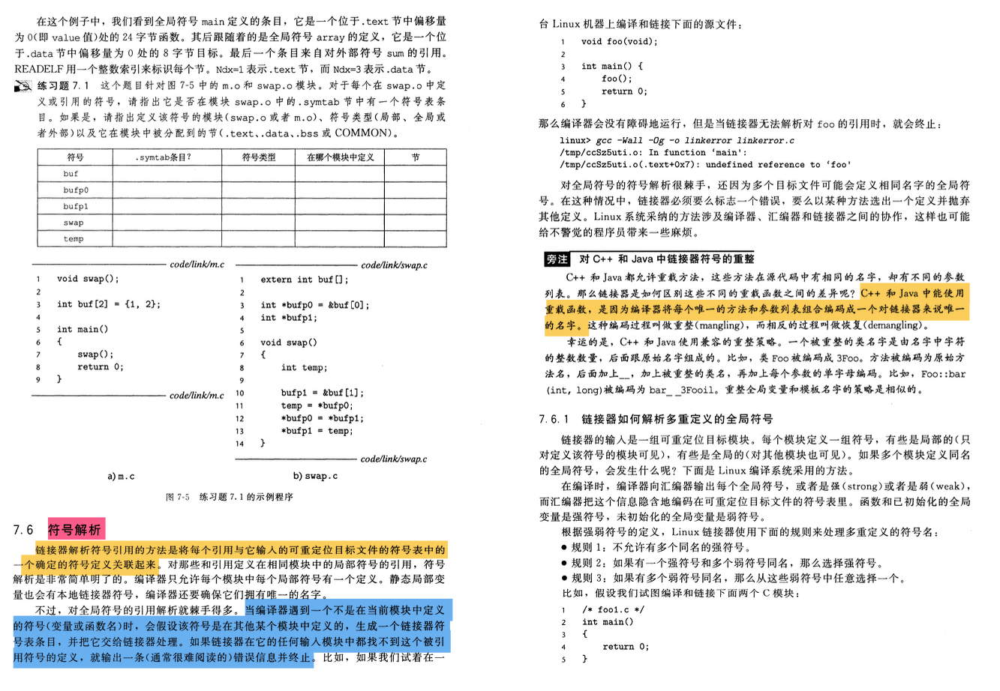 

### 4.1 链接器如何解析多重定义的全局符号

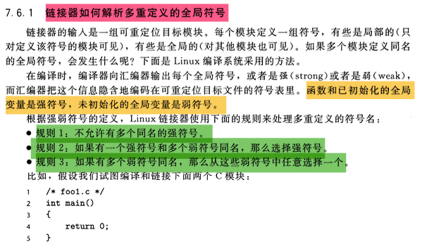 

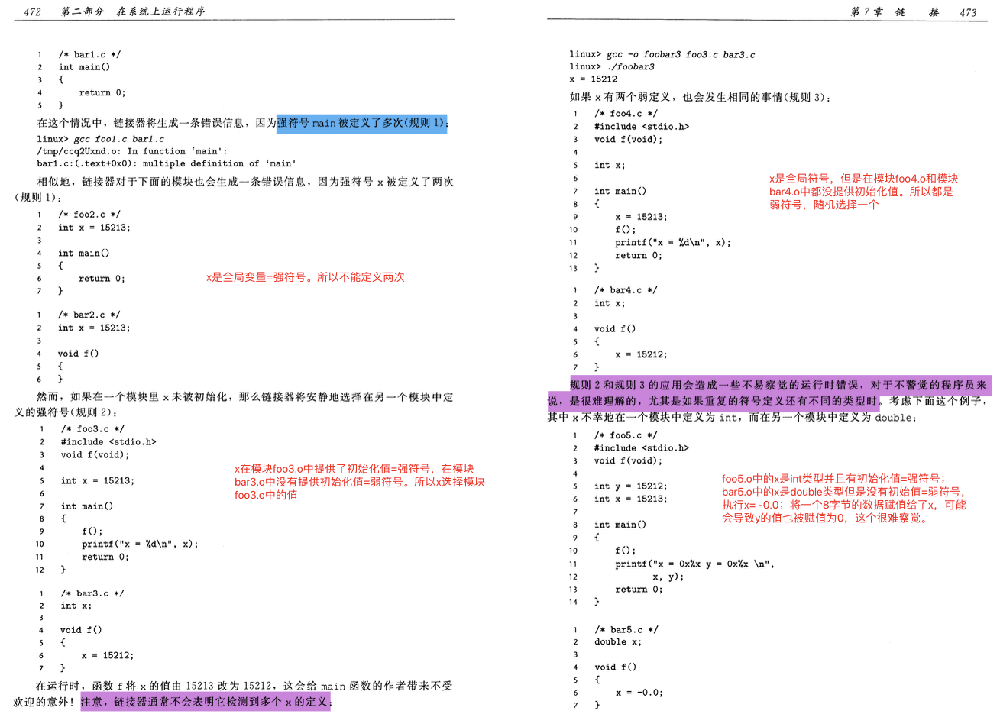 

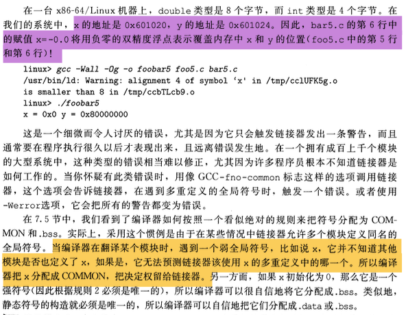 

### 4.2 与静态库链接

 

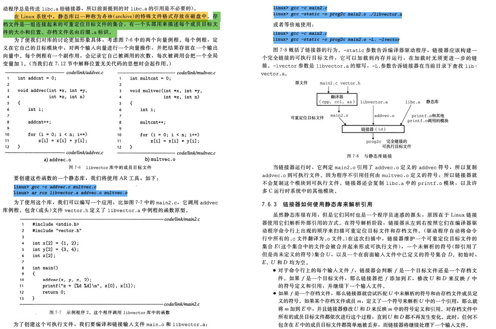 

[动态库和静态库.md](https://github.com/niu0217/Documents/blob/main/C%2B%2B/动态库和静态库.md)

### 4.3 链接器如何使用静态库来解析引用

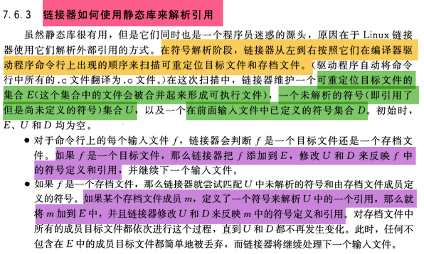 

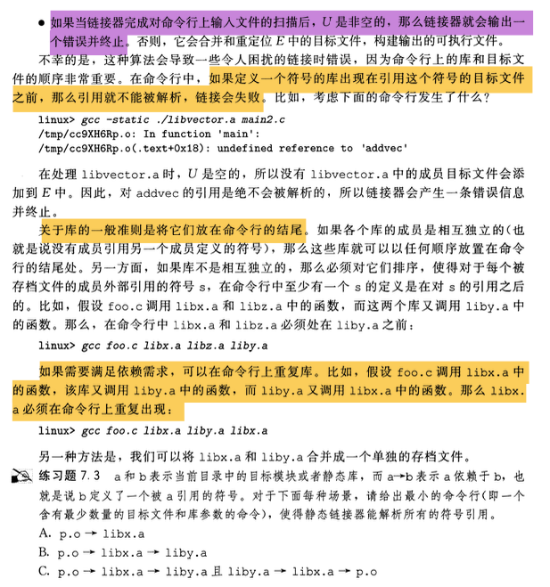 

## 5. 重定位

 

### 5.1 重定位条目

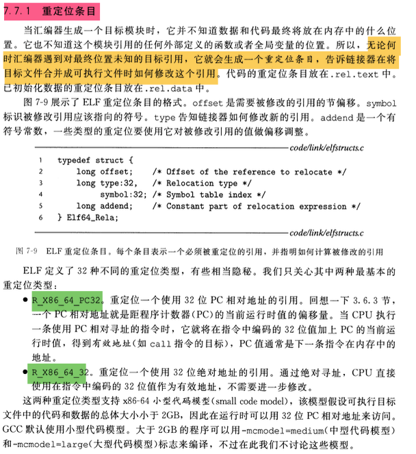 

### 5.2 重定位符号引用

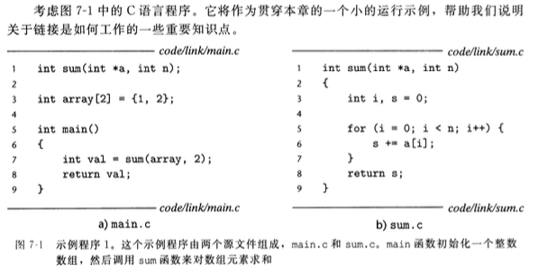 

  

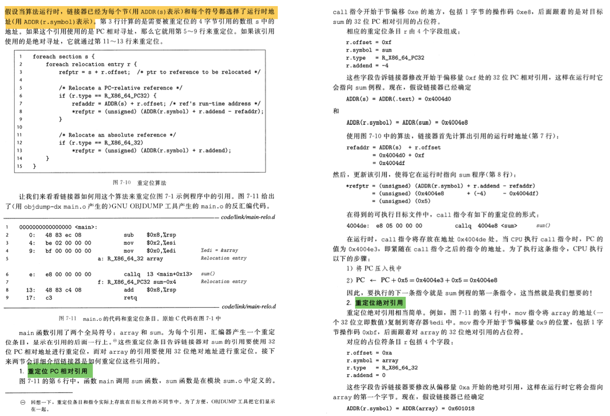 

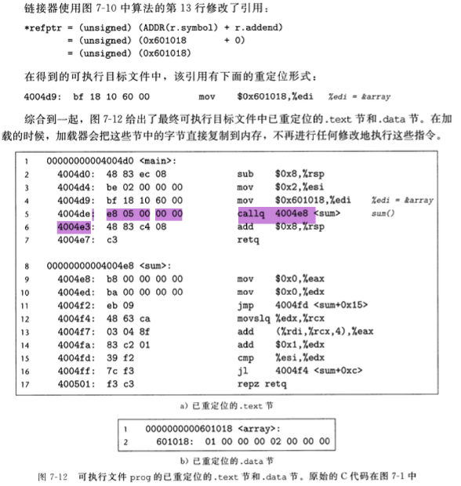 

## 6. 加载可执行目标文件

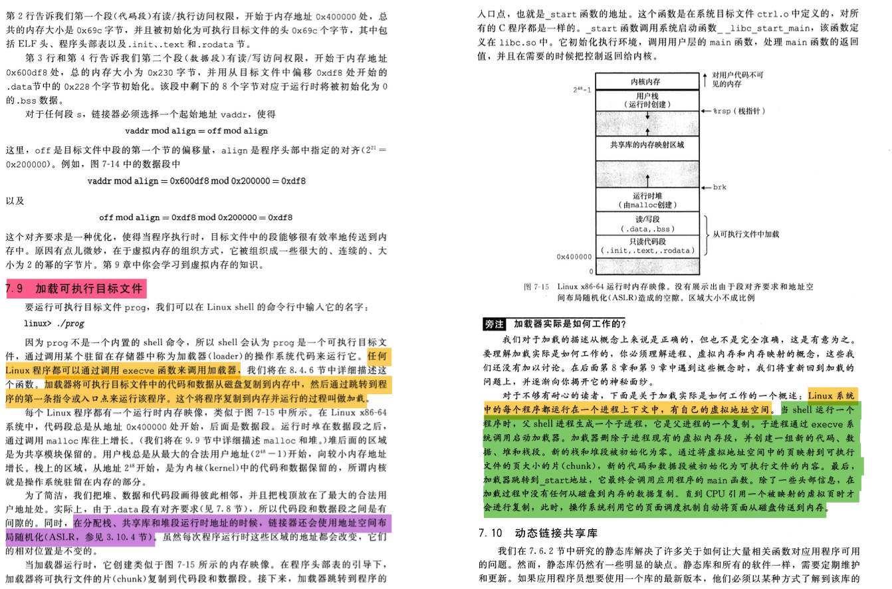 

## 7. 动态链接共享库

 

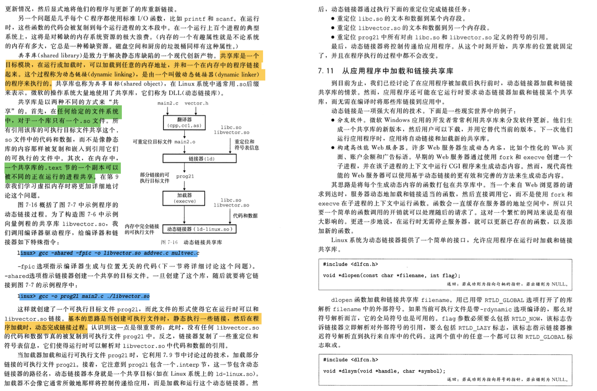 

[动态库和静态库.md](https://github.com/niu0217/Documents/blob/main/C%2B%2B/动态库和静态库.md)

## 8. 从应用程序中加载和链接共享库

[从应用程序中加载和链接共享库.md](https://github.com/niu0217/Documents/blob/main/C%2B%2B/从应用程序中加载和链接共享库.md)

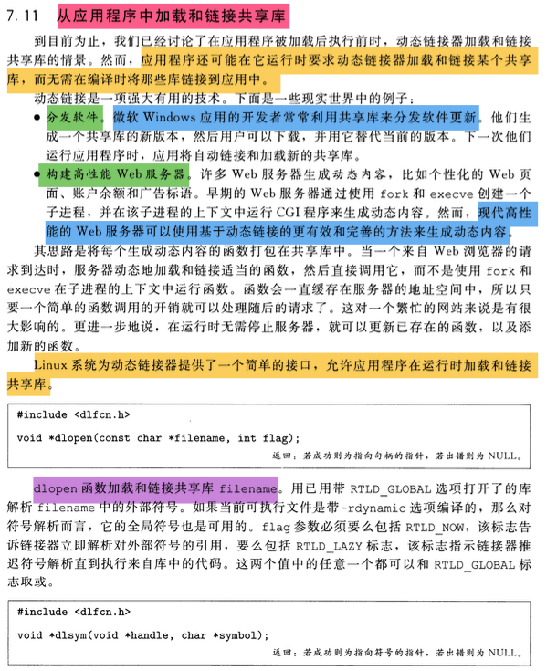 

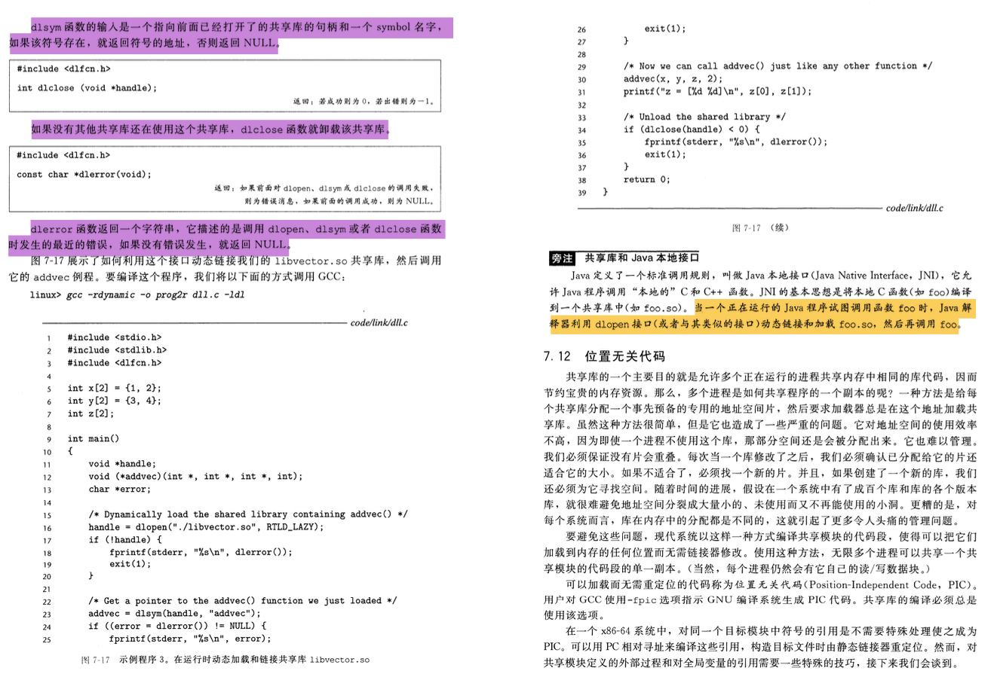 


