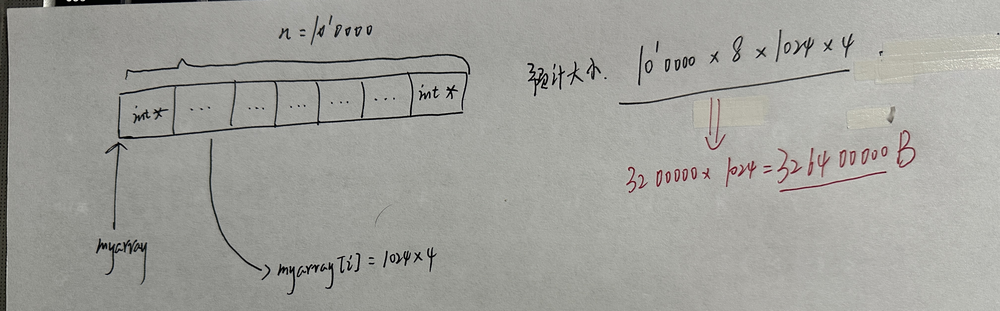

# 内存剖析

## 1. 简单使用

### 1.1 代码

```c
/* testmalloc.c */
/* Copyright (c) 2008 Thorsten Groetker, Ulrich Holtmann, Holger Keding, 
Markus Wloka. All rights reserved. Your use or disclosure of this source code 
is subject to the terms and conditions of the end user license agreement (EULA)
that is part of this software package. */

#include <stdio.h>
#include <stdlib.h>
#ifdef _MSC_VER
#define sleep(x) _sleep(1000*(x))
#else
#include <unistd.h>
#endif

#define blocksize 1024

/* make the program wait, so it is possible to inspect process for memory use */
void wait_for_input(const char *prefix, int is_interactive) {
    char c;
    if(is_interactive) {
        printf("%s hit return to continue\n", prefix); fflush(stdout);
        c = getchar();
    }
    else
    {   sleep(1); }
}

/* program entry point */
int main(int argc, char **argv) {
    const char *usage = "usage: testmalloc i[interactive]|n n iterations\n";
    int n, i, j, iterations, is_interactive = 0;
    int **myarray;

    if(argc != 4) {
        fprintf(stderr, usage);
	  return 1;
    }

    if(argv[1][0] == 'i')
        is_interactive = 1;

    n = atoi(argv[2]);
    iterations = atoi(argv[3]);
    if(n <= 0 || iterations < 0) {
        fprintf(stderr, usage);
	  return 2;
    }

    for(i=0; i<iterations; i++) {
	wait_for_input("before malloc: ", is_interactive);
#ifdef USE_NEW
        myarray = new int*[n];
#else
        myarray = (int **) malloc(n * (sizeof(int *)));
#endif
	for(j=0; j<n; j++) {
#ifdef USE_NEW
            myarray[j] = new int[blocksize];
#else
            myarray[j] = (int *) malloc(blocksize * sizeof(int));
#endif
        }
        wait_for_input("after malloc:  ", is_interactive);
        for(j=0; j<n; j++) {
#ifdef USE_NEW
            delete [] myarray[j];
#else
            free(myarray[j]);
#endif
        }

#ifdef USE_NEW
        delete [] myarray;
#else
        free(myarray);
#endif	
    }
    return 0;
}

```

### 1.2 命令行

```bash
gcc -g -o testmalloc testmalloc.c
valgrind --tool=massif ./testmalloc n 100000 8
```

### 1.3 结果分析

#### 1.3.1 自我预测

 

#### 1.3.2 实际结果

```bash
ubuntu@niu0217:~/GithubFile/CBooks/SoftwareDebug/valgrind$ ls -l
total 40
-rw-r--r-- 1 ubuntu ubuntu 12531 Mar  1 19:35 massif.out.3863344
-rwxrwxr-x 1 ubuntu ubuntu 20368 Mar  1 19:20 testmalloc
-rw-rw-r-- 1 ubuntu ubuntu  1894 Mar  1 19:35 testmalloc.c
```

查看当前目录，可以看到输出文件：`massif.out.3863344`。这个需要使用命令：`ms_print`查看：

结果如下：

```bash
ubuntu@niu0217:~/GithubFile/CBooks/SoftwareDebug/valgrind$ ms_print massif.out.3863344
--------------------------------------------------------------------------------
Command:            ./testmalloc n 100000 8
Massif arguments:   (none)
ms_print arguments: massif.out.3863344
--------------------------------------------------------------------------------


    MB
392.2^    ##
     |    #                           :        :                         @
     |    #         :        :        :        :        :       ::       @:
     |    #         :        :        :        :        :       ::       @:
     |    #        ::        :       ::        :        :       ::       @:
     |    #        ::        :       ::      :::       ::@      ::       @::
     |   :#        ::      :::       ::      : :       ::@      ::      :@::
     |   :#        ::      : ::      ::      : :       ::@     ::::     :@::
     |   :# :     ::::     : ::      :::     : :      :::@     ::::     :@::
     |   :# :     ::::     : ::      :::     : :@     :::@     ::::     :@::
     |   :# :     ::::    :: ::    :::::     : :@     :::@     :::::    :@:::
     |   :# :     ::::    :: ::    : :::     : :@     :::@     :::::   ::@:::
     |  ::# :     ::::    :: :::   : :::@   :: :@:   ::::@:   @:::::   ::@:::
     |  ::# :   @@::::@   :: :::   : :::@   :: :@:   ::::@:   @:::::   ::@:::
     |  ::# :   @ ::::@   :: :::   : :::@   :: :@:   ::::@:: :@:::::   ::@:::
     |  ::# ::  @ ::::@  ::: :::  :: :::@   :: :@:  :::::@:: :@:::::@  ::@::::
     |  ::# ::  @ ::::@  ::: :::  :: :::@: ::: :@:: :::::@:: :@:::::@ :::@::::
     |  ::# ::  @ ::::@  ::: :::: :: :::@: ::: :@:: :::::@:: :@:::::@ :::@::::
     |::::# ::::@ ::::@: ::: :::: :: :::@: ::: :@:: :::::@:: :@:::::@::::@::::
     |: ::# ::::@ ::::@: ::: :::: :: :::@::::: :@::::::::@::::@:::::@::::@::::
   0 +----------------------------------------------------------------------->Mi
     0                                                                   62.96

Number of snapshots: 85
 Detailed snapshots: [4 (peak), 9, 14, 30, 39, 48, 57, 67, 77]

--------------------------------------------------------------------------------
  n        time(i)         total(B)   useful-heap(B) extra-heap(B)    stacks(B)
--------------------------------------------------------------------------------
  0              0                0                0             0            0
  1        758,467       60,677,368       60,560,640       116,728            0
  2      1,936,323      173,094,136      172,758,272       335,864            0
  3      3,345,347      307,574,008      306,976,000       598,008            0
  4      4,431,245      411,200,008      410,400,000       800,008            0
99.81% (410,400,000B) (heap allocation functions) malloc/new/new[], --alloc-fns, etc.
->99.61% (409,600,000B) 0x1093A0: main (testmalloc.c:60)
|
->00.19% (800,000B) in 1+ places, all below ms_print's threshold (01.00%)

--------------------------------------------------------------------------------
  n        time(i)         total(B)   useful-heap(B) extra-heap(B)    stacks(B)
--------------------------------------------------------------------------------
  5      5,840,525      266,603,776      266,085,632       518,144            0
  6      7,249,805      122,011,648      121,775,360       236,288            0
  7      7,954,445       49,715,584       49,620,224        95,360            0
  8      8,923,254       47,745,664       47,654,144        91,520            0
  9      9,972,110      147,850,432      147,563,776       286,656            0
99.81% (147,563,776B) (heap allocation functions) malloc/new/new[], --alloc-fns, etc.
->99.27% (146,763,776B) 0x1093A0: main (testmalloc.c:60)
|
->00.54% (800,000B) in 1+ places, all below ms_print's threshold (01.00%)

--------------------------------------------------------------------------------
  n        time(i)         total(B)   useful-heap(B) extra-heap(B)    stacks(B)
--------------------------------------------------------------------------------
 10     11,020,966      247,955,200      247,473,408       481,792            0
 11     12,069,822      348,059,968      347,383,040       676,928            0
 12     13,118,725      371,469,184      370,746,624       722,560            0
 13     14,167,685      263,845,888      263,333,120       512,768            0
 14     15,216,645      156,222,592      155,919,616       302,976            0
99.81% (155,919,616B) (heap allocation functions) malloc/new/new[], --alloc-fns, etc.
->99.29% (155,119,616B) 0x1093A0: main (testmalloc.c:60)
|
->00.51% (800,000B) in 1+ places, all below ms_print's threshold (01.00%)

--------------------------------------------------------------------------------
  n        time(i)         total(B)   useful-heap(B) extra-heap(B)    stacks(B)
--------------------------------------------------------------------------------
 15     16,265,605       48,599,296       48,506,112        93,184            0
 16     16,790,094        6,377,344        6,366,464        10,880            0
 17     17,838,950      106,482,112      106,276,096       206,016            0
 18     18,887,806      206,586,880      206,185,728       401,152            0
 19     19,936,662      306,691,648      306,095,360       596,288            0
 20     21,247,765      389,038,408      388,281,600       756,808            0
 21     22,296,725      281,415,112      280,868,096       547,016            0
 22     23,345,685      173,791,816      173,454,592       337,224            0
 23     24,394,645       66,168,520       66,041,088       127,432            0
 24     25,181,362       15,061,408       15,033,600        27,808            0
 25     26,230,218      115,166,176      114,943,232       222,944            0
 26     27,279,074      215,270,944      214,852,864       418,080            0
 27     28,590,144      340,401,904      339,739,904       662,000            0
 28     29,352,965      409,053,616      408,257,792       795,824            0
 29     30,878,565      252,527,056      252,036,352       490,704            0
 30     31,641,365      174,263,776      173,925,632       338,144            0
99.81% (173,925,632B) (heap allocation functions) malloc/new/new[], --alloc-fns, etc.
->99.35% (173,125,632B) 0x1093A0: main (testmalloc.c:60)
|
->00.46% (800,000B) in 1+ places, all below ms_print's threshold (01.00%)

--------------------------------------------------------------------------------
  n        time(i)         total(B)   useful-heap(B) extra-heap(B)    stacks(B)
--------------------------------------------------------------------------------
 31     32,404,165       96,000,496       95,814,912       185,584            0
 32     33,548,378       21,430,816       21,390,592        40,224            0
 33     34,311,198       94,235,776       94,053,632       182,144            0
 34     35,074,018      167,040,736      166,716,672       324,064            0
 35     35,836,838      239,845,696      239,379,712       465,984            0
 36     36,599,658      312,650,656      312,042,752       607,904            0
 37     37,743,885      399,753,952      398,976,256       777,696            0
 38     38,506,685      321,490,672      320,865,536       625,136            0
 39     39,269,485      243,227,392      242,754,816       472,576            0
99.81% (242,754,816B) (heap allocation functions) malloc/new/new[], --alloc-fns, etc.
->99.48% (241,954,816B) 0x1093A0: main (testmalloc.c:60)
|
->00.33% (800,000B) in 1+ places, all below ms_print's threshold (01.00%)

--------------------------------------------------------------------------------
  n        time(i)         total(B)   useful-heap(B) extra-heap(B)    stacks(B)
--------------------------------------------------------------------------------
 40     40,032,285      164,964,112      164,644,096       320,016            0
 41     40,795,085       86,700,832       86,533,376       167,456            0
 42     41,939,302       30,082,048       30,024,960        57,088            0
 43     42,702,122      102,887,008      102,688,000       199,008            0
 44     43,464,942      175,691,968      175,351,040       340,928            0
 45     44,227,762      248,496,928      248,014,080       482,848            0
 46     44,990,582      321,301,888      320,677,120       624,768            0
 47     46,134,805      390,454,288      389,694,720       759,568            0
 48     46,897,605      312,191,008      311,584,000       607,008            0
99.81% (311,584,000B) (heap allocation functions) malloc/new/new[], --alloc-fns, etc.
->99.55% (310,784,000B) 0x1093A0: main (testmalloc.c:60)
|
->00.26% (800,000B) in 1+ places, all below ms_print's threshold (01.00%)

--------------------------------------------------------------------------------
  n        time(i)         total(B)   useful-heap(B) extra-heap(B)    stacks(B)
--------------------------------------------------------------------------------
 49     47,660,405      233,927,728      233,473,280       454,448            0
 50     48,184,925      180,111,976      179,762,432       349,544            0
 51     48,709,445      126,296,224      126,051,584       244,640            0
 52     49,233,965       72,480,472       72,340,736       139,736            0
 53     49,758,485       18,664,720       18,629,888        34,832            0
 54     50,283,012       34,227,088       34,161,920        65,168            0
 55     50,807,526       84,287,680       84,124,928       162,752            0
 56     51,332,040      134,348,272      134,087,936       260,336            0
 57     51,856,554      184,408,864      184,050,944       357,920            0
99.81% (184,050,944B) (heap allocation functions) malloc/new/new[], --alloc-fns, etc.
->99.37% (183,250,944B) 0x1093A0: main (testmalloc.c:60)
|
->00.43% (800,000B) in 1+ places, all below ms_print's threshold (01.00%)

--------------------------------------------------------------------------------
  n        time(i)         total(B)   useful-heap(B) extra-heap(B)    stacks(B)
--------------------------------------------------------------------------------
 58     52,381,068      234,469,456      234,013,952       455,504            0
 59     52,905,582      284,530,048      283,976,960       553,088            0
 60     53,430,096      334,590,640      333,939,968       650,672            0
 61     53,954,610      384,651,232      383,902,976       748,256            0
 62     54,479,125      385,935,784      385,185,024       750,760            0
 63     55,003,645      332,120,032      331,474,176       645,856            0
 64     55,528,165      278,304,280      277,763,328       540,952            0
 65     56,052,685      224,488,528      224,052,480       436,048            0
 66     56,577,205      170,672,776      170,341,632       331,144            0
 67     57,101,725      116,857,024      116,630,784       226,240            0
99.81% (116,630,784B) (heap allocation functions) malloc/new/new[], --alloc-fns, etc.
->99.12% (115,830,784B) 0x1093A0: main (testmalloc.c:60)
|
->00.68% (800,000B) in 1+ places, all below ms_print's threshold (01.00%)

--------------------------------------------------------------------------------
  n        time(i)         total(B)   useful-heap(B) extra-heap(B)    stacks(B)
--------------------------------------------------------------------------------
 68     57,626,245       63,041,272       62,919,936       121,336            0
 69     58,150,765        9,225,520        9,209,088        16,432            0
 70     58,675,269       43,005,544       42,923,264        82,280            0
 71     59,199,783       93,066,136       92,886,272       179,864            0
 72     59,724,297      143,126,728      142,849,280       277,448            0
 73     60,248,811      193,187,320      192,812,288       375,032            0
 74     60,773,325      243,247,912      242,775,296       472,616            0
 75     61,297,839      293,308,504      292,738,304       570,200            0
 76     61,822,353      343,369,096      342,701,312       667,784            0
 77     62,346,867      393,429,688      392,664,320       765,368            0
99.81% (392,664,320B) (heap allocation functions) malloc/new/new[], --alloc-fns, etc.
->99.60% (391,864,320B) 0x1093A0: main (testmalloc.c:60)
|
->00.20% (800,000B) in 1+ places, all below ms_print's threshold (01.00%)

--------------------------------------------------------------------------------
  n        time(i)         total(B)   useful-heap(B) extra-heap(B)    stacks(B)
--------------------------------------------------------------------------------
 78     62,871,365      376,500,688      375,768,320       732,368            0
 79     63,395,885      322,684,936      322,057,472       627,464            0
 80     63,920,405      268,869,184      268,346,624       522,560            0
 81     64,444,925      215,053,432      214,635,776       417,656            0
 82     64,969,445      161,237,680      160,924,928       312,752            0
 83     65,493,965      107,421,928      107,214,080       207,848            0
 84     66,018,485       53,606,176       53,503,232       102,944            0
ubuntu@niu0217:~/GithubFile/CBooks/SoftwareDebug/valgrind$
```

#### 1.3.3 结果对比

```bash
99.81% (410,400,000B) (heap allocation functions) malloc/new/new[], --alloc-fns, etc.
```

和我们自己计算的结果`326400000B`相差不大。


