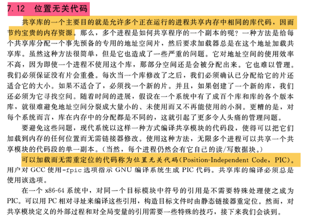
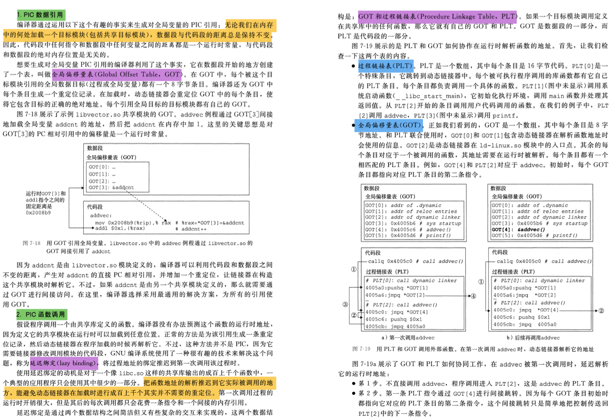
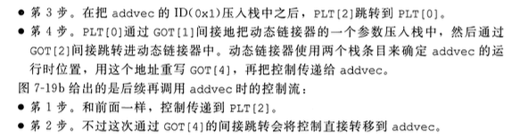

# 位置无关代码

## 1. 问题

### 1.1 什么是位置无关代码

位置无关代码（Position Independent Code，简称 PIC）是一种编程技术，使得代码能够在内存中的任何位置正确地运行，而不需要知道其确切的加载地址。在传统的编译和链接过程中，程序的各个部分（代码和数据）通常会被分配特定的内存地址。然而，这种方式可能会导致以下问题：

1. 地址空间冲突：如果多个程序或者库被加载到相同的地址空间，它们可能会因为地址重叠而产生冲突。
2. 动态加载和共享库：在动态链接和加载共享库时，由于库的实际加载地址可能与编译时假设的地址不同，因此需要对代码和数据进行重定位。

位置无关代码通过以下方式实现：

- **相对寻址**：使用相对跳转和调用指令，而不是绝对地址。这样，无论代码在内存中的哪个位置，相对偏移量都是不变的。
- **全局偏移表（GOT）**：对于全局变量和函数的引用，不直接使用它们的绝对地址，而是通过一个称为全局偏移表（Global Offset Table）的数据结构来间接访问。GOT中存储了每个全局符号在运行时的实际地址。当程序启动或动态库被加载时，动态链接器会解析这些地址并将它们填入GOT。
- **位置无关数据段（PIC Data Segment，.data.rel.ro 或 .got）**：对于只读数据，可以将其放在一个特殊的数据段中，这个段的内容在程序加载时会被重定位。

通过这些技术，位置无关代码可以在不同的内存位置正确执行，无需预先知道确切的加载地址。这使得代码更容易在多进程环境中共享，也简化了动态链接和加载的过程。在现代操作系统和编程语言中，位置无关代码是实现动态加载、地址空间布局随机化（ASLR）和其他安全特性的重要基础。

## 2. 具体

 

 

 

