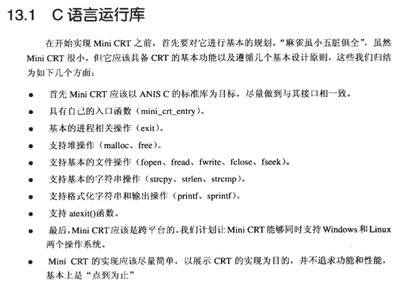
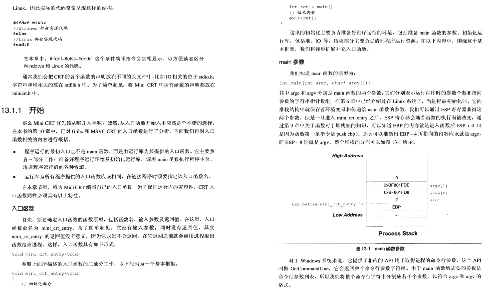
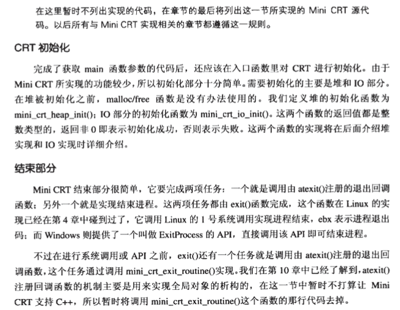
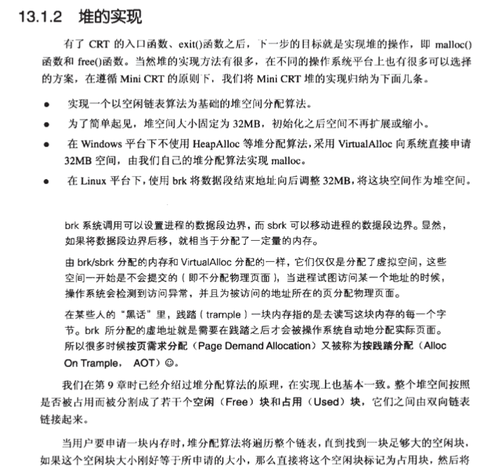
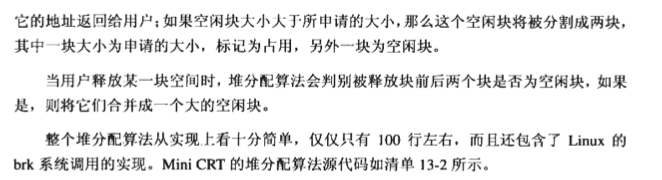
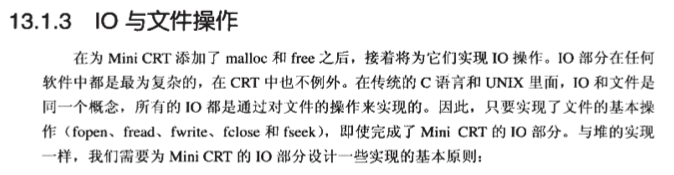
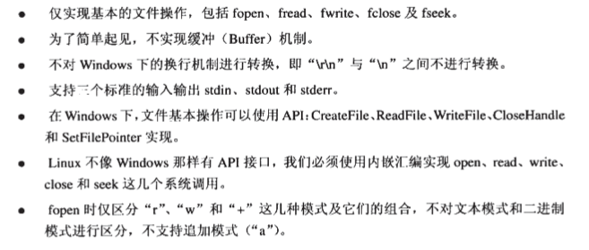

# 自己实现C语言运行库

## 引入

 

## 1. 入口函数

 

 

[entry.c](https://github.com/niu0217/Documents/blob/main/C%2B%2B/base/runtime_library/C_CRT/entry.c)

## 2. 堆的实现

 

 

[malloc.c](https://github.com/niu0217/Documents/blob/main/C%2B%2B/base/runtime_library/C_CRT/malloc.c)

## 3. IO与文件操作

 

 

[stdio.c](https://github.com/niu0217/Documents/blob/main/C%2B%2B/base/runtime_library/C_CRT/stdio.c)

## 4. 字符串操作

[string.c](https://github.com/niu0217/Documents/blob/main/C%2B%2B/base/runtime_library/C_CRT/string.c)

## 5. 格式化字符串

[printf.c](https://github.com/niu0217/Documents/blob/main/C%2B%2B/base/runtime_library/C_CRT/printf.c)

## 6. 库

[minicrt.h](https://github.com/niu0217/Documents/blob/main/C%2B%2B/base/runtime_library/C_CRT/minicrt.h)

## 7. 测试代码

[test.c](https://github.com/niu0217/Documents/blob/main/C%2B%2B/base/runtime_library/C_CRT/test.c)

