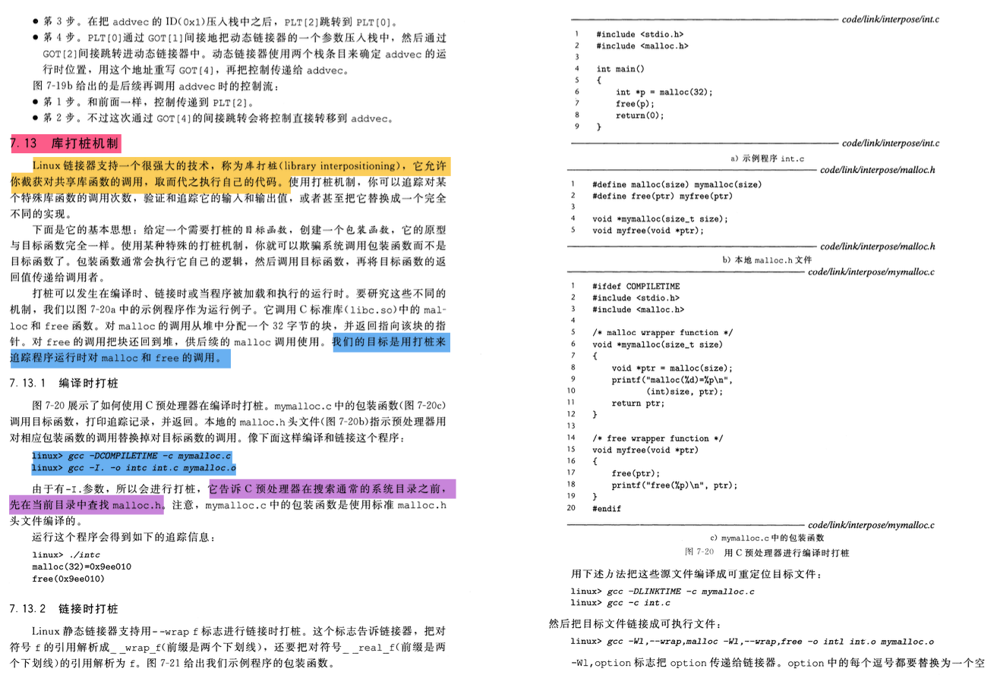
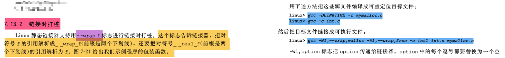
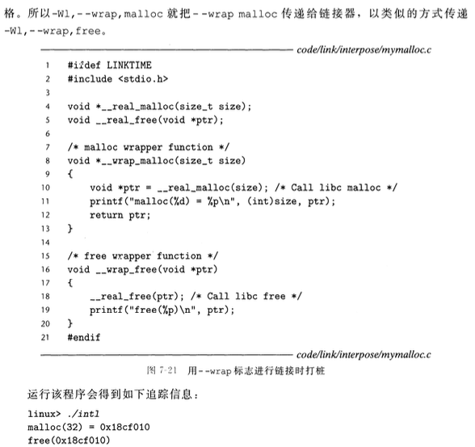
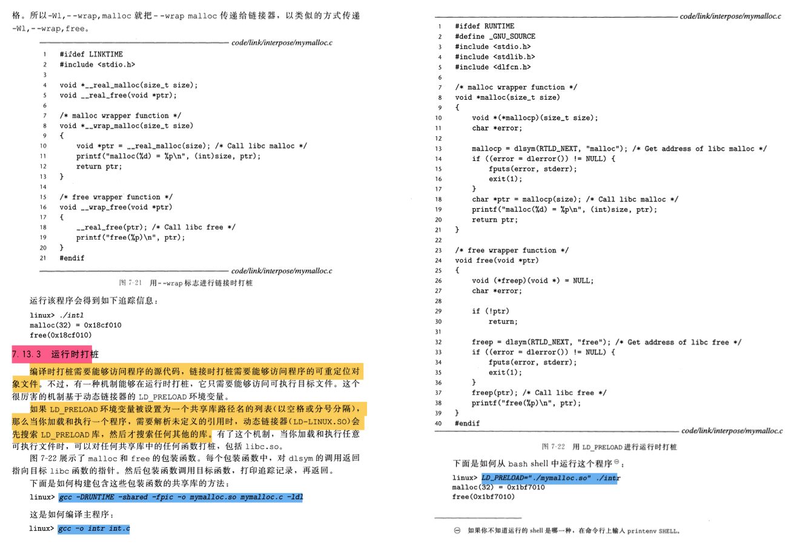
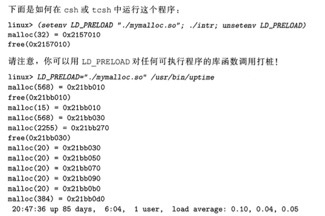

# 库打桩机制

## 1. 问题

### 1.1 什么是库打桩机制？

库打桩（Library Interpositioning）是一种技术，通过该技术可以在运行时替换或修改程序使用的库函数的行为。这种机制允许开发者或者安全研究人员在不修改原始代码的情况下，插入自己的代码来监控、调试、优化或者控制程序的执行。

库打桩通常通过以下几种方式实现：

1. **动态链接器重定向**：在操作系统层面，可以通过修改动态链接器的配置或者使用特定的环境变量（如 `LD_PRELOAD` 在 Unix/Linux 系统中），使得在程序启动时先加载一个自定义的共享库。这个库中的函数将优先于系统库中的同名函数被调用，从而实现对库函数的替换。
2. **符号绑定**：在某些编程语言或环境中，提供了符号绑定（Symbol Binding）的功能。通过符号绑定，可以改变程序在运行时查找和调用函数的方式，使其指向自定义的函数实现。
3. **代码注入**：在程序运行时，通过修改内存中的代码或者数据，直接替换目标库函数的指令或者数据，实现对函数行为的修改。

库打桩机制在很多场景下都有应用，例如：

- 软件测试和调试：通过打桩库函数，可以监控和控制程序的执行流程，帮助发现和修复软件中的错误。
- 性能分析和优化：通过打桩库函数，可以收集程序运行时的性能数据，为优化提供依据。
- 安全增强：通过打桩库函数，可以检测和阻止潜在的安全威胁，如缓冲区溢出、非法访问等。

需要注意的是，库打桩可能会引入新的问题或者错误，因为它改变了程序原有的执行逻辑。因此，在使用库打桩时需要谨慎，并确保自定义的函数实现能够正确地处理所有可能的输入和情况。

### 1.2 mymalloc.so和libmymalloc.so有什么区别？

`mymalloc.so` 和 `libmymalloc.so` 都是共享库（shared library）的文件名，它们的主要区别在于命名约定和习惯用法。

在 Unix/Linux 系统中，共享库通常遵循以下命名约定：

- 库文件名以 `lib` 开头，后跟库的名称。
- 如果库是主要的（或全局的），则其名称后面通常跟着 `.so`，表示它是共享对象（shared object）。
- 如果库有版本信息，版本号会放在 `.so` 后面，用句点分隔。例如，`.so.1`、`.so.2.3` 等。

因此，按照这个约定，一个名为 "mymalloc" 的库的标准命名应该是 `libmymalloc.so`。

然而，在实际使用中，直接命名为 `mymalloc.so` 也是可能的，特别是在本地开发或者特定场景下，可能不严格遵循这个命名约定。这不会影响库的功能，但在一些自动化构建工具或者依赖管理工具中，可能需要额外的配置来识别和处理这种非标准命名的库。

总结起来，`mymalloc.so` 和 `libmymalloc.so` 主要的区别在于命名约定，`libmymalloc.so` 更符合 Unix/Linux 系统中的标准共享库命名规则。在功能和使用上，两者并无本质区别。

## 2. 基本知识

### 2.1 编译时打桩

 

**文件结构：**

```
interpose/
├── int.c
├── makefile
├── malloc.h
└── mymalloc.c
```

**文件：**

```c
// int.c

#include<stdio.h>
#include<malloc.h>

int main()
{
    int *p = malloc(32);
    free(p);
    return 0;
}
```

```c
// malloc.h

#define malloc(size) mymalloc(size)
#define free(ptr) myfree(ptr)

void *mymalloc(size_t size);
void myfree(void *ptr);
```

```c
// mymalloc.c

#ifdef COMPILETIME
#include<stdio.h>
#include<malloc.h>

//malloc 包装函数
void *mymalloc(size_t size) {
    void *ptr = malloc(size);
    printf("malloc(%d)=%p\n", (int)size, ptr);
    return ptr;
}

//free 包装函数
void myfree(void *ptr) {
    free(ptr);
    printf("free(%p)\n", ptr);
}
#endif
```

```makefile
# makefile

all:
	gcc -DCOMPILETIME -c mymalloc.c
	gcc -I. -o intc int.c mymalloc.o
clean:
	rm intc mymalloc.o
```

### 2.2 链接时打桩

 

 

**文件结构：**

```
interpose/
├── int.c
├── makefile
└── mymalloc.c
```

文件：

```c
// int.c

#include<stdio.h>
#include<malloc.h>

int main()
{
    int *p = malloc(32);
    free(p);
    return 0;
}
```

```c
// mymalloc.c

#ifdef LINKTIME
#include<stdio.h>

void *__real_malloc(size_t size);
void __real_free(void *ptr);

//malloc 包装函数
void *__wrap_malloc(size_t size) {
    void *ptr = __real_malloc(size);  //Call libc malloc
    printf("malloc(%d)=%p\n", (int)size, ptr);
    return ptr;
}

//free 包装函数
void __wrap_free(void *ptr) {
    __real_free(ptr);  //Call libc free
    printf("free(%p)\n", ptr);
}
#endif
```

```makefile
# makefile

all:
	gcc -DLINKTIME -c mymalloc.c
	gcc -c int.c
	gcc -Wl,--wrap,malloc -Wl,--wrap,free -o intl int.o mymalloc.o
clean:
	rm intl mymalloc.o int.o
```

### 2.3 运行时打桩

 

 

#### 2.3.1 错误代码

**文件结构：**

```
interpose/
├── int.c
├── makefile
└── mymalloc.c
```

**文件：**

```c
// int.c

#include<stdio.h>
#include<stdlib.h>

int main()
{
    int *p = malloc(32);
    free(p);
    return 0;
}
```

```c
// mymalloc.c

#ifdef RUNTIME
#define _GNU_SOURCE
#include<stdio.h>
#include<stdlib.h>
#include<dlfcn.h>

//malloc 包装函数
void *malloc(size_t size) {
    void* (*mallocp)(size_t size);
    char *error;

    //Get address of libc malloc
    mallocp = dlsym(RTLD_NEXT, "malloc");
    if((error = dlerror()) != NULL) {
        fputs(error, stderr);
        exit(1);
    }

    //Call libc malloc
    char *ptr = mallocp(size);
    printf("malloc(%d)=%p\n", (int)size, ptr);

    return ptr;
}

//free 包装函数
void free(void *ptr) {
    void (*freep)(void *) = NULL;
    char *error;

    if(!ptr) {
        return;
    }

    //Get address of libc free
    freep = dlsym(RTLD_NEXT, "free");
    if((error = dlerror()) != NULL) {
        fputs(error, stderr);
        exit(1);
    }

    //Call libc free
    freep(ptr);
    printf("free(%p)\n", ptr);
}
#endif
```

```makefile
# makefile

all:
	gcc -DRUNTIME -shared -fpic -o mymalloc.so mymalloc.c -ldl
	gcc -o intr int.c
```

此时运行代码会栈溢出。

原因：

+ 网址：https://blog.csdn.net/imred/article/details/77418323
+ 总结：
  + printf函数也调用了malloc，导致形成了环结构调用，栈很快就溢出了。
+ 如何分析的：
  + 用gdb调试产生的core文件，bt的函数调用多达两万多行，并且printf函数重复出现。因此可以判断可能是printf函数也调用了malloc，导致形成了环结构调用。

#### 2.3.2 正确代码

**文件结构：**

```
interpose/
├── int.c
├── makefile
└── mymalloc.c
```

**文件：**

```c
//int.c

#include<stdio.h>
#include<stdlib.h>

int main()
{
    printf("hello niu0217\n");
    return 0;
}
```

```c
//mymalloc.c

#ifdef RUNTIME
#define _GNU_SOURCE
#include<stdio.h>
#include<stdlib.h>
#include<dlfcn.h>

//malloc 包装函数
void *malloc(size_t size) {
    //设置静态线程局部变量。
    //静态的目的：限制作用域为本函数，并延长生命周期
    //线程局部变量的目的：多线程中每个都有一份，不会冲突
    static __thread int print_times = 0;
    print_times++;

    void* (*mallocp)(size_t size);
    char *error;

    //Get address of libc malloc
    mallocp = dlsym(RTLD_NEXT, "malloc");
    if((error = dlerror()) != NULL) {
        fputs(error, stderr);
        exit(1);
    }

    //Call libc malloc
    char *ptr = mallocp(size);
    //多线程环境或者如果printf调用了malloc，那么print_times可能为2，那么我们就不打印
    if(print_times == 1) {
        printf("malloc(%d)=%p\n", (int)size, ptr);
    }
    print_times = 0; //每次结束都将其置0，保证下一次进入的时候它的值从0开始统计
    return ptr;
}

//free 包装函数
void free(void *ptr) {
    void (*freep)(void *) = NULL;
    char *error;

    if(!ptr) {
        return;
    }

    //Get address of libc free
    freep = dlsym(RTLD_NEXT, "free");
    if((error = dlerror()) != NULL) {
        fputs(error, stderr);
        exit(1);
    }

    //Call libc free
    freep(ptr);
    printf("free(%p)\n", ptr);
}
#endif
```

```makefile
all:
	gcc -DRUNTIME -shared -fpic -o mymalloc.so mymalloc.c -ldl
	gcc -o intr int.c
```

执行：

```shell
ubuntu@niu0217:~/Dev/interpose$ LD_PRELOAD="./mymalloc.so" ./intr
malloc(1024)=0x56434a6c12a0
free(0x56434a6c16b0)
hello niu0217
ubuntu@niu0217:~/Dev/interpose$
```

从这里看出，printf函数确实调用了malloc。