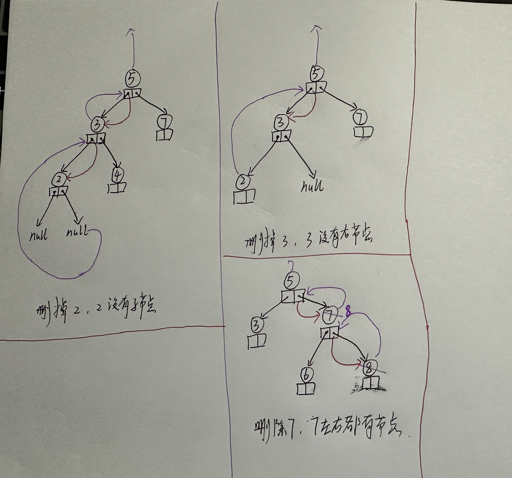

# tree

## 1. 问题

## 2. 完整代码

### 2.1 BST(二叉搜索树)

[bst_tree.cpp](https://github.com/niu0217/Documents/blob/main/C%2B%2B/datastructure/code/bst_tree.cpp)

## 3. 分析BST代码

### 3.1 删除一个节点

```c++
TreeNode* BinaryTree::delete_node(TreeNode* root, int key) {
    if(root == nullptr) {
        return root;  //没找到直接返回
    }
    if(key < root->value_) {
        //在左子树中删除，并且用root->left_接住删除后的左子树的根节点
        root->left_ = delete_node(root->left_, key);
    }
    else if(key > root->value_) {
        //在右子树中删除，并且用root->right_接住删除后的右子树的根节点
        root->right_ = delete_node(root->right_, key);
    }
    else {
        //找到要删除的节点
        if(root->left_ == nullptr) {  //只有一个右节点或者没有子节点
            TreeNode* after_delete_subtree = root->right_;
            delete root;
            return after_delete_subtree;
        }
        else if(root->right_ == nullptr) {  //只有一个左节点或者没有子节点
            TreeNode* after_delete_subtree = root->left_;
            delete root;
            return after_delete_subtree;
        }
        else {  //有两个子节点，获取右子树中的最小值节点来替换当前节点，并删除那个最小值节点
            TreeNode* min_subtree_node = get_minvalue_node(root->right_);
            root->value_ = min_subtree_node->value_;
            root->right_ = delete_node(root->right_, min_subtree_node->value_);
        }
    }
    return root;  //返回修改后的根指针（可能是新的根）
}
```

 


