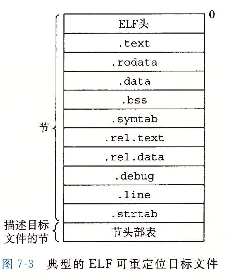

# 可重定位目标文件

## 1. 基础知识

 

+ `ELF头`：以一个16字节的序列开始，这个序列描述了生成该文件的系统的字的大小和字节顺序。ELF头剩下的部分包含帮组链接器语法分析和解释目标文件的信息。其中包括ELF头的大小、目标文件的类型（如可重定位、可执行或者共享的）、机器类型（如x86-64）、节头部表的文件偏移，以及节头部表中条目的大小和数目。不同节的位置和大小是由节头部表描述的，其中目标文件中每个节都有一个固定大小的条目。
+ `.text`：已编译程序的机器代码
+ `.rodata`：只读数据，比如printf语句中的格式串和开关语句的跳转表。我觉得const的数据在这里。
+ `.data`：已初始化的全局和静态C变量。局部C变量在运行时被保存在栈中，既不出现在.data节中，也不出现在.bss节中。
+ `.bss`：未初始化的全局和静态C变量，以及所有被初始化为0的全局或静态变量。在目标文件中这个节不占据实际的空间，它仅仅是一个占位符。目标文件格式区分为已初始化和未初始化变量是为了空间效率：在目标文件中，未初始化变量不需要占据任何实际的磁盘空间。运行时，在内存中分配这些变量，初始值为0。
+ `.symtab`：一个符号表，它存放在程序中定义和引用的函数和全局变量的信息。一些程序员错误的认为必须通过-g选项来编译一个程序，才会得到符号表信息。实际上，每个可重定位目标文件在`.symtab`中都有一张符号表（除非程序员特意用STRIP命令去掉它）。然而，和编译器中的符号表不同，`.symtab`符号表不包含局部变量的条目。
+ `.rel.text`：一个`.text`节中位置的列表，当链接器把这个目标文件和其他文件组合时，需要修改这些位置。一般而言，任何调用外部函数或者引用全局变量的指令都需要修改。另一方面，调用本地函数的指令则不需要修改。注意，可执行目标文件中并不需要重定位信息，因此通常省略，除非用户显式地指示链接器包含这些信息。
+ `.rel.data`：被模块引用或定义的所有全局变量的重定位信息。一般而言，任何已初始化的全局变量，如果它的初始值是一个全局变量地址或者外部定义函数的地址，都需要被修改。
+ `.debug`：一个调试符号表，其条目是程序中定义的局部变量和类型定义，程序中定义和引用的全局变量，以及原始的C源文件。只有以-g选项调用编译器驱动程序时，才会得到这张表。
+ `.line`：原始C源程序中的行号和`.text`节中机器指令之间的映射。只有以-g选项调用编译器驱动程序时，才会得到这张表。
+ `.strtab`：一个字符串表，其内容包括`.symtab`和`.debug`节中的符号表，以及节头部中的节名字。字符串表就是以null结尾的字符串的序列。

## 2. 举例

### 2.1 查看ELF头

```c++
//test.cpp

#include<iostream>

//自己定义的全局变量
int g_value1 = 10; //.data
int g_value2 = 20; //.data
int g_value3 = 30; //.data
int g_value4 = 0; //.bss
int g_value5 = 0; //.bss
int g_value6 = 0; //.bss

//引用外部的全局变量
extern int extern_g_value1;
extern int extern_g_value2;
extern int extern_g_value3;

//自己定义的常量
const int const_g_value1 = 100; //.rodata
const int const_g_value2 = 200; //.rodata
const int const_g_value3 = 300; //.rodata
const int const_g_value4 = 0; //.rodata
const int const_g_value5 = 0; //.rodata
const int const_g_value6 = 0; //.rodata

int main()
{

}
```

```bash
g++ -c test.cpp

objdump -f test.o
```

输出：

```bash
test.o:     file format elf64-x86-64
architecture: i386:x86-64, flags 0x00000011:
HAS_RELOC, HAS_SYMS
start address 0x0000000000000000
```

### 2.2 查看.text

```c++
//test.cpp

#include<iostream>

void printHello() {

}

void sayByeBye() {

}

int main()
{

}
```

```bash
g++ -c test.cpp

objdump -d test.o --section=.text
```

输出：

```assembly
ubuntu@niu0217:~/Dev/C++ObjectModern/objfile$ cat test.txt
test.o:     file format elf64-x86-64


Disassembly of section .text:

0000000000000000 <_Z10printHellov>:
   0:	f3 0f 1e fa          	endbr64
   4:	55                   	push   %rbp
   5:	48 89 e5             	mov    %rsp,%rbp
   8:	90                   	nop
   9:	5d                   	pop    %rbp
   a:	c3                   	retq

000000000000000b <_Z9sayByeByev>:
   b:	f3 0f 1e fa          	endbr64
   f:	55                   	push   %rbp
  10:	48 89 e5             	mov    %rsp,%rbp
  13:	90                   	nop
  14:	5d                   	pop    %rbp
  15:	c3                   	retq

0000000000000016 <main>:
  16:	f3 0f 1e fa          	endbr64
  1a:	55                   	push   %rbp
  1b:	48 89 e5             	mov    %rsp,%rbp
  1e:	b8 00 00 00 00       	mov    $0x0,%eax
  23:	5d                   	pop    %rbp
  24:	c3                   	retq

0000000000000025 <_Z41__static_initialization_and_destruction_0ii>:
  25:	f3 0f 1e fa          	endbr64
  29:	55                   	push   %rbp
  2a:	48 89 e5             	mov    %rsp,%rbp
  2d:	48 83 ec 10          	sub    $0x10,%rsp
  31:	89 7d fc             	mov    %edi,-0x4(%rbp)
  34:	89 75 f8             	mov    %esi,-0x8(%rbp)
  37:	83 7d fc 01          	cmpl   $0x1,-0x4(%rbp)
  3b:	75 32                	jne    6f <_Z41__static_initialization_and_destruction_0ii+0x4a>
  3d:	81 7d f8 ff ff 00 00 	cmpl   $0xffff,-0x8(%rbp)
  44:	75 29                	jne    6f <_Z41__static_initialization_and_destruction_0ii+0x4a>
  46:	48 8d 3d 00 00 00 00 	lea    0x0(%rip),%rdi        # 4d <_Z41__static_initialization_and_destruction_0ii+0x28>
  4d:	e8 00 00 00 00       	callq  52 <_Z41__static_initialization_and_destruction_0ii+0x2d>
  52:	48 8d 15 00 00 00 00 	lea    0x0(%rip),%rdx        # 59 <_Z41__static_initialization_and_destruction_0ii+0x34>
  59:	48 8d 35 00 00 00 00 	lea    0x0(%rip),%rsi        # 60 <_Z41__static_initialization_and_destruction_0ii+0x3b>
  60:	48 8b 05 00 00 00 00 	mov    0x0(%rip),%rax        # 67 <_Z41__static_initialization_and_destruction_0ii+0x42>
  67:	48 89 c7             	mov    %rax,%rdi
  6a:	e8 00 00 00 00       	callq  6f <_Z41__static_initialization_and_destruction_0ii+0x4a>
  6f:	90                   	nop
  70:	c9                   	leaveq
  71:	c3                   	retq

0000000000000072 <_GLOBAL__sub_I__Z10printHellov>:
  72:	f3 0f 1e fa          	endbr64
  76:	55                   	push   %rbp
  77:	48 89 e5             	mov    %rsp,%rbp
  7a:	be ff ff 00 00       	mov    $0xffff,%esi
  7f:	bf 01 00 00 00       	mov    $0x1,%edi
  84:	e8 9c ff ff ff       	callq  25 <_Z41__static_initialization_and_destruction_0ii>
  89:	5d                   	pop    %rbp
  8a:	c3                   	retq
```

我们查看函数：

```assembly
Disassembly of section .text:

0000000000000000 <_Z10printHellov>:
   0:	f3 0f 1e fa          	endbr64
   4:	55                   	push   %rbp
   5:	48 89 e5             	mov    %rsp,%rbp
   8:	90                   	nop
   9:	5d                   	pop    %rbp
   a:	c3                   	retq

000000000000000b <_Z9sayByeByev>:
   b:	f3 0f 1e fa          	endbr64
   f:	55                   	push   %rbp
  10:	48 89 e5             	mov    %rsp,%rbp
  13:	90                   	nop
  14:	5d                   	pop    %rbp
  15:	c3                   	retq

0000000000000016 <main>:
  16:	f3 0f 1e fa          	endbr64
  1a:	55                   	push   %rbp
  1b:	48 89 e5             	mov    %rsp,%rbp
  1e:	b8 00 00 00 00       	mov    $0x0,%eax
  23:	5d                   	pop    %rbp
  24:	c3                   	retq
```


### 2.3 查看.rodata/.data/.bss/.symtab

```c++
#include<iostream>

//自己定义的全局变量
int g_value1 = 10; //.data
int g_value2 = 20; //.data
int g_value3 = 30; //.data
int g_value4 = 0; //.bss
int g_value5 = 0; //.bss
int g_value6 = 0; //.bss

//引用外部的全局变量
extern int extern_g_value1;
extern int extern_g_value2;
extern int extern_g_value3;

//自己定义的全局常量
const int const_g_value1 = 100; //.rodata
const int const_g_value2 = 200; //.rodata
const int const_g_value3 = 300; //.rodata
const int const_g_value4 = 0; //.rodata
const int const_g_value5 = 0; //.rodata
const int const_g_value6 = 0; //.rodata

//自己定义的全局静态变量
static int static_g_value1 = 1000; //.data
static int static_g_value2 = 2000; //.data
static int static_g_value3 = 3000; //.data
static int static_g_value4 = 0;  //.bss
static int static_g_value5 = 0;  //.bss
static int static_g_value6 = 0;  //.bss

int main()
{

}
```

```bash
g++ -c test.cpp

# 查看.symtab节的内容
objdump -t test.o > test.txt
```

输出：

```bash
ubuntu@niu0217:~/Dev/C++ObjectModern/objfile$ cat test.txt
test.o:     file format elf64-x86-64

SYMBOL TABLE:
0000000000000000 l    df *ABS*	0000000000000000 test.cpp
0000000000000000 l    d  .text	0000000000000000 .text
0000000000000000 l    d  .data	0000000000000000 .data
0000000000000000 l    d  .bss	0000000000000000 .bss
0000000000000000 l    d  .rodata	0000000000000000 .rodata
0000000000000000 l     O .rodata	0000000000000001 _ZStL19piecewise_construct
000000000000000c l     O .bss	0000000000000001 _ZStL8__ioinit
0000000000000004 l     O .rodata	0000000000000004 _ZL14const_g_value1
0000000000000008 l     O .rodata	0000000000000004 _ZL14const_g_value2
000000000000000c l     O .rodata	0000000000000004 _ZL14const_g_value3
0000000000000010 l     O .rodata	0000000000000004 _ZL14const_g_value4
0000000000000014 l     O .rodata	0000000000000004 _ZL14const_g_value5
0000000000000018 l     O .rodata	0000000000000004 _ZL14const_g_value6
000000000000000c l     O .data	0000000000000004 _ZL15static_g_value1
0000000000000010 l     O .data	0000000000000004 _ZL15static_g_value2
0000000000000014 l     O .data	0000000000000004 _ZL15static_g_value3
0000000000000010 l     O .bss	0000000000000004 _ZL15static_g_value4
0000000000000014 l     O .bss	0000000000000004 _ZL15static_g_value5
0000000000000018 l     O .bss	0000000000000004 _ZL15static_g_value6
000000000000000f l     F .text	000000000000004d _Z41__static_initialization_and_destruction_0ii
000000000000005c l     F .text	0000000000000019 _GLOBAL__sub_I_g_value1
0000000000000000 l    d  .init_array	0000000000000000 .init_array
0000000000000000 l    d  .note.GNU-stack	0000000000000000 .note.GNU-stack
0000000000000000 l    d  .note.gnu.property	0000000000000000 .note.gnu.property
0000000000000000 l    d  .eh_frame	0000000000000000 .eh_frame
0000000000000000 l    d  .comment	0000000000000000 .comment
0000000000000000 g     O .data	0000000000000004 g_value1
0000000000000004 g     O .data	0000000000000004 g_value2
0000000000000008 g     O .data	0000000000000004 g_value3
0000000000000000 g     O .bss	0000000000000004 g_value4
0000000000000004 g     O .bss	0000000000000004 g_value5
0000000000000008 g     O .bss	0000000000000004 g_value6
0000000000000000 g     F .text	000000000000000f main
0000000000000000         *UND*	0000000000000000 _GLOBAL_OFFSET_TABLE_
0000000000000000         *UND*	0000000000000000 _ZNSt8ios_base4InitC1Ev
0000000000000000         *UND*	0000000000000000 .hidden __dso_handle
0000000000000000         *UND*	0000000000000000 _ZNSt8ios_base4InitD1Ev
0000000000000000         *UND*	0000000000000000 __cxa_atexit
```

+ 我们看到const变量在`.rodata`节中，并且属性为`o`，代表只能读。

```assembly
//自己定义的全局常量
const int const_g_value1 = 100; //.rodata
const int const_g_value2 = 200; //.rodata
const int const_g_value3 = 300; //.rodata
const int const_g_value4 = 0; //.rodata
const int const_g_value5 = 0; //.rodata
const int const_g_value6 = 0; //.rodata

0000000000000004 l     O .rodata	0000000000000004 _ZL14const_g_value1
0000000000000008 l     O .rodata	0000000000000004 _ZL14const_g_value2
000000000000000c l     O .rodata	0000000000000004 _ZL14const_g_value3
0000000000000010 l     O .rodata	0000000000000004 _ZL14const_g_value4
0000000000000014 l     O .rodata	0000000000000004 _ZL14const_g_value5
0000000000000018 l     O .rodata	0000000000000004 _ZL14const_g_value6
```

+ 我们看到全局变量/静态变量如果初始化并且不为0，则在`.data`节；如果初始化为0，则在`.bss`节中。

```assembly
//自己定义的全局变量
int g_value1 = 10; //.data
int g_value2 = 20; //.data
int g_value3 = 30; //.data
int g_value4 = 0; //.bss
int g_value5 = 0; //.bss
int g_value6 = 0; //.bss

//自己定义的全局静态变量
static int static_g_value1 = 1000;
static int static_g_value2 = 2000;
static int static_g_value3 = 3000;
static int static_g_value4 = 0;
static int static_g_value5 = 0;
static int static_g_value6 = 0;


0000000000000000 g     O .data	0000000000000004 g_value1
0000000000000004 g     O .data	0000000000000004 g_value2
0000000000000008 g     O .data	0000000000000004 g_value3
0000000000000000 g     O .bss	0000000000000004 g_value4
0000000000000004 g     O .bss	0000000000000004 g_value5
0000000000000008 g     O .bss	0000000000000004 g_value6

000000000000000c l     O .data	0000000000000004 _ZL15static_g_value1
0000000000000010 l     O .data	0000000000000004 _ZL15static_g_value2
0000000000000014 l     O .data	0000000000000004 _ZL15static_g_value3
0000000000000010 l     O .bss	0000000000000004 _ZL15static_g_value4
0000000000000014 l     O .bss	0000000000000004 _ZL15static_g_value5
0000000000000018 l     O .bss	0000000000000004 _ZL15static_g_value6
```

### 2.4 查看.rel.text

在C++中，`.rel.text`节包含了那些在编译时无法确定最终地址，需要在链接时修正的代码部分的重定位信息。通常情况下，这些信息与函数调用、分支（如跳转和条件语句）和符号引用（如全局变量或静态变量的地址）有关。特别是当涉及到外部链接、动态链接库或跨模块的引用时，`.rel.text`节的重定位信息就显得尤为重要。

以下是`.rel.text`节可能包含的一些情况的例子：

1. **外部函数调用**：如果你的代码调用另一个尚未定义的函数（例如在另一个编译单元或库中定义的函数），链接器需要将这个调用指令中的符号地址修正为确切的地址。

```cpp
extern void externalFunction(); // 在其它模块定义

void myFunction() {
    externalFunction(); // 对externalFunction的调用需要重定位
}
```

在上面的例子中，对`externalFunction`的调用是在编译时未知的，并且会在`.rel.text`节中包含一个重定位条目，链接器会在链接时填入正确的地址。

2. **静态变量的地址**：如果函数中引用了静态存储期的变量（如全局变量或`static`的局部变量），并取它们的地址，这些地址可能需要在链接时进行修正。

```cpp
int globalVariable;

void myFunction() {
    int *ptr = &globalVariable; // 对globalVariable的引用需要重定位
}
```

在这个例子中，指针`ptr`初始化为`globalVariable`的地址，在编译阶段`globalVariable`的地址不确定，需要在链接时确定，因此在`.rel.text`节中需要一个重定位条目。

3. **跳转或分支指令**：如果代码有基于某些条件的跳转，目标地址若在不同的编译单元，则需要在链接时确定最终地址。

```cpp
void funcA();
void funcB();

void myFunction(bool condition) {
    if (condition) {
        funcA(); // 跳转到funcA需要重定位
    } else {
        funcB(); // 跳转到funcB需要重定位
    }
}
```

在这个例子中，如果`funcA`和`funcB`在其他编译单元中定义，并且它们的地址在编译时不可知，则需要在`.rel.text`节中创建重定位条目。

要看到这些重定位条目的实际例子，你需要先编译上面的代码片段生成目标文件(`g++ -c my_code.cpp -o my_code.o`)，然后使用`objdump -r my_code.o`检查重定位条目。记住，只有在需要的时候（例如在代码引用了其他编译单元中的符号），才会在`.rel.text`节生成重定位条目。

**代码：**

```c++
#include<iostream>

extern void externalFunction(); // 在其它模块定义

void myFunctionOne() {
    externalFunction(); // 对externalFunction的调用需要重定位
}

int globalVariable;

void myFunctionTwo() {
    int *ptr = &globalVariable; // 对globalVariable的引用需要重定位
}

int main()
{
    myFunctionOne();
    myFunctionTwo();
}
```

```bash
g++ -c test.cpp

objdump -r test.o > test.txt
```

**输出：**

```assembly
ubuntu@niu0217:~/Dev/C++ObjectModern/objfile$ cat test.txt

test.o:     file format elf64-x86-64

RELOCATION RECORDS FOR [.text]:
OFFSET           TYPE              VALUE
0000000000000009 R_X86_64_PLT32    _Z16externalFunctionv-0x0000000000000004
000000000000001b R_X86_64_PC32     globalVariable-0x0000000000000004
000000000000002f R_X86_64_PLT32    _Z13myFunctionOnev-0x0000000000000004
0000000000000034 R_X86_64_PLT32    _Z13myFunctionTwov-0x0000000000000004
0000000000000063 R_X86_64_PC32     .bss
0000000000000068 R_X86_64_PLT32    _ZNSt8ios_base4InitC1Ev-0x0000000000000004
000000000000006f R_X86_64_PC32     __dso_handle-0x0000000000000004
0000000000000076 R_X86_64_PC32     .bss
000000000000007d R_X86_64_REX_GOTPCRELX  _ZNSt8ios_base4InitD1Ev-0x0000000000000004
0000000000000085 R_X86_64_PLT32    __cxa_atexit-0x0000000000000004


RELOCATION RECORDS FOR [.init_array]:
OFFSET           TYPE              VALUE
0000000000000000 R_X86_64_64       .text+0x000000000000008c


RELOCATION RECORDS FOR [.eh_frame]:
OFFSET           TYPE              VALUE
0000000000000020 R_X86_64_PC32     .text
0000000000000040 R_X86_64_PC32     .text+0x0000000000000010
0000000000000060 R_X86_64_PC32     .text+0x0000000000000026
0000000000000080 R_X86_64_PC32     .text+0x000000000000003f
00000000000000a0 R_X86_64_PC32     .text+0x000000000000008c
```

根据所提供的`.rel.text`节的重定位记录，可以分析每一个条目以了解其含义：

1. `OFFSET 0000000000000009 TYPE R_X86_64_PLT32 VALUE _Z16externalFunctionv-0x0000000000000004`:
   - 这表明在代码偏移量为`0x9`的地方，有一个调用类型为`R_X86_64_PLT32`的外部函数`externalFunction`（根据名称修饰，这应该是C++编译后的名称），这需要通过过程链接表（PLT）进行动态链接。
2. `OFFSET 000000000000001b TYPE R_X86_64_PC32 VALUE globalVariable-0x0000000000000004`:
   - 在偏移量`0x1b`处，代码引用了一个全局变量`globalVariable`。`R_X86_64_PC32`类型意味着这个引用是PC-relative的，即该引用是相对于当前程序计数器的值的。
3. `OFFSET 000000000000002f TYPE R_X86_64_PLT32 VALUE _Z13myFunctionOnev-0x0000000000000004`:
   - 与第一个条目类似，这里在`0x2f`的偏移量上调用了名为`myFunctionOne`的函数，这个名字也经过了C++的名称修饰。
4. `OFFSET 0000000000000034 TYPE R_X86_64_PLT32 VALUE _Z13myFunctionTwov-0x0000000000000004`:
   - 这是另一个调用，针对另一个名为`myFunctionTwo`的函数。
5. `OFFSET 0000000000000063 TYPE R_X86_64_PC32 VALUE .bss` 和 `OFFSET 0000000000000076 TYPE R_X86_64_PC32 VALUE .bss`:
   - 这些条目表示偏移量`0x63`和`0x76`上的指令或数据需要访问`.bss`段的位置，`.bss`段通常用于存储未初始化的全局变量。
6. `OFFSET 0000000000000068 TYPE R_X86_64_PLT32 VALUE _ZNSt8ios_base4InitC1Ev-0x0000000000000004`:
   - 这表明有一处调用C++标准库中的`std::ios_base::Init`的构造函数，这也是通过PLT进行的。
7. `OFFSET 000000000000006f TYPE R_X86_64_PC32 VALUE __dso_handle-0x0000000000000004`:
   - 这是与动态共享对象（DSO）处理有关的引用，`__dso_handle`在共享库中使用。
8. `OFFSET 000000000000007d TYPE R_X86_64_REX_GOTPCRELX VALUE _ZNSt8ios_base4InitD1Ev-0x0000000000000004`:
   - 这是对`std::ios_base::Init`析构函数的引用，具体表明使用了地址修正，依靠全局偏移表（GOT）进行。
9. `OFFSET 0000000000000085 TYPE R_X86_64_PLT32 VALUE __cxa_atexit-0x0000000000000004`:
   - 这段引用了`__cxa_atexit`，一个在程序正常退出时负责调用已注册的析构函数的C++运行库函数。

在这份重定位列表中，`-0x4`是因为在x86-64中的PLT和GOT编址模式中，调用或跳转指令需要调整以指向指令流中的正确位置。这些修正通常发生在链接阶段，这时候链接器根据实际的地址来填入这些偏移量。

### 2.5 查看.rel.data

在C++中，`.rel.data`（或`.reldata`）节通常用于存储数据节（如`.data`）中需要被重定位的各个条目的信息。这包括在编译时无法确定最终内存地址的全局或静态数据成员的引用。这些数据可能是各种类型的静态链接地址，比如全局变量、静态变量、静态类成员变量以及对其他模块定义的数据的引用。

以下是一些可能在`.rel.data`节出现的典型案例的示例：

1. **全局变量引用**：
   如果程序包含对尚未定义的全局变量的引用，这些引用将在链接阶段被修正。

   ```cpp
   extern int globalVariable; // 定义在另一个模块中
   
   int* ptrToGlobal = &globalVariable; // 需要重定位
   ```

   上面的例子中，`ptrToGlobal`的初始化依赖于`globalVariable`的地址，如果`globalVariable`定义在另外的编译单元中，那么它的地址需要在链接时由`.rel.data`节进行修正。

2. **静态类成员的地址**：
   类的静态成员在链接器的视角也是需要重定位的全局符号。

   ```cpp
   class MyClass {
   public:
       static int staticMember;
   };
   
   int MyClass::staticMember; // 定义静态成员
   
   int* ptrToStaticMember = &MyClass::staticMember; // 需要重定位
   ```

   在这个例子中，对`MyClass::staticMember`的引用需要重定位信息来指示其正确的地址。

3. **对动态链接库中符号的引用**：
   当程序使用的符号定义在动态链接库中，这些符号地址的引用也需要在`.rel.data`节存储重定位信息。

   ```cpp
   extern int dynamicLibVariable; // 定义在动态链接库中
   
   int localVariable = dynamicLibVariable; // 需要重定位
   ```

如果你想查看具体的重定位记录，可以编译上述代码并使用像`objdump`这样的工具来检查二进制文件。如`objdump -r my_object.o`命令就可以列出目标文件中的重定位条目。记住，只有那些在链接时确切地址不确定的引用才会产生重定位条目。

**代码：**

```c++
#include<iostream>

extern int globalVariable; // 定义在另一个模块中

int* ptrToGlobal = &globalVariable; // 需要重定位

class MyClass {
public:
    static int staticMember;
};

int MyClass::staticMember; // 定义静态成员

int* ptrToStaticMember = &MyClass::staticMember; // 需要重定位

int main()
{

}
```

```bash
g++ -c test.cpp

objdump -r test.o > test.txt
```

**输出：**

```assembly
ubuntu@niu0217:~/Dev/C++ObjectModern/objfile$ cat test.txt

test.o:     file format elf64-x86-64

RELOCATION RECORDS FOR [.text]:
OFFSET           TYPE              VALUE
0000000000000033 R_X86_64_PC32     .bss
0000000000000038 R_X86_64_PLT32    _ZNSt8ios_base4InitC1Ev-0x0000000000000004
000000000000003f R_X86_64_PC32     __dso_handle-0x0000000000000004
0000000000000046 R_X86_64_PC32     .bss
000000000000004d R_X86_64_REX_GOTPCRELX  _ZNSt8ios_base4InitD1Ev-0x0000000000000004
0000000000000055 R_X86_64_PLT32    __cxa_atexit-0x0000000000000004


RELOCATION RECORDS FOR [.data.rel]:
OFFSET           TYPE              VALUE
0000000000000000 R_X86_64_64       globalVariable


RELOCATION RECORDS FOR [.data.rel.local]:
OFFSET           TYPE              VALUE
0000000000000000 R_X86_64_64       _ZN7MyClass12staticMemberE


RELOCATION RECORDS FOR [.init_array]:
OFFSET           TYPE              VALUE
0000000000000000 R_X86_64_64       .text+0x000000000000005c


RELOCATION RECORDS FOR [.eh_frame]:
OFFSET           TYPE              VALUE
0000000000000020 R_X86_64_PC32     .text
0000000000000040 R_X86_64_PC32     .text+0x000000000000000f
0000000000000060 R_X86_64_PC32     .text+0x000000000000005c
```

在给出的重定位记录例子中，我们可以观察到两种类型的重定位条目：一种是针对全局变量（`.data.rel`节），另一种是针对本地静态变量（`.data.rel.local`节）。这些记录指示链接器在最终的二进制文件中填充实际的内存地址。

让我们来分析这些条目：

1. 对`.data.rel`节的条目：

   ```
   OFFSET           TYPE              VALUE
   0000000000000000 R_X86_64_64       globalVariable
   ```

   - `OFFSET`字段为`0x0`，这意味着在`.data`节的开头有一个需要重定位的引用。
   - `TYPE`字段`R_X86_64_64`表示该重定位条目是针对64位地址的，这通常指一个变量或函数的地址是64位宽的。
   - `VALUE`字段提供了符号名`globalVariable`，链接器需要找到这个全局变量的实际地址并填充到`.data`节相应的位置。

2. 对`.data.rel.local`节的条目：

   ```
   OFFSET           TYPE              VALUE
   0000000000000000 R_X86_64_64       _ZN7MyClass12staticMemberE
   ```

   - `OFFSET`字段也为`0x0`，指示在`.data`节的某个本地区域（`.data.local`）的开始有一个重定位引用。
   - `TYPE`字段和上面一样，也是`R_X86_64_64`，适用于64位地址的重定位。
   - `VALUE`字段包含C++的名称修饰（mangling）后的符号名`_ZN7MyClass12staticMemberE`，这代表`MyClass`类的一个名为`staticMember`的静态成员。链接器要找到这个静态成员变量的地址，并替换`.data.local`节中相应的引用地址。