# 虚拟内存-动态内存分配

## 1. 问题

## 2. 内存映射

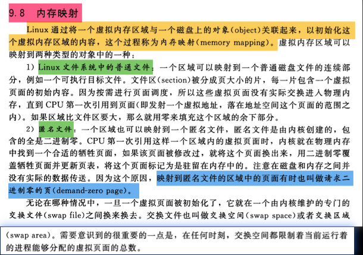 

### 2.1 内存映射函数

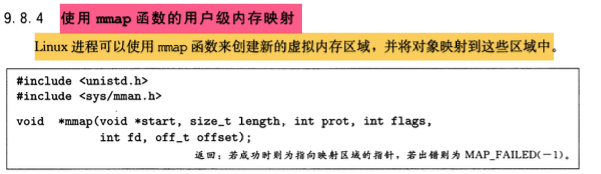 

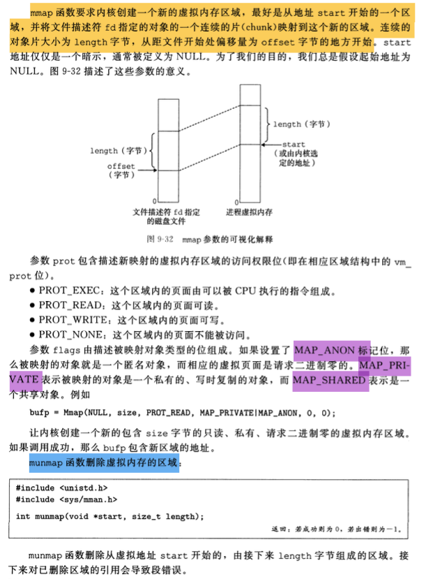 

### 2.2 共享对象

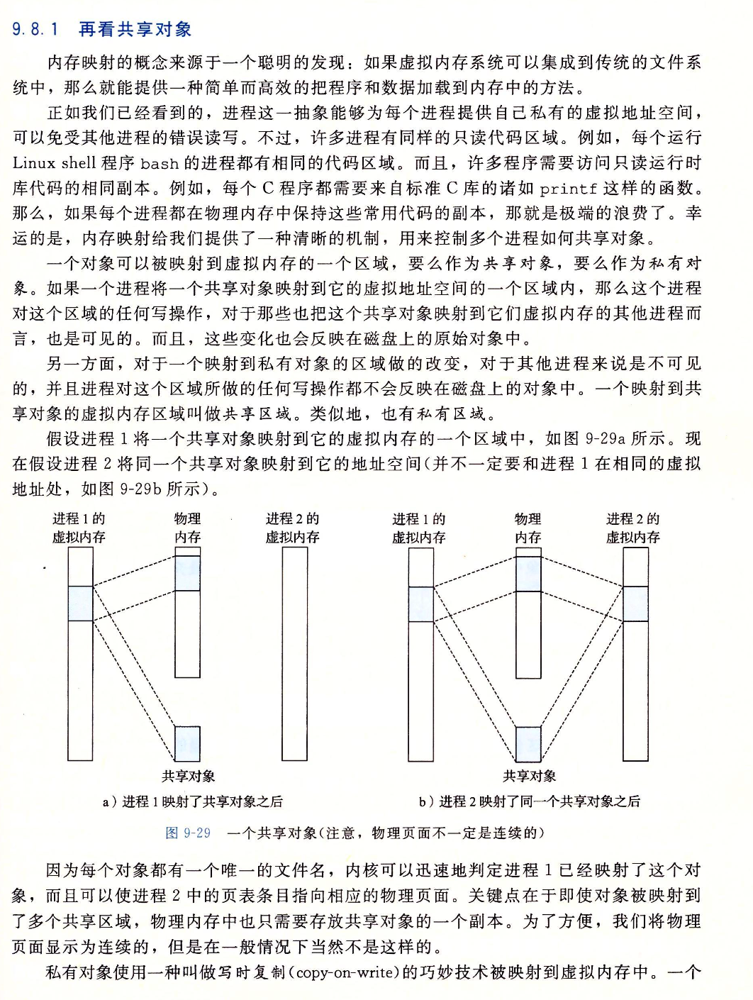  

### 2.3 私有的写时复制对象

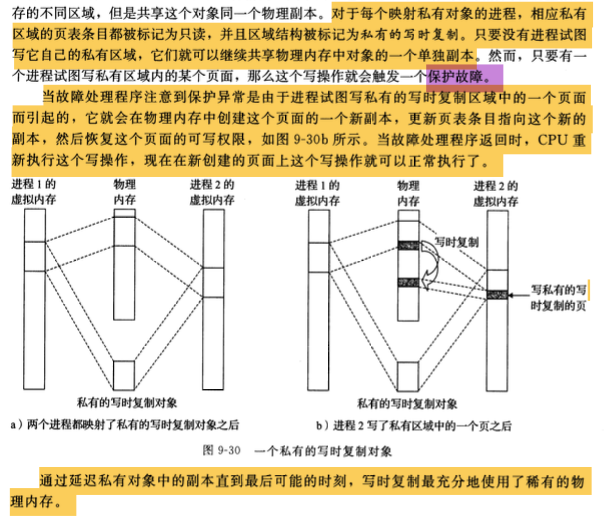 

### 2.4 共享对象和私有的写时复制对象区别

共享对象和私有写时复制对象主要在内存管理和数据共享方面存在区别：

1. 共享对象（Shared Objects）：
   - 在多进程或多线程环境中，共享对象是指多个进程或线程可以访问同一块内存区域的数据。
   - 这种情况下，所有访问者看到的是同一份数据，修改操作会影响到所有能够访问该对象的进程或线程。
   - 共享对象通常用于减少内存消耗和提高数据共享的效率，但需要适当的同步机制（如锁、信号量等）来保证数据的一致性和避免竞态条件。
2. 私有写时复制对象（Private Copy-on-Write Objects）：
   - 在多进程或多线程环境中，每个进程或线程最初都有一个对象的私有副本。
   - 当某个进程或线程试图修改其私有副本时，系统会检测到这个写操作，并在必要时创建一个新的副本，确保修改不会影响到其他进程或线程的副本。
   - 这种机制被称为“写时复制”（Copy-On-Write, COW），因为它只有在发生写操作时才会进行复制，从而节省了不必要的内存复制开销。
   - 私有写时复制对象可以简化同步问题，因为每个进程或线程都拥有独立的数据副本，但可能会增加内存使用量，尤其是在大量写操作发生的情况下。

总结起来，共享对象强调数据的共享和内存的高效使用，但需要额外的同步机制来管理并发访问；而私有写时复制对象则通过延迟复制来平衡内存使用和数据隔离，简化了同步问题，但在写操作频繁的情况下可能会导致更多的内存分配和复制操作。选择哪种方式取决于具体的应用场景和需求。

### 2.5 fork函数原理

当`fork`函数被当前进程调用时，内核为新进程创建各种数据结构，并分配给它一个唯一的PID。为了给这个新进程创建虚拟内存，它创建了当前进程的`mm_struct`、区域结构和页表的原样副本。它将两个进程中的每个页面都标记为只读，并将两个进程中的每个区域结构都标记为私有的写时复制。

当`fork`在新进程返回时，新进程现在的虚拟内存刚好和调用`fork`时存在的虚拟内存相同。当这两个进程中的任一个后来进行写操作时，写时复制机制就会创建新页面，因此，也就为每个进程保持了私有地址空间的抽象概念。

### 2.6 execve函数原理

假设运行在当前进程中的程序执行如下的`execve`调用：

```bash
execve("a.out", NULL, NULL);
```

`execve`函数在当前进程中加载并运行包含在可执行目标文件`a.out`中的程序，用`a.out`程序有效地替代了当前程序。加载并运行`a.out`需要以下几个步骤：

+ 删除已存在的用户区域。删除当前进程虚拟地址的用户部分中的已存在的区域结构。
+ 映射私有区域。为新程序的代码、数据、`bss`和栈区域创建新的区域结构。所有这些新的区域都是私有的、写时复制的。代码和数据区域被映射为`a.out`文件中的`.text`和`.data`区。`bss`区域是请求二进制零的，映射到匿名文件，其大小包含在`a.out`中。栈和堆区域也是请求二进制零的，初始长度为零。
+ 映射共享区域。如果`a.out`程序与共享对象（或目标）链接，比如标准C库`libc.so`，那么这些对象都是动态链接到这个程序的，然后再映射到用户虚拟地址空间中的共享区域内。
+ 设置程序计数器（PC）。`execve`的最后一件事情就是设置当前进程上下文中的程序计数器，使之指向代码区域的入口点。

下一次调度这个进程时，它将从这个入口点开始执行。Linux将根据需要换入代码和数据页面。

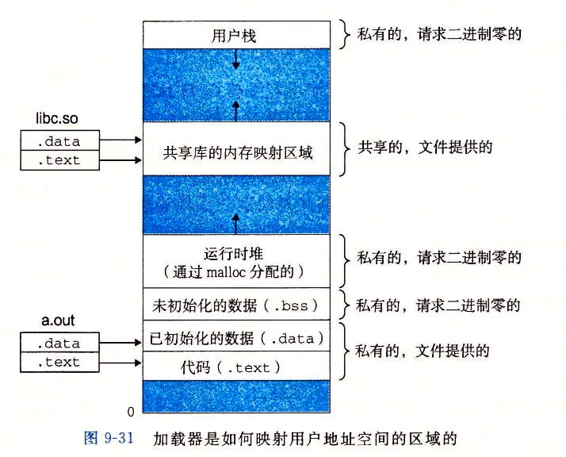 

## 3. 动态内存分配

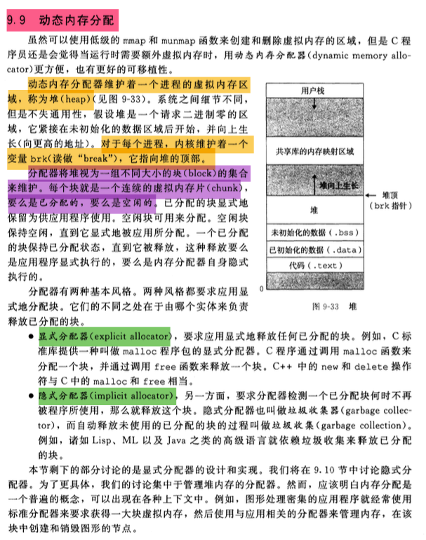 

## 4. malloc和free函数

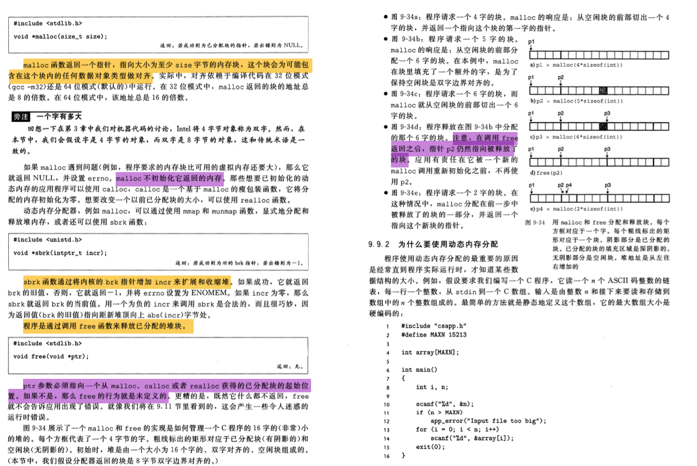 

## 5. 为什么要使用动态内存分配

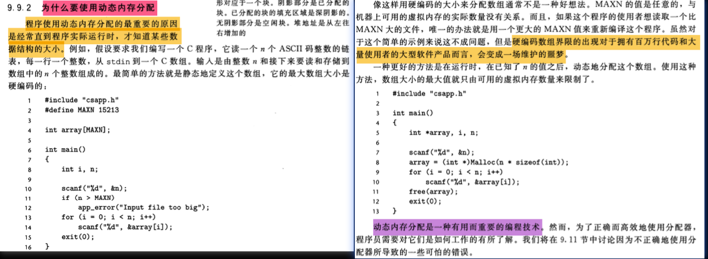 

## 6. 分配器的要求和目标

 

## 7. 碎片

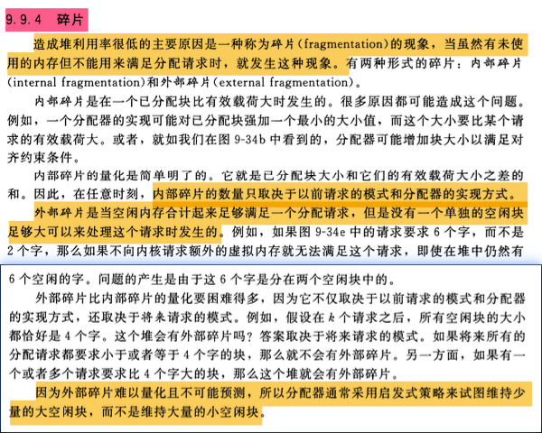 

内部碎片和外部碎片是计算机内存管理中常见的两种不同类型的资源浪费现象。

1. **内部碎片**： 内部碎片是指在分配给一个进程或程序的内存块中，由于分配策略或者内存块大小与实际需求不完全匹配，导致部分内存空间未被有效利用的情况。例如，如果一个程序需要500字节的内存，但操作系统最小分配单位是1000字节，那么即使程序只需要500字节，也会分配1000字节的内存给它。这额外的500字节就是内部碎片。内部碎片主要出现在固定分区分配和分页式存储管理中。
2. **外部碎片**： 外部碎片是指在内存中存在一些小的、不连续的空闲区域，这些区域由于太小而无法满足任何进程的内存请求，因此被视为不可用，尽管它们加起来可能足以满足某个进程的需求。外部碎片主要出现在可变分区分配和段式存储管理中。当系统不断地分配和释放内存时，可能会导致内存空间变得支离破碎，形成许多小的、无法使用的空闲区域。

这两种碎片都会导致内存资源的浪费，降低系统的内存利用率。为了解决这些问题，现代操作系统采用了各种技术和策略，如紧凑技术、分页与分段结合的混合存储管理、动态内存分配算法等，来减少或消除内部碎片和外部碎片的影响。

## 8. 实现问题

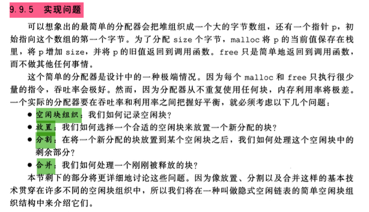 

## 9. 隐式空闲链表

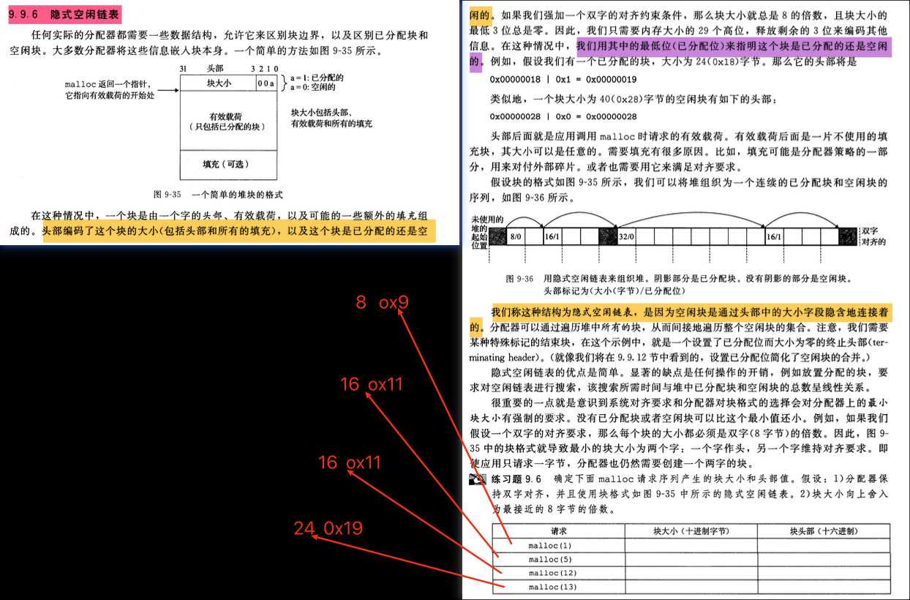 

## 10. 放置已分配的块

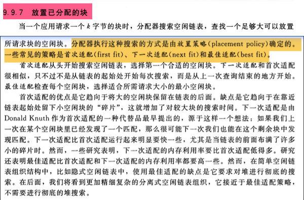 

## 11. 分割空闲块

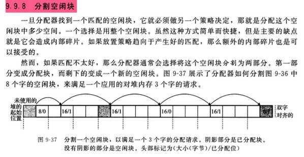 

## 12. 获取额外的堆内存

 

## 13. 合并空闲块

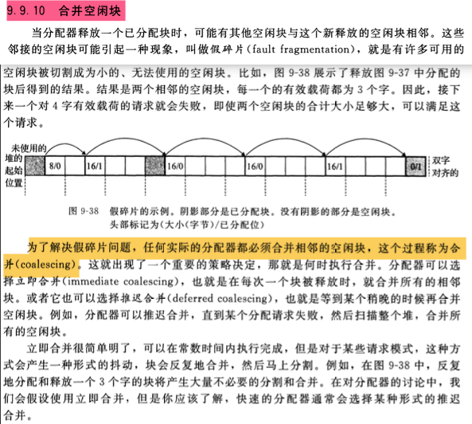 

## 14. 带边界标志的合并

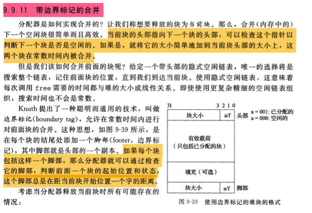 

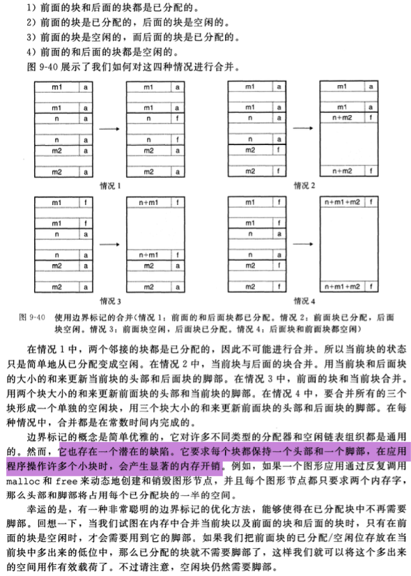 