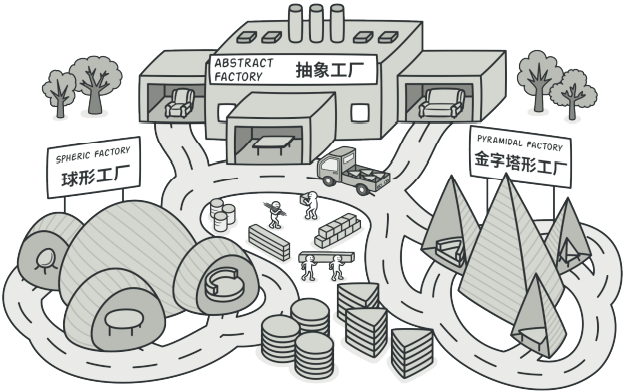
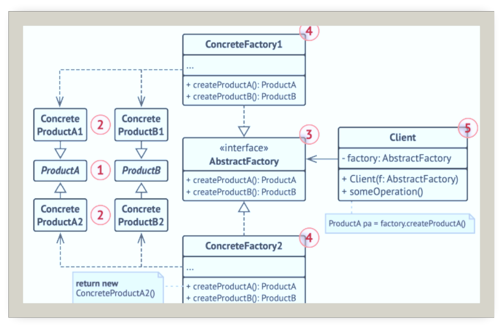
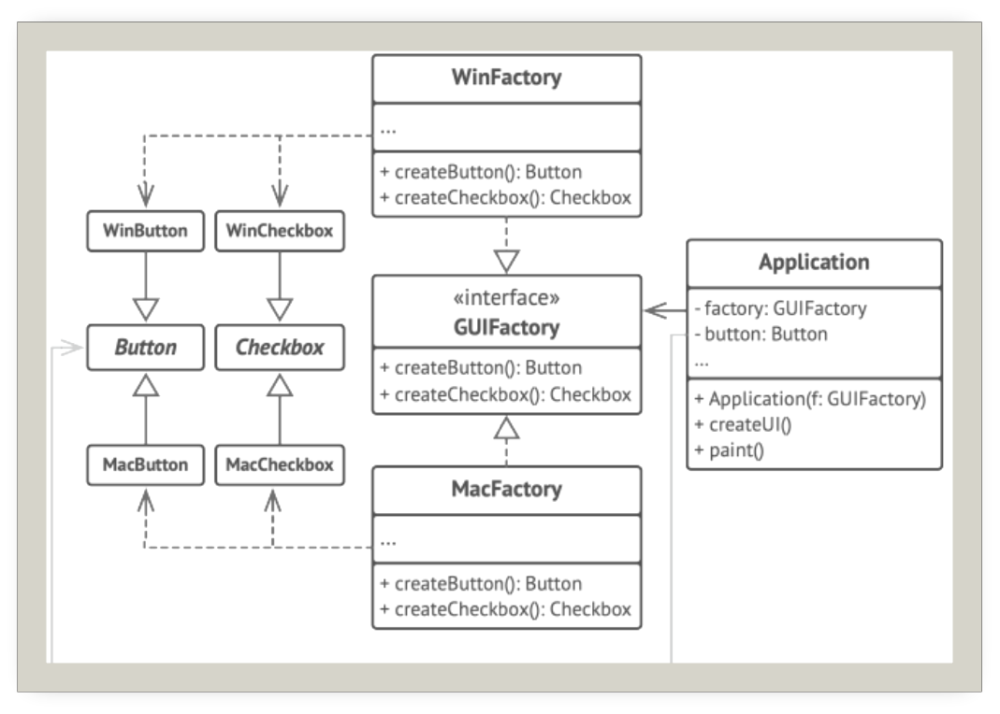

# 抽象工厂

## 引入

分类：(对象)创建型

问题：家具店里有沙发、椅子、茶几等产品。产品有不同风格，如现代、北欧、工业。希望确保客户收到的产品风格统一，并可以方便的添加新产品和风格。

解决办法：提供一个创建一系列相关或相互依赖对象的接口，而无需指定他们具体的类。

 

## 设计图

 

1. 抽象产品(Abstract Product)构成系列产品的一组不同但相关的产品声明接口
2. 具体产品(Concrete Product)抽象产品的多种不同类型实现
3. 抽象工厂(Abstract Factory)声明了一组创建各种抽象产品的方法
4. 具体工厂(Concrete Factory)实现抽象工厂的构建方法
5. 客户端(Client)只需通过抽象接口调用工厂和产品对象

## 自己的代码实现

```c++
#include <iostream>

class Chair {
public:
    virtual ~Chair(){}
    virtual void sitOn() const = 0;
};
class ModernChair:public Chair {
public:
    virtual ~ModernChair() {}
    virtual void sitOn() const override {
        std::cout << "可以被坐下的ModernChair\n";
    }
};
class ChineseChair :public Chair {
public:
    virtual ~ChineseChair() {}
    virtual void sitOn() const override {
        std::cout << "可以被坐下的ChineseChair\n";
    }
};

class Table {
public:
    virtual ~Table() {}
    virtual void putOn() const = 0;
};
class ModernTable :public Table {
public:
    virtual ~ModernTable() {}
    virtual void putOn() const override {
        std::cout << "ModernTable可以放东西\n";
    }
};
class ChineseTable :public Table {
public:
    virtual ~ChineseTable() {}
    virtual void putOn() const override {
        std::cout << "ChineseTable可以放东西\n";
    }
};
class FurnitureFacotry {//抽象工厂
public:
    virtual Chair* createChair() const = 0;
    virtual Table* createTable() const = 0;
};
class ModernStyleFactory:public FurnitureFacotry {
public:
    virtual Chair* createChair() const override{
        return new ModernChair();
    }
    virtual Table* createTable() const override {
        return new ModernTable();
    }
};
class ChineseStyleFactory :public FurnitureFacotry {
public:
    virtual Chair* createChair() const override {
        return new ChineseChair();
    }
    virtual Table* createTable() const override {
        return new ChineseTable();
    }
};
class Client {
private:
    FurnitureFacotry* m_factory;
public:
    Client(FurnitureFacotry* factory){
        setFacotry(factory);
    }
    void buyFurniture() {
        Chair* chair = m_factory->createChair();
        Table* table = m_factory->createTable();
        chair->sitOn();
        table->putOn();
        delete chair;
        delete table;
    }

    void setFacotry(FurnitureFacotry* factory) {
        m_factory = factory;
    }
};
int main()
{
    ModernStyleFactory modernFactory;
    Client client(&modernFactory);
    client.buyFurniture();

    ChineseStyleFactory chineseFactory;
    client.setFacotry(&chineseFactory);
    client.buyFurniture();
}
```

## 扩展

跨平台UI类：使得客户端代码无需与具体的UI类耦合，就能创建跨平台的UI元素，同时确保所创建的元素与指定的操作系统匹配。

 

## 缺点

在产品族中扩展新的产品需要修改抽象工厂的接口代码。