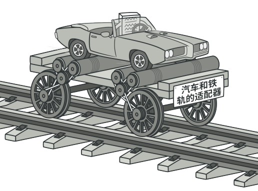
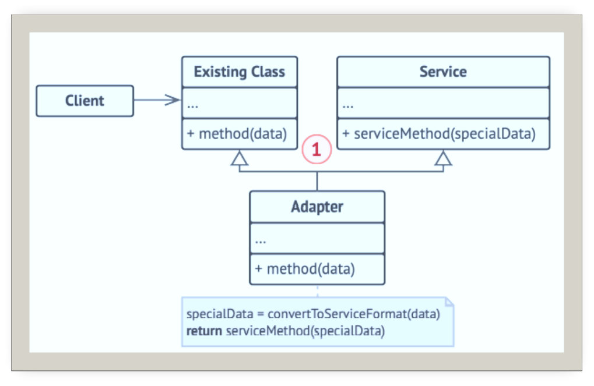
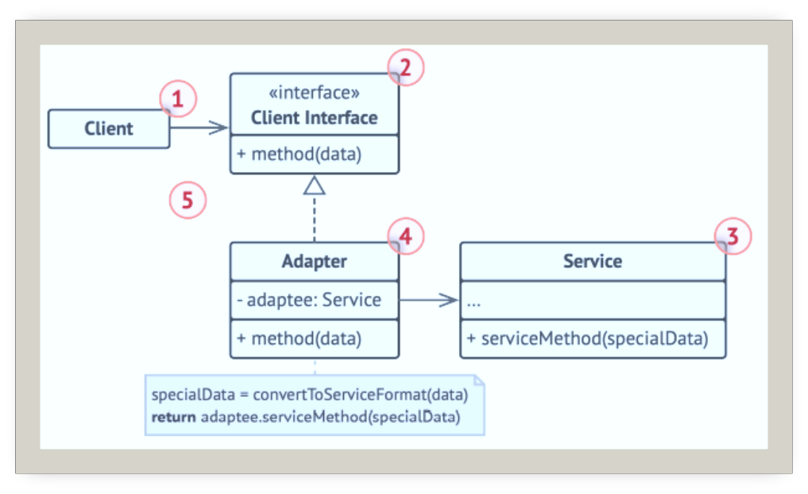
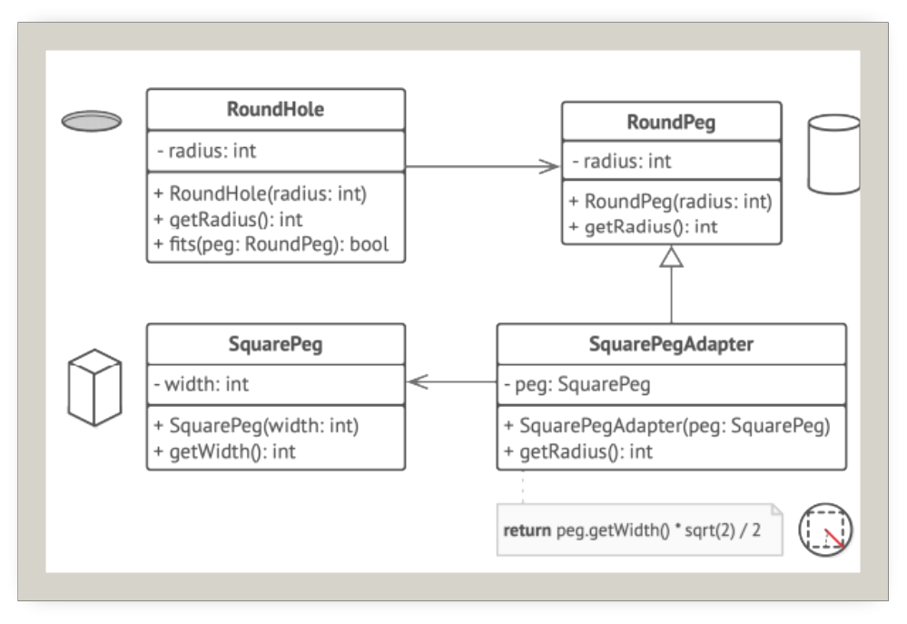

# 适配器

## 引入

分类：(类)结构型、(对象)结构型

问题：开发一款股票市场监测程序，会从不同来源下载XML格式的股票数据，然后向用户呈现出分析图表。但是，分析函数库只兼容JSON格式的数据。

解决方案：将一个类的接口转换为客户希望的另一个接口。使得本来不兼容的一些类可以一起工作。即创建一个适配器。这是一个特殊的对象，能够转换对象接口。

 

## 设计图

 

1. 类适配器不需要封装任何对象，因为它同时继承了客户端和服务的行为。

 

1. 客户端(Client)：是包含当前程序业务逻辑的类
2. 客户端接口(Client Interface)：描述了其他类与客户端代码合作时必须遵守的协议
3. 服务(Service)：有一些功能类，客户端与其接口不兼容
4. 适配器(Adapter)：是一个可以同时与客户端和服务交互的类：它在实现客户端接口的同时封装了服务对象。
5. 客户端代码只需通过接口与适配器交互即可。无需与具体的适配器类耦合。

## 自己实现的代码

```c++
#include <iostream>

//Target:客户端需要的目标接口
class JasonInfo {
public:
    virtual ~JasonInfo(){}

    virtual std::string request() const {
        return "Some Jason information.......";
    }
};

//Adaptee:客户端不兼容的接口，需要转换为Target接口
class XmlInfo {
public:
    std::string specialRequest() const {
        return "Some Xml information.......";
    }
};

//Adaptor:适配器，就是把Adaptee包装起来，让他看上去像是Target
class XmlJasonAdapter :public JasonInfo {
private:
    XmlInfo* m_adaptee;
public:
    XmlJasonAdapter(XmlInfo* adaptee) :m_adaptee(adaptee) {}

    virtual std::string request() const override{
        std::string string=m_adaptee->specialRequest();
        return "Jason<-XmlJasonAdaptor<-"+ string;
    }
};

void clientCode(const JasonInfo* info) {
    
    std::cout << "股票分析软件运行Jason：" <<
        info->request()<<std::endl;
    std::cout << "----------------------------------------\n";
}
int main()
{
    JasonInfo jasonInfo;
    clientCode(&jasonInfo);
    XmlInfo xmlInfo;
    XmlJasonAdapter jasonAdpater(&xmlInfo);
    clientCode(&jasonAdpater);
}
```

## 扩展

 

优点：

+ 单一职责原则：可以将接口或数据转换代码从程序主要业务逻辑中分离
+ 开闭原则：只要客户端代码通过客户端接口与适配器进行交互，你就能在不修改现有客户端代码的情况下在程序中添加新类型的适配器。

## 缺点

代码整体复杂度增加，因为需要增加一系列接口和类，有时直接更改服务类使其与其他代码兼容会更简单。

