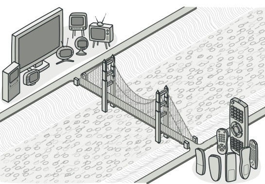
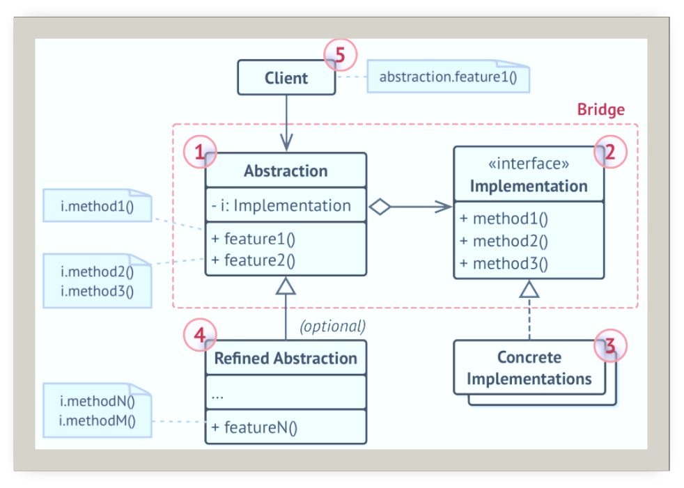
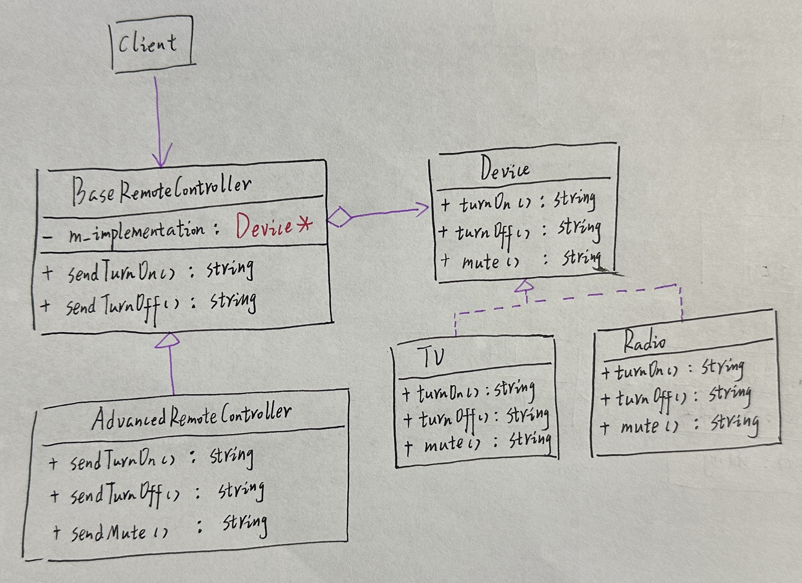
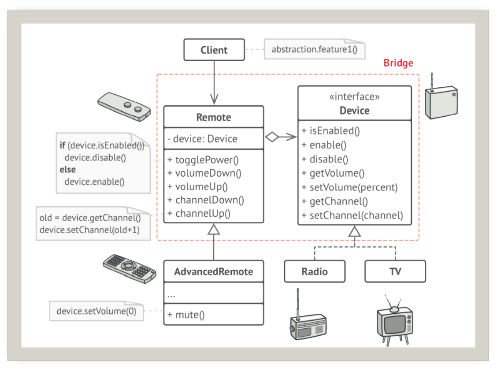

# 桥梁

## 引入

分类：(对象)结构型

问题：遥控器和控制的设备属于同一个商品的组成部分。需要一个类能描述这样的商品，描述不同的遥控器和设备。

解决方案：将抽象部分与它的实现部分分离，使它们都可以独立的变化，即使用组合的方式代替继承，将一个类层次转化为多个相关的类层次，避免单个类层次的失控，在抽象和实现间架起一座桥梁。

 

## 设计图

 

1. 抽象部分(Abstraction)：提供高层控制逻辑，依赖于完成底层实际工作的实现对象
2. 实现部分(Implementation)：为所有具体实现声明通用接口
3. 具体实现(Concrete Implementation)：特定于平台的实现代码
4. 精确抽象(Refined Abstraction)：提供控制逻辑的变体
5. 客户端(Client)：仅关心如何与抽象部分合作。但是，**客户端需要将抽象对象与一个实现对象连接起来**

## 自己实现的代码

 

```c++
/* ************************************************************************
> File Name:     Bridge.cpp
> Author:        niu0217
> Created Time:  Mon 12 Feb 2024 11:49:04 AM CST
> Description:
 ************************************************************************/

#include <iostream>
#include <string>

//实现
class Device {
public:
    virtual ~Device(){}
    virtual std::string turnOn() const = 0;
    virtual std::string turnOff() const = 0;
    virtual std::string mute() const = 0;
};
class TV : public Device {
public:
    ~TV(){}
    std::string turnOn() const override{
        return "TV:开机...\n";
    }
    std::string turnOff() const override {
        return "TV:关机...\n";
    }
    std::string mute() const override {
        return "TV:静音...\n";
    }
};
class Radio : public Device {
public:
    ~Radio() {}
    std::string turnOn() const override {
        return "Radio:开机...\n";
    }
    std::string turnOff() const override {
        return "Radio:关机...\n";
    }
    std::string mute()const override {
        return "Radio:静音...\n";
    }
};

//抽象
class BaseRemoteController {
protected:
    Device* m_implementation;
public:
    ~BaseRemoteController(){}
    BaseRemoteController(Device* implementation) :m_implementation(implementation){
    }
public:
    virtual std::string sendTurnOn() {
       return "基础遥控器发出TurnOn：" + m_implementation->turnOn();
    }
    virtual std::string sendTurnOff() {
        return "基础遥控器发出TurnOff：" + m_implementation->turnOff();
    }
};
class AdvancedRemoteController : public BaseRemoteController {
public:
    ~AdvancedRemoteController() {}
    AdvancedRemoteController(Device* implementation) :BaseRemoteController(implementation) {
    }
public:
    virtual std::string sendTurnOn() override {
        return "高级遥控器发出TurnOn：" + m_implementation->turnOn();
    }
    virtual std::string sendTurnOff() override {
        return "高级遥控器发出TurnOff：" + m_implementation->turnOff();
    }
    virtual std::string sendMute() {
        return "高级遥控器发出Mute：" + m_implementation->mute();
    }
};
int main()
{
    Radio radio;
    BaseRemoteController baseRC(&radio);
    std::cout<<baseRC.sendTurnOn();
    std::cout << baseRC.sendTurnOff();
    std::cout << "---------------------------------------------\n";
    AdvancedRemoteController advancedRC(&radio);
    std::cout << advancedRC.sendTurnOn();
    std::cout << advancedRC.sendMute();
    std::cout << advancedRC.sendTurnOff();
}
```

## 扩展

设备Device类作为实现部分，而遥控器Remote类则作为抽象部分

 

+ 可以创建与平台无关的类和程序
+ 客户端代码仅与高层抽象部分进行互动，不会接触到平台的详细信息。
+ 开闭原则：可以新增抽象部分和实现部分，且它们之间不会相互影响
+ 单一职责原则：抽象部分专注于处理高层逻辑，实现部分处理平台细节

## 缺点

对高内聚的类使用该模式可能会让代码更加复杂。