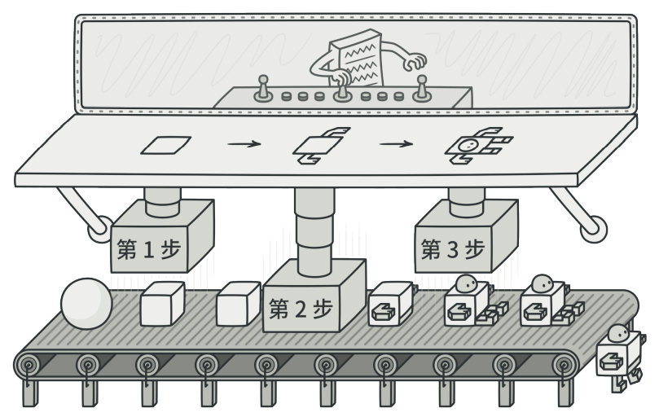
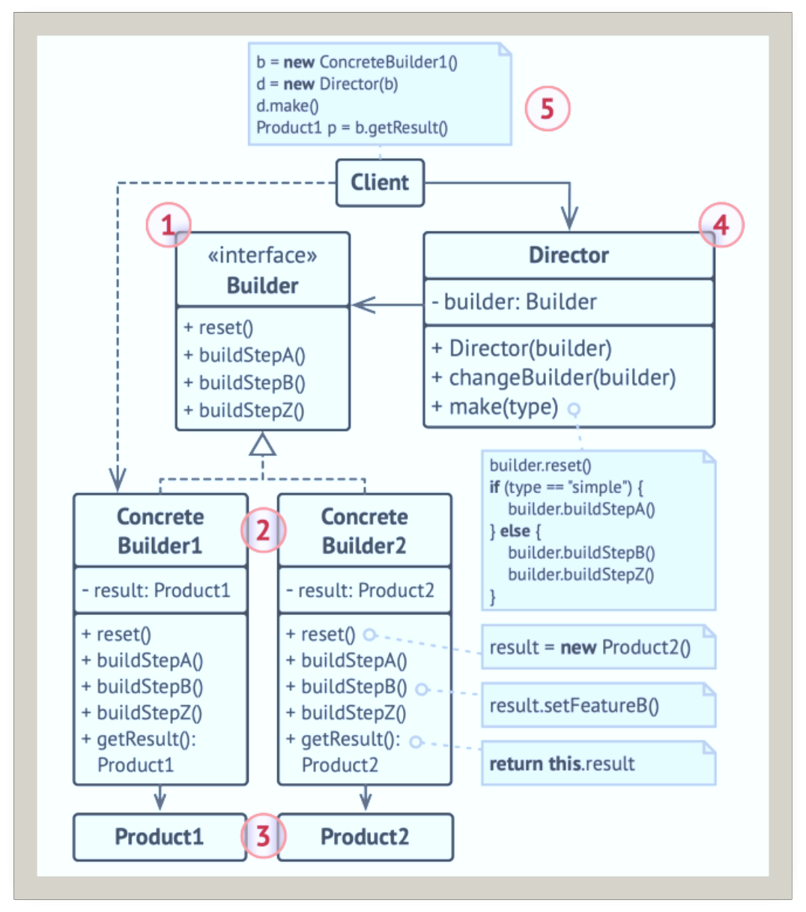
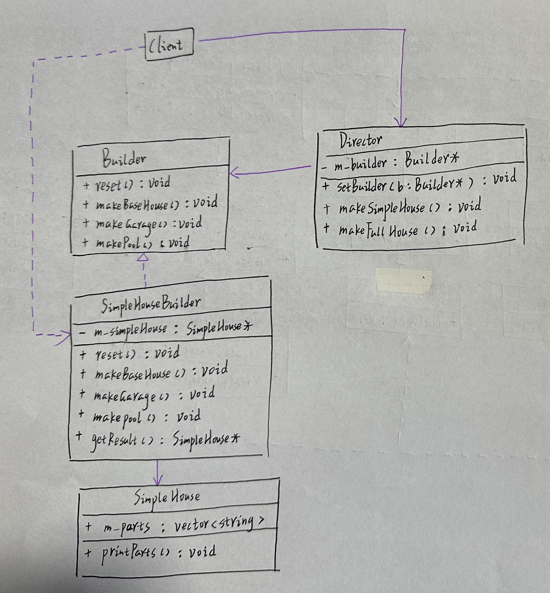
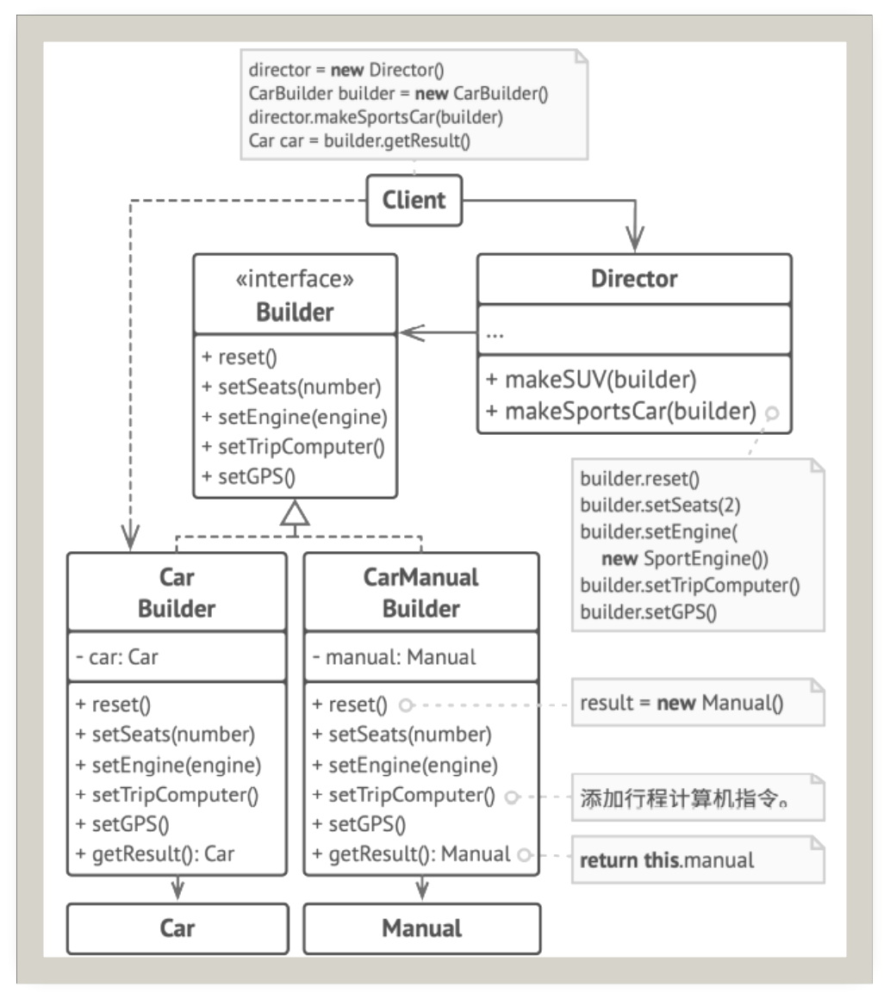

# 生成器

## 引入

分类：(对象)创建型

问题：

+ 构建一个房屋，需要考虑是否有车库，游泳池，花园，雕塑等，需要对诸多成员变量进行初始化工作。都写在构造函数里？每种可能都创建一个新的类？
+ 相同的步骤需要能够产生不同的产品，例如使用木头和玻璃盖出来的是普通住房，用黄金和水晶建造出来的是宫殿。

解决方案：将一个复杂对象的构建与它的表示分离，使得同样的构建过程可以创建不同的表示。即将对象构造代码从产品类中抽取出来，并将其放在一个名为Builder的独立对象中。

 

## 设计图

 

1. 生成器(Builder)：声明通用的产品构造步骤
2. 具体生成器(Concrete Builders)：提供构造过程的不同实现。具体生成器也可以构造不遵循通用接口的代码
3. 产品(Products)：最终生成的对象，由不同生成器构造的产品无需属于同一类层次结构或接口
4. 主管(Director)：定义调用构造步骤的顺序，这样你就可以创建和复用特定的产品配置
5. 客户端(Client)：必须将某个生成器对象与主管类关联。一般情况下，只需通过主管类构造函数的参数进行一次性关联即可。

程序中并不一定需要主管类。客户端代码可以直接以特定顺序调用创建步骤。不过，主管类非常适合放入各种例行构造流程，以便在程序中反复使用。

不同于其他创造模式，不同的ConcreteBuilder可以生成不相关的产品。Product1和Product2可以不遵循相同的接口。因此在C++这样的静态类型语言中，getResult方法不能放到Builder接口里。

## 自己的代码实现

 

```c++
/* ************************************************************************
> File Name:     Builder.cpp
> Author:        niu0217
> Created Time:  Mon 12 Feb 2024 11:30:11 AM CST
> Description:
 ************************************************************************/

#include <iostream>
#include <vector>
#include <string>
//产品1
class SimpleHouse{
public:
    std::vector<std::string> m_parts;
    void printParts() const {
        std::cout << "SimpleHouse 包括：\n";
        for (int i = 0; i < m_parts.size(); ++i) {
            std::cout << m_parts[i] << std::endl;
        }
        std::cout << "----------------------\n";
    }
};

class Builder {
public:
    virtual ~Builder(){}
    virtual void reset() = 0;
    virtual void makeBaseHouse() = 0;
    virtual void makeGarage() = 0;
    virtual void makePool() = 0;
};
//concreteBuilder1，施工队
class SimpleHouseBuilder : public Builder {
private:
    SimpleHouse* m_simplehouse;
public:
    SimpleHouseBuilder() {
        reset();
    }
    ~SimpleHouseBuilder() { delete m_simplehouse; }
    void reset() override{
        m_simplehouse = new SimpleHouse();
    }
    virtual void makeBaseHouse() override{
        m_simplehouse->m_parts.push_back("BaseHouse");
    }
    virtual void makeGarage() override {
        m_simplehouse->m_parts.push_back("Garage");
    }
    virtual void makePool() override {
        m_simplehouse->m_parts.push_back("Pool");
    }

    SimpleHouse* getResult() {
        SimpleHouse* result = m_simplehouse;
        reset();
        return result;
    }
};
//主管：负责流程
class Director {
private:
    Builder* m_builder;
public:
    void setBuilder(Builder* builder) {
        m_builder = builder;
    }
    void makeSimpleHouse() {
        m_builder->makeBaseHouse();
        m_builder->makeGarage();
    }
    void makeFullFuncHouse() {
        m_builder->makeBaseHouse();
        m_builder->makeGarage();
        m_builder->makePool();
    }
};
void client(Director* director) {
    std::cout << "客户自己设计流程：---------------------\n";
    SimpleHouseBuilder* builder = new SimpleHouseBuilder();
    builder->makeBaseHouse();
    builder->makeGarage();
    SimpleHouse * simpleHouse= builder->getResult();
    simpleHouse->printParts();
    delete simpleHouse;
    std::cout << "主管负责设计流程：---------------------\n";
    director->setBuilder(builder);
    director->makeFullFuncHouse();
    simpleHouse = builder->getResult();
    simpleHouse->printParts();
    delete simpleHouse;
    delete builder;
}
int main()
{
    Director director;
    client(&director);
}
```

## 扩展

如何复用相同的对象构造代码来生成不同类型的产品

+ 汽车
+ 汽车的使用手册

 

+ 将对象的构造过程分解到若干个步骤，这就使程序可以更加精细，有效的控制整个对象的构造
+ 生成不同形式的产品时，可以复用相同的制造代码
+ 单一职责原则：可以将复杂构造代码从产品的业务逻辑中分离出来
+ 当增加新的具体生成器时，不必修改主管的代码，满足开闭原则

## 缺点

如果产品之间的差异性很大，则不适合使用Builder模式，使用范围受到一定的限制

