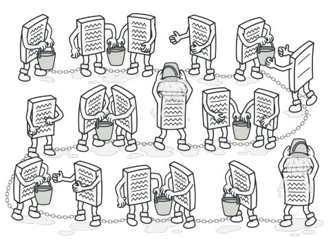
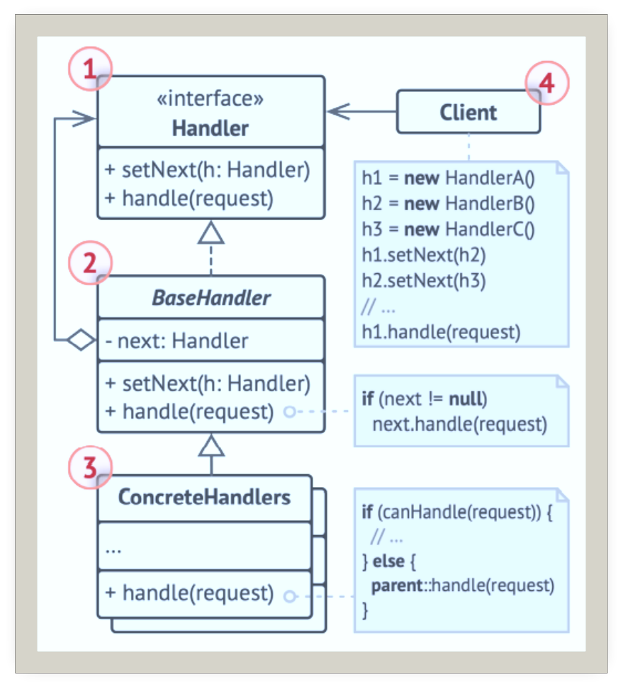
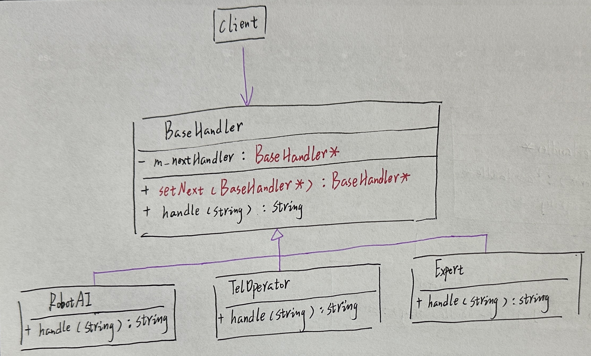
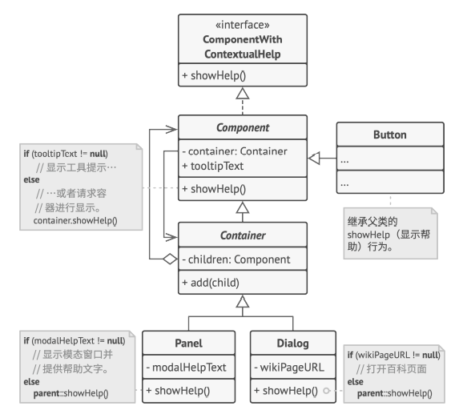

# 职责链

## 引入

分类：(对象)行为型

问题：开发一款故障报修系统，不同的业务员处理的故障不同，如何确保客户的维修请求得到妥善的处理。

解决方案：使多个对象都有机会处理请求，从而避免请求的发送者和接受者之间的耦合关系。将这些对象连成一条链，并沿着这条链传递该请求，直到有一个对象处理它为止。

 

## 设计图

 

## 自己实现的代码

 

```c++
#include <iostream>
#include <string>
#include <list>

//class Handler {
//public:
//    virtual Handler* setNext(Handler* handler) = 0;
//    virtual std::string handle(std::string request) = 0;
//};

class BaseHandler/*:public Handler*/{
private:
    BaseHandler* m_nextHandler = nullptr;
public:
    BaseHandler* setNext(BaseHandler* handler) {
        m_nextHandler = handler;
        return m_nextHandler;
    }
    virtual std::string handle(std::string request) {
        if (m_nextHandler) {
            return m_nextHandler->handle(request);
        }

        return "";
    }
};

class RobotAI :public BaseHandler {
public:
    std::string handle(std::string request) override {
        if (request == "使用向导") {
            return "RobotAI:我来处理-" + request + "-。\n";
        }
        else {
            return BaseHandler::handle(request);
        }
    }
};
class TelOperator :public BaseHandler {
public:
    std::string handle(std::string request) override {
        if (request == "常见问题") {
            return "TelOperator:我来处理-" + request + "-。\n";
        }
        else {
            return BaseHandler::handle(request);
        }
    }
};
class Expert :public BaseHandler {
public:
    std::string handle(std::string request) override {
        if (request == "疑难杂症") {
            return "Expert:我来处理-" + request + "-。\n";
        }
        else {
            return BaseHandler::handle(request);
        }
    }
};

void clientCode(BaseHandler& handler) {
    std::list<std::string> problems = { "疑难杂症","常见问题","使用向导","常见问题","扯淡的问题" };
    for (const std::string& problem : problems) {
        std::string result = handler.handle(problem);
        std::cout << "Client：谁来处理" << problem<<":\n";
        if (result.empty()) {
            std::cout << "处理结果：" << "没人能够处理。\n\n";
        }
        else
        {
            std::cout << "处理结果：" << result<<"\n\n";
        }
    }
}
int main()
{
    RobotAI robot;
    TelOperator telOperator;
    Expert expert;
    robot.setNext(&telOperator)->setNext(&expert);
    std::cout << "Chain：机器人AI->话务员->专家\n";
    clientCode(robot);

    //clientCode(telOperator);
}
```

## 扩展

责任链模式负责为活动的GUI元素显示上下文帮助信息。

 

+ 你可以控制请求处理的顺序。
+ 单一职责原则：你可以对发起操作和执行操作的类进行解耦。
+ 开闭原则：你可以在不更改现有代码的情况下在程序中新增处理者。

## 缺点

部分请求可能未被处理。

