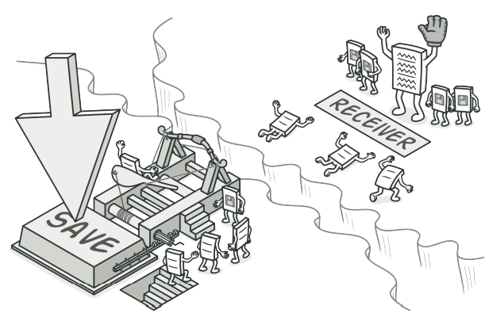
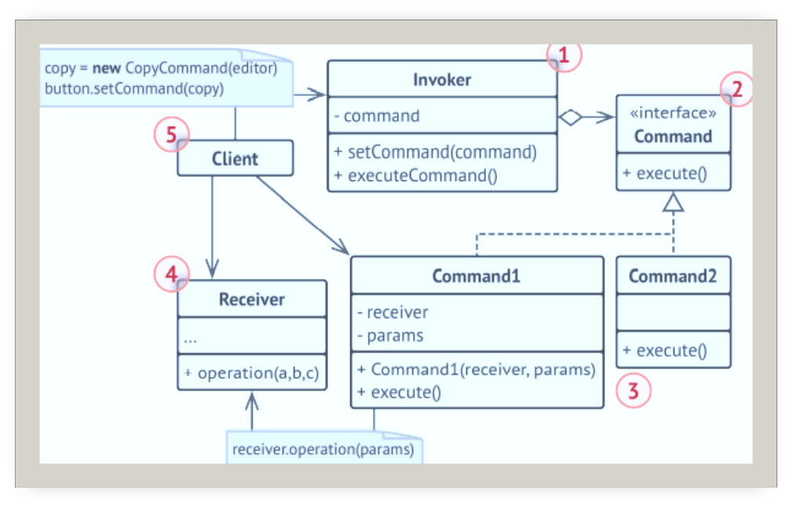
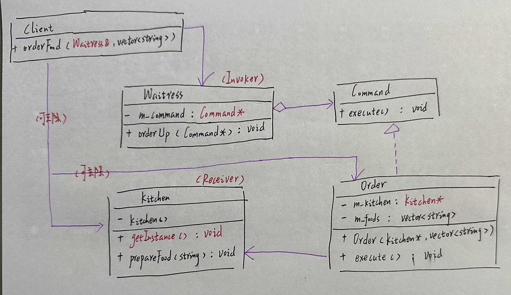
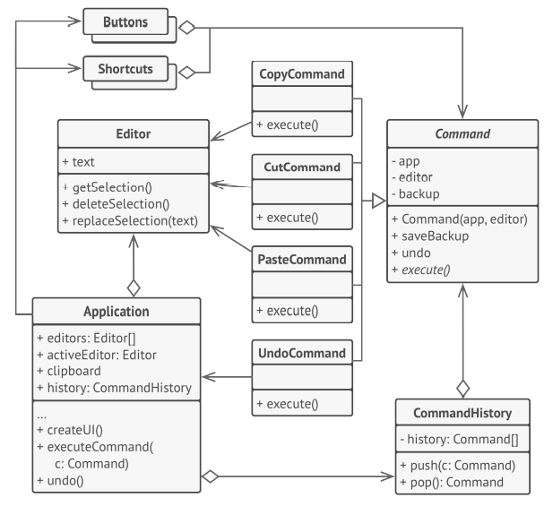

# 命令

## 引入

分类：(对象)行为型

问题：模拟小餐馆点餐，客户提交订单给服务员，服务员将需求提交给大厨，由大厨完成食物的准备工作。

解决方案：将一个请求封装为一个对象，从而可用不同的请求对客户进行参数化。对请求排队或记录请求日志，以及支持可撤销的操作。

 

## 设计图

 

## 自己实现的代码 

 

```c++
#include <iostream>
#include <string>
#include <vector>
//Receiver
class Kitchen {
private:
    Kitchen(){}
public:
    static Kitchen* getInstance() {
        static Kitchen* instance = new Kitchen();
        return instance;
    }

    void prepareFood(const std::string& food) {
        std::cout << "厨房：正在准备(" << food << ".)\n";
    }
};
//
class Command {
public:
    virtual ~Command(){}
    virtual void execute() const = 0;
};
//ConcreteCommand1
class Order :public Command {
private:
    Kitchen* m_kitchen = nullptr;//receiver
    std::vector<std::string> m_foods;//params
public:
    Order(Kitchen* kitchen, std::vector<std::string> foods)
    :m_kitchen(kitchen),m_foods(foods){

    }
    virtual ~Order() {}
    virtual void execute() const override {
        std::cout << "订单：需要厨房进行处理...\n";
        for (const std::string& item : m_foods) {
            m_kitchen->prepareFood(item);
        }
    }
};
//Invoker
class Waitress {
private:
    Command* m_command = nullptr;
public:
    ~Waitress() { delete m_command; }

    void orderUp(Command* command) {
        std::cout << "服务员：...提交订单...\n";
        m_command = command;//用于回收内存
        m_command->execute();
    }
};
//
class Client {
public:
    void orderFood(Waitress& waitress, std::vector<std::string> foods) {
        waitress.orderUp(new Order(Kitchen::getInstance(),foods));
    }
};
int main()
{
    Client Arxibye;
    Waitress waitress;//Invoker
    Arxibye.orderFood(waitress, { "波士顿大龙虾","炒刀削","雪顶咖啡" });
}
```

## 扩展

可以撤销操作的文字编辑器。

 

+ 单一职责原则：可以解耦触发和执行操作的类
+ 开闭原则：在不修改已有客户端代码的情况下在程序中创建新的命令
+ 可以实现撤销和恢复功能
+ 可以实现操作的延迟执行
+ 可以将一组简单命令组合成一个复杂命令

## 缺点

代码可能会变得更加复杂，因为在发送者和接收者之间增加了一个全新的层次。