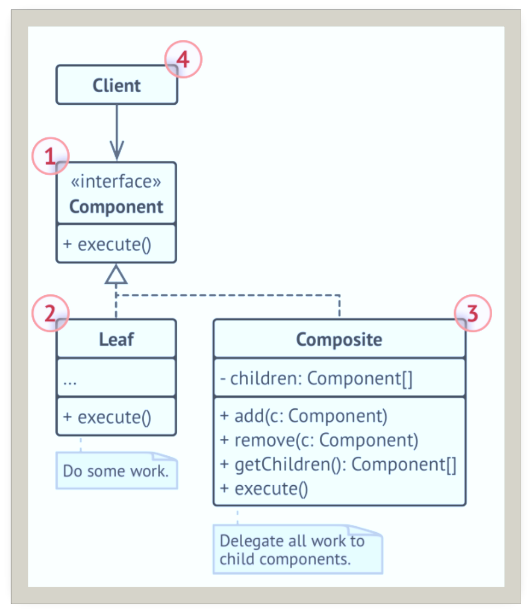
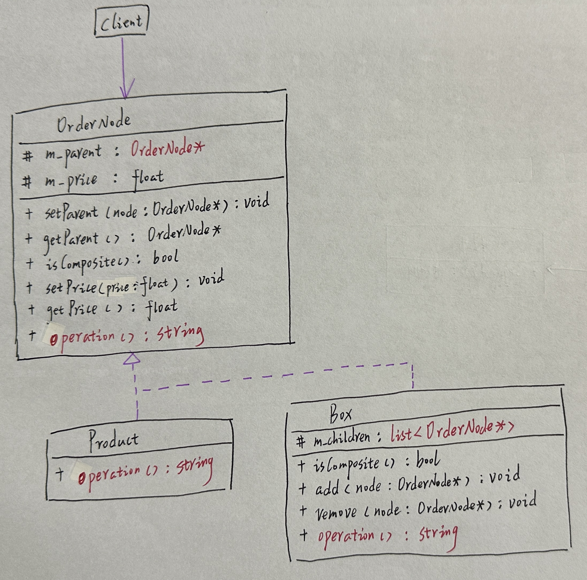

# 组合

## 引入

分类：(对象)结构型

问题：复杂订单的计算，有两类对象：产品和盒子。一个盒子中可以包含多个产品或多个小盒子。这些小盒子同样可以包含一些产品或更小的盒子，以此类推。

解决方案：将对象组成树形结构以表示“部分---整体”的层次结构，使得用户对单个对象和组合对象的使用具有一致性。

 

## 设计图

 

1. 组件(Component)：接口描述了树中简单项目和复杂项目所共有的操作
2. 叶节点(Leaf)：树的基本结构，它不包含子项目
3. 容器(Container)：又名组合，是包含叶节点或其他容器等子项目的单位
4. 客户端(Client)：通过组件接口与所有项目交互

## 自己实现的代码

 

```c++
/* ************************************************************************
> File Name:     Composite.cpp
> Author:        niu0217
> Created Time:  Mon 12 Feb 2024 11:54:09 AM CST
> Description:
 ************************************************************************/

#include <iostream>
#include <list>
#include <string>
//接口：不管是商品还是盒子，都依赖这个接口
class OrderNode {
protected:
    OrderNode* m_parent;
    float m_price;
public:
    virtual ~OrderNode(){}
    OrderNode() :m_parent(nullptr), m_price(0.0f) {

    }
    OrderNode(OrderNode* parent,float price) :m_parent(parent), m_price(price) {

    }
    void setParent(OrderNode* node) { m_parent = node; }
    OrderNode* getParent() { return m_parent; }
    virtual bool isComposite() const { return false; }
    //Add, Remove

    void setPrice(float price) { m_price = price; }
    float getPrice() { return m_price; }
    virtual std::string operation() = 0;
};
//产品
class Product :public OrderNode {
public:
    ~Product(){}
    Product(float price):OrderNode(nullptr,price){}
    virtual std::string operation()override{
        return "产品";
    };
};
//盒子
class Box :public OrderNode {
protected:
    std::list<OrderNode*> m_children;
public:
    ~Box() {}
    Box(){}
    bool isComposite() const override{
        return true;
    }
    void Add(OrderNode* node) {
        m_children.push_back(node);
        node->setParent(this);
        m_price += node->getPrice();
    }
    void Remove(OrderNode* node) {
        m_children.remove(node);//注意：只是从容器里移除。
        node->setParent(nullptr);
        m_price -= node->getPrice();
    }
    virtual std::string operation()override {
        std::string result;
        m_price = 0;
        for (auto c : m_children) {
            if (c == m_children.back()) {
                result += c->operation();
            }
            else {
                result += c->operation()+'+';
            }
            m_price += c->getPrice();
        }
        return "盒子（"+result+")";
    };
};
void clientCode(OrderNode* node) {
    std::cout << "结构:" << node->operation() << std::endl;
    std::cout << "价格:" << node->getPrice();
}
int main()
{
    std::cout << "#处理叶子节点.....\n";
    Product leaf(5.0f);
    clientCode(&leaf);

    std::cout << "\n\n";
    std::cout << "#处理组合节点.....\n";
    Box tree;
    Box branch1;
    Box branch2;
    Product leaf_1(5.0f);
    Product leaf_2(5.0f);
    Product leaf_3(5.0f);
    tree.Add(&branch1);
    tree.Add(&branch2);
    branch1.Add(&leaf_1);
    branch1.Add(&leaf_2);
    branch2.Add(&leaf_3);
    clientCode(&tree);
    std::cout << "\n\n";
    tree.Add(&leaf);
    clientCode(&tree);
    std::cout << "\n\n";
}
```

## 扩展

使用组合模式在图形编辑器中实现一系列的几何图形

 

+ 可以利用多态和递归机制更方便地使用复杂树结构
+ 开闭原则：无需更改现有代码，就可以在应用中添加新元素，使其成为抽象树的一部分

## 缺点

对于功能差异较大的类，提供公共接口或许会有困难，在特定情况下，需要过度一般化组件接口，使其变得令人难以理解。

