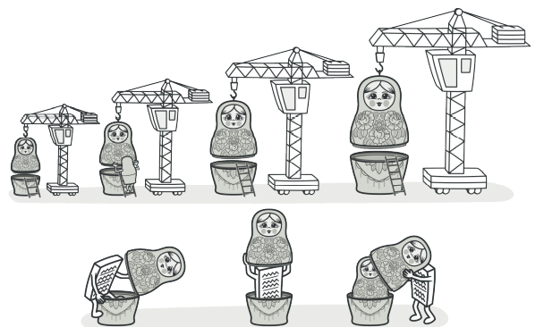
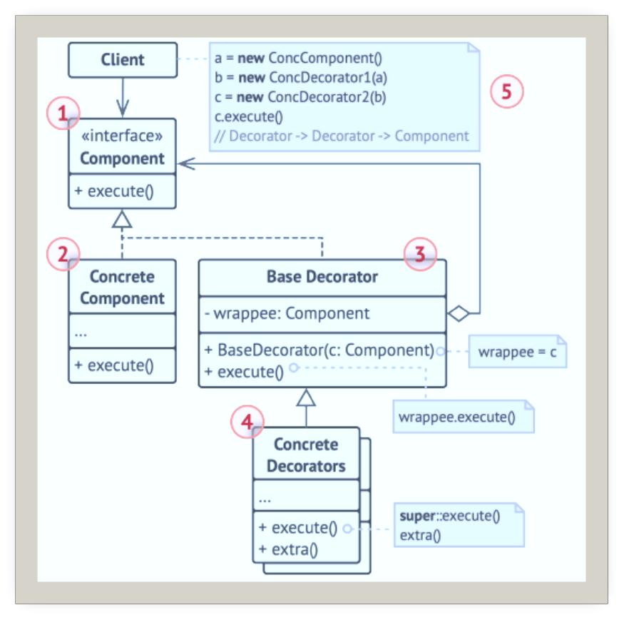
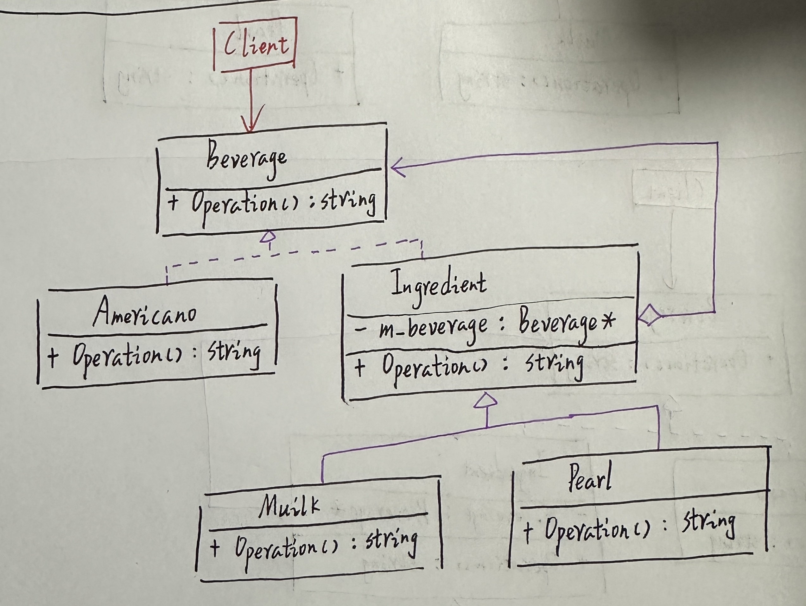
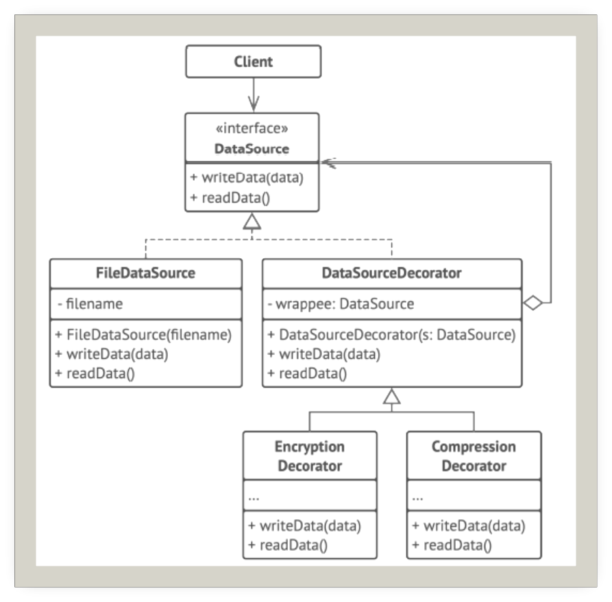

# 装饰

## 引入

分类：(对象)结构型

问题：饮料店订单系统，饮料有很多种，并且可以选择加牛奶、冰淇淋、巧克力等配料。

解决方案：动态地给一个对象添加一些额外的职责。就增加功能来说，装饰模式相比生成子类更为灵活。找出基本组件和可选层次。

 

## 设计图

 

1. 组件(Component)声明封装器和被封装对象的公用接口
2. 具体组件(Concrete Component)类是被封装对象所属的类。它定义了基础行为，但装饰类可以改变这些行为
3. 基础装饰(Base Decorater)类拥有指向被封装对象的引用成员变量。装饰基类会将所有操作委派给被封装的对象
4. 具体装饰类(Concrete Decorator)定义了可动态添加到组件的额外行为。具体装饰类会重写装饰基类的方法，并在调用父类方法之前或之后进行额外的行为
5. 客户端(Client)可以使用多层装饰来封装部件，只要它能使用通用接口与所有对象互动即可。

## 自己实现的代码

 

```c++
#include<iostream>
#include<string>

class Beverage {
public:
    virtual ~Beverage() { }
    virtual std::string operation() const = 0;
};

class Americano : public Beverage {
public:
    ~Americano() { }
    std::string operation() const override {
        return "美式咖啡";
    }
};

class Ingredient : public Beverage {
protected:
    Beverage* m_beverage;
public:
    ~Ingredient() { }
    Ingredient(Beverage* beverage)
        : m_beverage{ beverage } { }
    std::string operation() const override {
        return m_beverage->operation();
    }
};

class Muilk : public Ingredient {
public:
    ~Muilk() { }
    Muilk(Beverage* beverage)
        : Ingredient(beverage) { }
    std::string operation() const {
        return "牛奶(" + Ingredient::operation() + ")";
    }
};

class Pearl : public Ingredient {
public:
    ~Pearl() { }
    Pearl(Beverage* beverage)
        : Ingredient(beverage) { }
    std::string operation() const {
        return "珍珠(" + Ingredient::operation() + ")";
    }
};

void clientCode(Beverage* beverage) {
    std::cout<<"执行结果："<<beverage->operation()<<"\n\n";
}

int main()
{
    std::cout<<"来一杯普通美式咖啡：\n";
    Beverage* americano = new Americano();
    clientCode(americano);

    std::cout<<"来一杯珍珠珍珠牛奶美式咖啡：\n";
    Beverage* muilk = new Muilk(americano);
    Beverage* pearlOne = new Pearl(muilk);
    Beverage* pearlTwo = new Pearl(pearlOne);
    clientCode(pearlTwo);
}
```

## 扩展

使用装饰模式能够对敏感数据进行压缩和加密。

 

+ 无需创建新子类即可扩展对象的行为
+ 可以在运行时添加或删除对象的功能
+ 可以用多个装饰封装对象来组合几种行为
+ 单一职责原则：将实现了许多不同行为的一个大类分为多个较小的类

## 缺点

+ 在封装器栈中删除特定封装器比较困难
+ 实现行为不受装饰栈顺序影响的装饰比较困难
+ 各层的初始化配置代码看上去可能会很糟糕