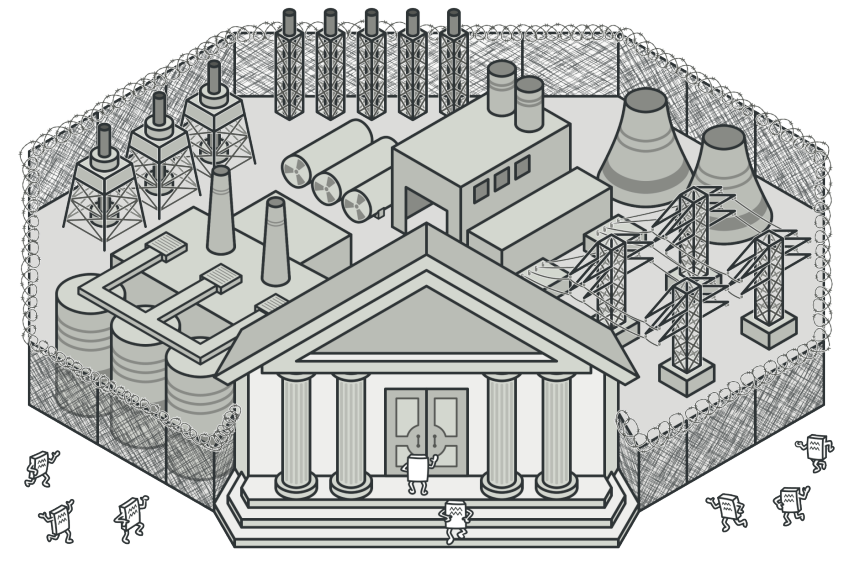

# 外观

## 引入

分类：(对象)结构型

问题：有一套复杂的视频系统，以及一套复杂的音频系统。希望简化使用流程，提供简化的操作面板。

解决方案：为子系统中的一组接口提供一个一致的界面，外观模式定义了一个高层接口，这个接口使得子系统更加容易使用。开放用户真正关心的功能。

 


## 设计图

 

1. 外观(Facade)提供了一种访问特定子系统功能的便捷方式，其了解如何重定向客户端请求，知晓如何操作一切活动部件。
2. 创建附加外观(Additional Facade)类可以避免多种不相关的功能污染单一外观，使其变成又一个复杂结构。客户端和其他外观都可以使用附加外观。
3. 复杂子系统(Complex Subsystem)由数十个不同对象构成。如果要使用这些对象完成有意义的工作，你必须深入了解子系统的实现细节，比如按照正确顺序初始化对象和为其提供正确格式的数据。
4. 客户端(Client)使用外观代替对子系统对象的直接调用。

## 自己实现的代码

 

```c++
#include <iostream>
#include <string>

//子系统1
class VideoSystem {
public:
    std::string initial() const {
        return "视频系统：Ready!\n";
    }
    std::string play() const {
        return "视频系统：Go!\n";
    }
    //.....
    std::string operationX() const {
        return "视频系统：不常用的骚操作!\n";
    }
};
//子系统2
class RadioSystem {
public:
    std::string init() const {
        return "音频系统：就绪!\n";
    }
    std::string play() const {
        return "音频系统：播放!\n";
    }
    //.....
    std::string operationX() const {
        return "音频系统：不常用的骚操作!\n";
    }
    std::string mute() const {
        return "音频系统：静音!\n";
    }
};
//外观
class Controller {
protected:
    VideoSystem* m_video;
    RadioSystem* m_radio;
public:
    Controller(VideoSystem* video = nullptr, RadioSystem* radio = nullptr)
        : m_video{ video ? video : new VideoSystem },
          m_radio{ radio ? radio : new RadioSystem } { }
    ~Controller() {
        delete m_video;
        delete m_radio;
    }
    std::string start() {
        std::string string = "控制器启动系统：\n";
        string += m_video->initial();
        string += m_radio->init();
        string += "控制器播放;\n";
        string += m_video->play();
        string += m_radio->play();
        return string;
    }
    std::string mute() {
        return m_radio->mute();
    }
};
int main()
{
    VideoSystem* video = new VideoSystem;
    RadioSystem* radio = new RadioSystem;
    Controller controller(video, radio);//外观对象，负责回收子系统
    std::cout << controller.start();
}
```

## 扩展

使用单个外观类隔离多层依赖，简化了客户端与复杂视频转换框架之间的交互。

 

+ 可以让自己的代码独立于复杂子系统

## 缺点

外观可能成为与程序中所有类都耦合的上帝对象。

