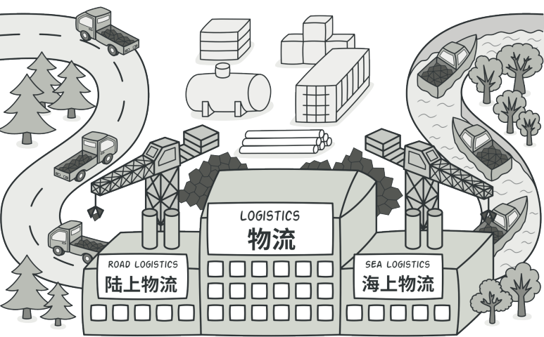
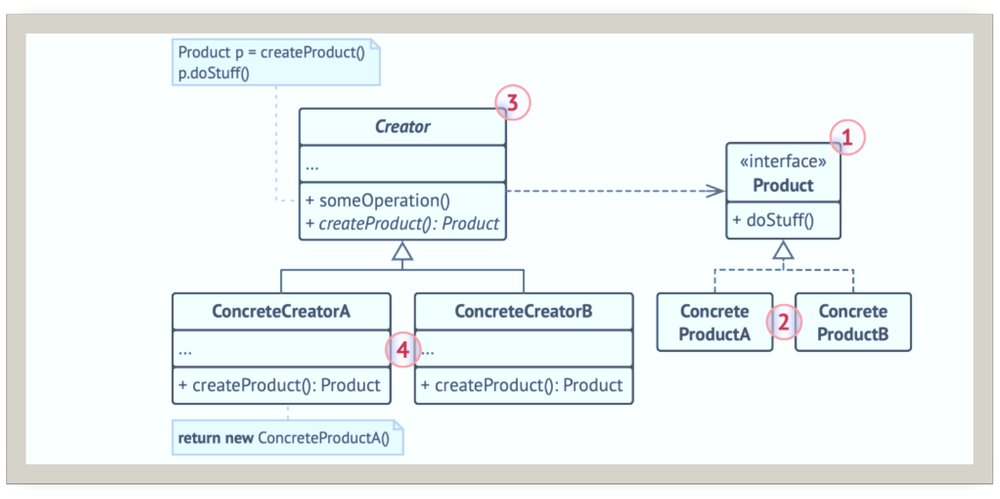
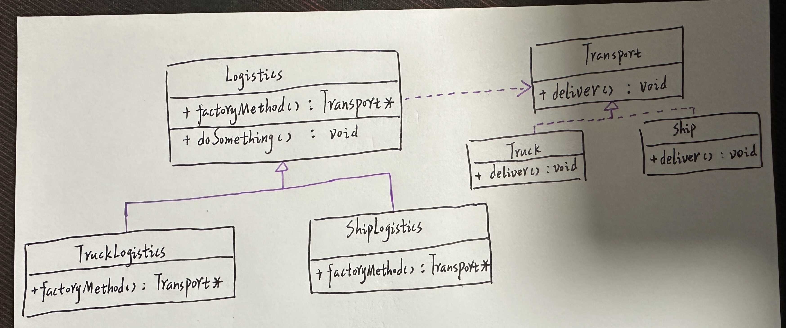
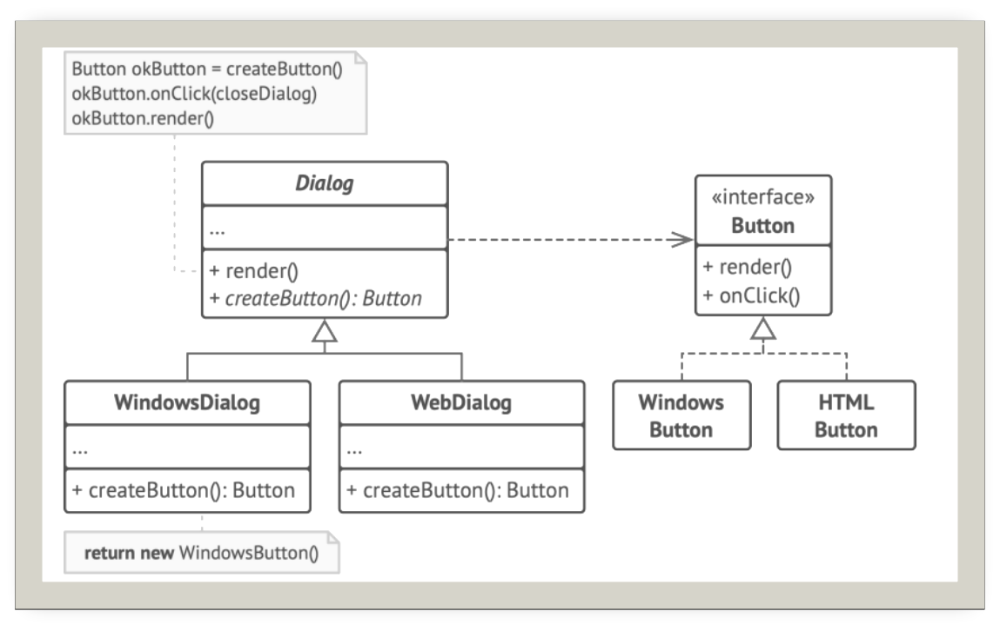

# 工厂方法

## 引入 

分类：（类）创建型。

问题：一个物流公司起初只用卡车运输，现在需要增加轮船运输业务，目前的代码与卡车关联。

解决办法：定义一个用于创建对象的接口，让子类决定实例化哪一个类。Factory Method使一个类的实例化延迟到子类。

 

## 设计图

 

1. 产品(Product)将会对接口进行声明
2. 具体产品(Concrete Products)是产品接口的不同实现
3. 创建者(Creator)声明返回产品对象的工厂方法
4. 具体创建者(Concrete Creators)将会重写基础工厂方法，使其返回不同类型的产品

## 自己的代码实现

 

```c++
#include <iostream>
//产品的接口
class Transport {
public:
    virtual ~Transport(){}
    virtual void deliver() const = 0;
};
//产品A
class Truck:public Transport {
public:
    void deliver() const override{
        std::cout << "卡车运输货物中ing。\n";
    }
};
//产品B
class Ship :public Transport {
public:
    void deliver() const override {
        std::cout << "轮船运输货物中ing。\n";
    }
};
//创造者（注意：除了创建产品以外，创造者还有自己的业务需要处理）
class Logistics {
public:
    virtual ~Logistics(){}
    //工厂方法的核心
    virtual Transport * factoryMethod() const = 0;
    void doSomething() const {
        Transport * transport= factoryMethod();
        transport->deliver();
        delete transport;
    }
};
//具体的创造者A
class TruckLogistis:public Logistics {
public:
    virtual ~TruckLogistis(){}
    virtual Transport* factoryMethod() const override{
        return new Truck();
    }
};
//具体的创造者B
class ShipLogistis :public Logistics {
public:
    virtual ~ShipLogistis() {}
    virtual Transport* factoryMethod() const override {
        return new Ship();
    }
};
int main()
{
    Logistics* truckLogistics = new TruckLogistis();
    Logistics* shipLogistics = new ShipLogistis();

    truckLogistics->doSomething();
    truckLogistics->doSomething();
   
    shipLogistics->doSomething();
    shipLogistics->doSomething();
    shipLogistics->doSomething();
    delete truckLogistics;
    delete shipLogistics;
}
```

## 扩展

跨平台的对话框：在不同的操作系统下，UI组件外观或许有些不同，但是功能保持一致。Windows系统中的按钮在Linux系统中仍然是按钮。如果使用工厂方法，就不需要为每种操作系统重写对话框逻辑。

 

## 缺点

引用工厂模式需要引入许多新的子类，代码可能会因此变得更加复杂，最好的情况是将该模式引入创建者类的现有层次结构中。

