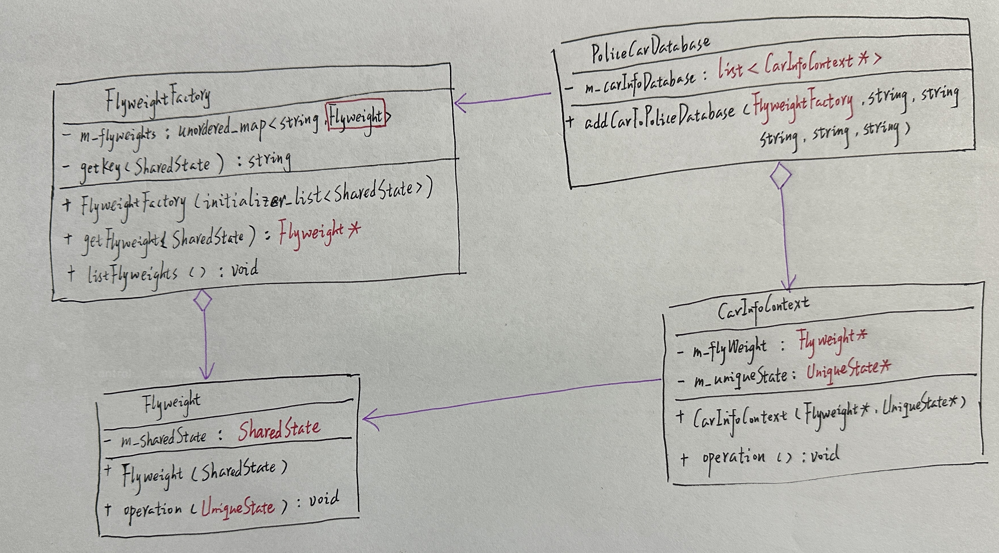

# 享元

## 引入

分类：(对象)结构型

问题：做一个车管所系统，将会产生大量的车辆实体，如果每一个实例都保存自己的所有信息，将会需要大量内存，甚至导致程序崩溃。

解决方案：运用共享技术有效的支持大量细粒度的对象。

 


## 设计图

 

1. 享元模式只是一种优化。只有存在大量类似对象销毁内存的情况，才考虑使用。
2. 享元(Flyweight)类包含原始对象中部分能在多个对象中共享的状态。享元中存储的状态被称为“内在状态”。传递给享元方法的状态被称为“外在状态”。
3. 上下文(Context)类包含原始对象中各不相同的外在状态。上下文与享元对象组合在一起就能表示原始对象的全部状态。
4. 通常情况下，原始对象的行为保留在享元类中。因此调用享元方法必须提供部分外在状态作为参数。但也可将行为移动到上下文类中，将连入的享元作为单纯的数据对象。
5. 客户端(Client)负责计算或存储享元的外在状态。在客户端看来，享元是一种可在运行时进行配置的模版对象，具体的配置方式为向其方法中传入一些上下文数据参数。
6. 享元工厂(Flyweight Factory)会对已有享元的缓存池进行管理。有了工厂后，客户端就无需直接创建享元，只需调用工厂并向其传递目标享元的一些内在状态即可。工厂会根据参数在之前已创建的享元中进行查找，如果找到满足条件的享元就将其返回，如果没有找到就根据参数新建享元。

## 自己实现的代码

 

```c++
#include <iostream>
#include <string>
#include <unordered_map>
#include <list>

using std::string;
//内部状态
struct SharedState {
    string m_brand;
    string m_model;
    string m_color;

    SharedState(const string& brand,const string model,const string color):
        m_brand(brand),m_model(model),m_color(color){}

    friend std::ostream& operator<<(std::ostream& os, const SharedState& ss) {
        return os << "[" << ss.m_brand << "," << ss.m_model << "," << ss.m_color << "]";
    }
};
//外部状态
struct UniqueState
{
    std::string m_owner;
    std::string m_plates;

    UniqueState(const std::string& owner, const std::string& plates)
        : m_owner(owner), m_plates(plates)
    {
    }

    friend std::ostream& operator<<(std::ostream& os, const UniqueState& us)
    {
        return os << "[ " << us.m_owner << " , " << us.m_plates << " ]";
    }
};

//享元，存放共享状态，内部状态
class Flyweight {
private:
    SharedState m_sharedState;
public:
    Flyweight(const SharedState sharedState):m_sharedState(sharedState){}
    void operation(UniqueState uniqueState) const//使用的时候，使用外部状态作为参数，对整个context做出操作
    {
        std::cout << "Flyweight:显示内部状态（"
            << m_sharedState << "),显示外部状态：（"
            << uniqueState << ")\n";
    }
};

class FlyweightFactory {
private:
    std::unordered_map<string, Flyweight> m_flyweights;

    string getKey(const SharedState& ss) const
    {
        return ss.m_brand + "_" + ss.m_model + "_" + ss.m_color;
    }
public:
    FlyweightFactory(std::initializer_list<SharedState> share_states)
    {
        for (const SharedState& ss : share_states) {
            m_flyweights.insert({ getKey(ss),Flyweight(ss) });
        }
    }

    Flyweight* getFlyWeight(const SharedState& shared_state) {
        string key = getKey(shared_state);
        if (m_flyweights.find(key) == m_flyweights.end()) {
            std::cout << "FlyweightFactory:没有找到需要的享元，创建一个新的。\n";
            m_flyweights.insert({ key,shared_state });
        }
        else {
            std::cout << "FlyweightFactory:返回一个现有的享元。\n";
        }
        return &m_flyweights.at(key);
    }

    void listFlyWeights() const
    {
        int count = m_flyweights.size();
        std::cout << "\nFlyweightFactory:我有" << count << "个享元：\n";
        for (std::pair<std::string, Flyweight> item : m_flyweights) {
            std::cout << item.first << "\n";
        }
    }
};

class CarInfoContext {
private:
    Flyweight* m_flyWeight = nullptr;//内部状态
    UniqueState m_uniqueState;//外部状态
public:
    CarInfoContext(Flyweight* flyWeight,const UniqueState * unique_state):
        m_flyWeight(flyWeight),m_uniqueState(*unique_state){}
    void operation() {
        m_flyWeight->operation(m_uniqueState);
    }
};
//Client
class PoliceCarDatabase {
private:
    std::list<CarInfoContext*> carInfoDatabase;
public:
    ~PoliceCarDatabase() {
        for (auto item : carInfoDatabase)
            delete item;
    }

    void addCarToPoliceDatabase(FlyweightFactory &ff,
      const string& owner,const string& plates,
      const string& brand,const string& model,const string& color) {
        std::cout << "\n客户端：添加车辆信息到数据库。\n";
        Flyweight* flyWeight = ff.getFlyWeight({ brand,model,color });//内部状态
        UniqueState uniqueState(owner, plates);//外部状态
        carInfoDatabase.push_back(new CarInfoContext(flyWeight, &uniqueState));
        std::cout << "\n客户端：数据库当前状态：\n";
        for (auto item : carInfoDatabase)
        {
            item->operation();
        }
    }
};
int main()
{
    FlyweightFactory factory({
        SharedState("奔驰","GLC","白色"),
        SharedState("奥迪","A7","黑色"),
        SharedState("宝马","X1","白色")
        });
    factory.listFlyWeights();

    PoliceCarDatabase database;
    database.addCarToPoliceDatabase(factory,
        "阿西拜", "赣ABC888", "奔驰", "GLC", "白色");
    factory.listFlyWeights();
    database.addCarToPoliceDatabase(factory,
        "阿西拜", "赣ABC999", "比亚迪", "唐EV", "蓝色");
    database.addCarToPoliceDatabase(factory,
        "阿西拜", "赣ABC666", "奔驰", "GLC", "白色");
    factory.listFlyWeights();
}
```

## 扩展

享元模式能有效减少在画布上渲染数百万个树状对象时所需的内存

 

+ 如果程序中有很多相似对象，那么你将可以节省大量内存

## 缺点

可能需要牺牲执行速度来换取内存，因为他人每次调用享元方法时都需要重新计算部分情景数据。

