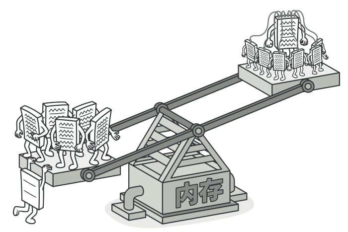
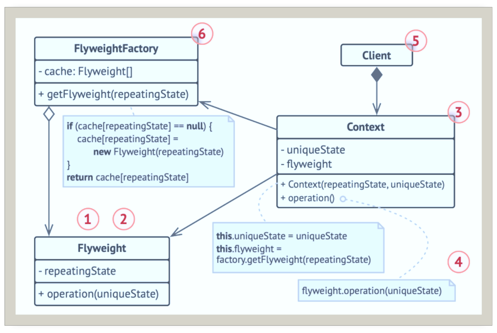
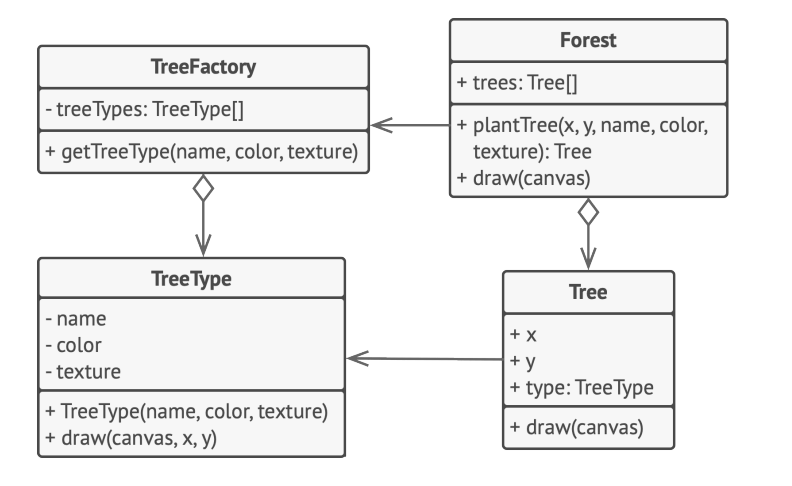

# 享元

## 引入

分类：(对象)结构型

问题：做一个车管所系统，将会产生大量的车辆实体，如果每一个实例都保存自己的所有信息，将会需要大量内存，甚至导致程序崩溃。

解决方案：运用共享技术有效的支持大量细粒度的对象。

 

## 设计图

 

1. 享元模式只是一种优化。只有存在大量类似对象销毁内存的情况，才考虑使用。
2. 享元(Flyweight)类包含原始对象中部分能在多个对象中共享的状态。享元中存储的状态被称为“内在状态”。传递给享元方法的状态被称为“外在状态”。
3. 上下文(Context)类包含原始对象中各不相同的外在状态。上下文与享元对象组合在一起就能表示原始对象的全部状态。
4. 通常情况下，原始对象的行为保留在享元类中。因此调用享元方法必须提供部分外在状态作为参数。但也可将行为移动到上下文类中，将连入的享元作为单纯的数据对象。
5. 客户端(Client)负责计算或存储享元的外在状态。在客户端看来，享元是一种可在运行时进行配置的模版对象，具体的配置方式为向其方法中传入一些上下文数据参数。
6. 享元工厂(Flyweight Factory)会对已有享元的缓存池进行管理。有了工厂后，客户端就无需直接创建享元，只需调用工厂并向其传递目标享元的一些内在状态即可。工厂会根据参数在之前已创建的享元中进行查找，如果找到满足条件的享元就将其返回，如果没有找到就根据参数新建享元。

## 自己实现的代码

## 扩展

享元模式能有效减少在画布上渲染数百万个树状对象时所需的内存

 

+ 如果程序中有很多相似对象，那么你将可以节省大量内存

## 缺点

可能需要牺牲执行速度来换取内存，因为他人每次调用享元方法时都需要重新计算部分情景数据。

