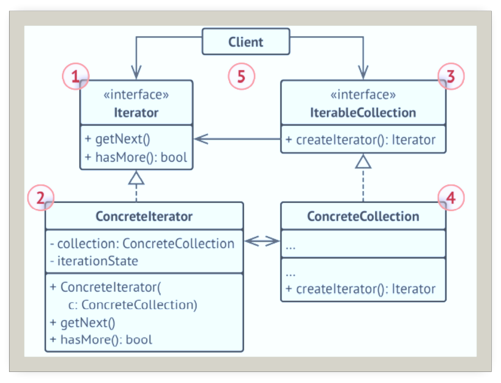
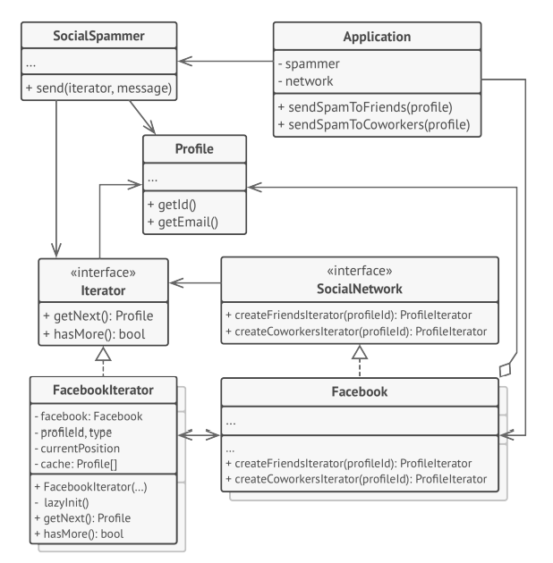

# 迭代器

## 引入

分类：(对象)行为型

问题：两个餐厅要合并，虽然两家菜单系统类似，单底层使用的数据结构不同，如何能让客户端方便的遍历。

解决方案：提供一种方法顺序访问一个聚合对象中各个元素，而又不需暴露该对象的内部表示。

 

## 设计图

 

## 自己实现的代码

```c++
#include <iostream>
#include <string>
#include <list>

template <class T,class U>
class Iterator {
public:
    typedef typename std::list<T>::iterator Pointer;
    Iterator(U* p_container, bool reverse = false) :m_pContainer(p_container) {

    }
    void first() {
        m_iter = m_pContainer->m_data.begin();
    }
    void next() {
        m_iter++;
    }
    bool isDone() {
        return (m_iter == m_pContainer->m_data.end());
    }
    Pointer current() {
        return m_iter;
    }
private:
    U* m_pContainer;
    Pointer m_iter;
};

template <class T>
class Container {
    friend class Iterator<T, Container>;
public:
    Iterator<T, Container>* createIterator() {
        return new Iterator<T, Container>(this);
    }
    void add(T data) {
        m_data.push_back(data);
    }
private:
    std::list<T> m_data;
};

class MenuItem {
public:
    ~MenuItem(){}
    virtual void setData(std::string data1, std::string data2="") = 0;
    virtual std::string data() const = 0;
};
class Beverage :public MenuItem {
public:
    ~Beverage() {}
    Beverage(std::string data1, std::string data2) :m_data1(data1), m_data2(data2) {

    }
    virtual void setData(std::string data1, std::string data2) override{
        m_data1 = data1;
        m_data2 = data2;
    }

    virtual std::string data() const override{
        return m_data1 + "_"+m_data2;
    }
private:
    std::string m_data1;
    std::string m_data2;
};
class Pizza:public MenuItem {
public:
    ~Pizza() {}
    Pizza(std::string data):m_data(data){}
    virtual void setData(std::string data, std::string data2="") override {
        m_data = data;
    }

    virtual std::string data() const override {
        return m_data;
    }
private:
    std::string m_data;
};

template<class T>
void clientCode(T* iter) {
    for (iter->first(); !iter->isDone(); iter->next()) {
        std::cout << iter->current()->data()<<std::endl;
    }
}
int main()
{
    Container<Beverage> beverageMenu;
    Beverage coffee("美式", "咖啡"), bubbleTea("珍珠", "奶茶");
    beverageMenu.add(coffee);
    beverageMenu.add(bubbleTea);

    Container<Pizza> pizzaMenu;
    Pizza a("意大利香肠"), b("海鲜披萨"),c("榴莲披萨");
    pizzaMenu.add(a);
    pizzaMenu.add(b);
    pizzaMenu.add(c);
    //遍历菜单
    std::cout << "Iterator用于遍历Beverage菜单：\n";
   /*Iterator<Beverage, Container<Beverage>>**/
    auto it = beverageMenu.createIterator();
    clientCode(it);
    std::cout << "Iterator用于遍历Pizza菜单：\n";
    auto it2 = pizzaMenu.createIterator();
    clientCode(it2);

    delete it;
    delete it2;
}
```

## 扩展

迭代器模式用于遍历一个封装了好访问好友关系功能的特殊集合。该集合提供使用不同方式遍历档案资料的多个迭代器。

 

+ 单一职责原则：将庞大的遍历算法代码抽取为独立的类
+ 开闭原则：可实现新型的集合和迭代器，无需修改现有代码
+ 可以并行遍历同一个集合，因为每个迭代器对象都包含其自身的遍历状态，并可以暂停遍历并在需要的时候继续

## 缺点

+ 如果程序只与简单的集合进行交互，应用该模式可能适得其反。
+ 对于某些特殊集合，使用迭代器可能比直接遍历的效率低。

