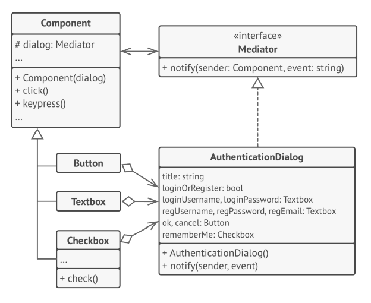

# 中介者

## 引入

分类：(对象)行为型

问题：实现一个机场的起飞管理系统，如果由驾驶员们讨论谁先飞，后果可能是灾难性的。

解决方案：用一个中介对象来封装一系列的对象交互。中介者使各对象不需要显示地相互引用，从而使得其耦合松散。

 

## 设计图

 

## 自己实现的代码

 

```c++
#include <iostream>
#include <string>
class Staff;
//Mediator Interface
class ControlTower {
public:
    virtual void notify(Staff* sender, std::string event) const = 0;
};

class Staff {
protected:
    std::string m_name;
    ControlTower* m_controlTower;
public:
    Staff(std::string name, ControlTower* controlTower = nullptr)
    :m_name(name),m_controlTower(controlTower){

    }
    std::string getName() { return m_name; }
    void setMediator(ControlTower* controlTower) {
        m_controlTower = controlTower;
    }
};
class Pilot :public Staff {
public:
    Pilot(std::string name):Staff(name){}

    void takeOff() {
        std::cout << getName() + ":请求起飞。\n";
        m_controlTower->notify(this, "起飞请求");
    }
    void reply() {
        std::cout << getName() + ":收到。\n";
        //m_controlTower->notify(this, "收到");
    }
};

class GroundGrew :public Staff {
public:
    GroundGrew(std::string name) :Staff(name) {}

    void maintenance() {
        std::cout << getName() + ":请求维护。\n";
        m_controlTower->notify(this, "请求维护");
    }
    void reply() {
        std::cout << getName() + ":收到。\n";
        //m_controlTower->notify(this, "收到");
    }
};
class ConcreteControlTower :public ControlTower {
private:
    Pilot* m_pilot1;
    Pilot* m_pilot2;
    Pilot* m_pilot3;
    GroundGrew* m_ground1;
public:
    ConcreteControlTower(Pilot* p1, Pilot* p2, Pilot* p3, GroundGrew* g1)
    :m_pilot1(p1), m_pilot2(p2), m_pilot3(p3),m_ground1(g1) {
        m_pilot1->setMediator(this);
        m_pilot2->setMediator(this);
        m_pilot3->setMediator(this);
        m_ground1->setMediator(this);
    }

    void notify(Staff* sender, std::string event) const override {
        std::cout << "控制塔：收到" + sender->getName() + event + "。\n";
        if (event == "起飞请求") {

            m_ground1->reply();
            if(sender!= m_pilot1)
                m_pilot1->reply();
            if (sender != m_pilot2)
                m_pilot2->reply();
            if (sender != m_pilot3)
                m_pilot3->reply();
        }

        if (event == "请求维护") {

                m_pilot1->reply();
                m_pilot2->reply();
                m_pilot3->reply();
        }
    }
};
int main()
{
    Pilot* p1 = new Pilot("空军1号");
    Pilot* p2 = new Pilot("空军2号");
    Pilot* p3 = new Pilot("空军3号");
    GroundGrew* g1 = new GroundGrew("地勤1");
    ConcreteControlTower* controlTower = new ConcreteControlTower(p1, p2, p3, g1);
    p1->takeOff();
    std::cout<<"\n\n";
    g1->maintenance();
    delete p1;
    delete p2;
    delete p3;
    delete g1;
}
```

## 扩展

中介者可以帮组你减少各种UI类（按钮、复选框和文本标签）之间的相互依赖关系。

 

+ 无需修改实际组件就能增加新的中介者
+ 可以减轻应用中多个组件间的耦合关系
+ 可以更方便地复用各个组件

## 缺点

一段时间后，中介者可能会演化为上帝对象。

