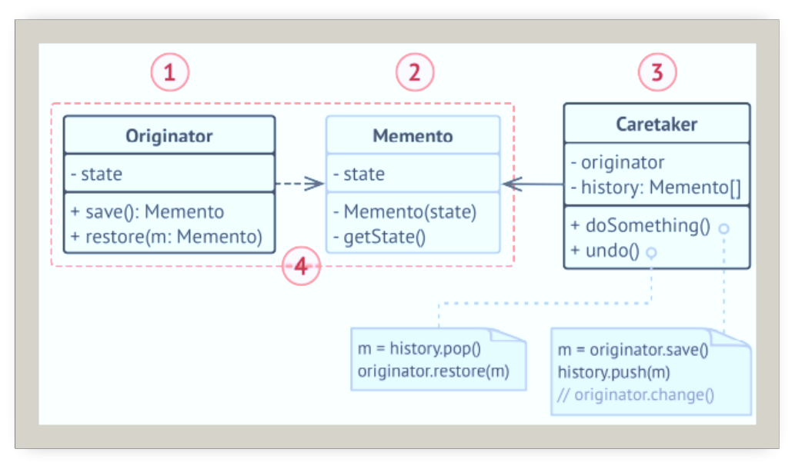
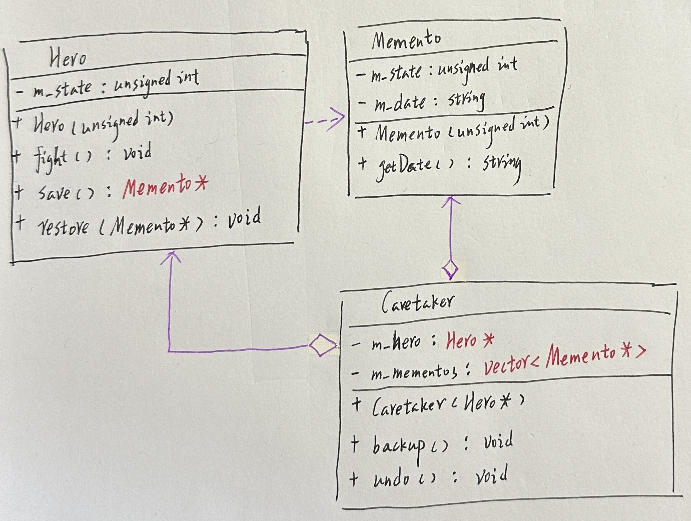
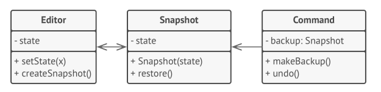

# 备忘录

## 引入

分类：(对象)行为型

问题：实现一个游戏的存档功能。希望在保持状态的同时可以不破坏类的封装。

解决方案：在不破坏类的前提下，捕获一个对象的内部状态。并在该对象之外保留这个状态。这样以后就可将该对象恢复到原先保存的状态。

 

## 设计图

 

## 自己实现的代码

 

```c++
#define _CRT_SECURE_NO_WARNINGS
#include <iostream>
#include <vector>
#include <ctime>
#include <string>
//Memento
class Memento {
    friend class Hero;
private:
    unsigned int m_state;
    std::string m_date;//metadata
public:
    Memento(unsigned int state) :m_state(state) {
        std::time_t now= std::time(0);
        m_date = std::ctime(&now);
    }

    std::string getDate() {
        return m_date;
    }
};

//Originator
class Hero {
private:
    unsigned int m_state;
public:
    Hero(unsigned int state) :m_state(state) {
        std::cout << "英雄：我的初始状态为：" << m_state << "\n\n";
    }

    void fight() {
        std::cout << "英雄：啊！被砍了一刀。\n";
        m_state -= rand() % 20;
        std::cout << "英雄：当前状态变为："<<m_state<<"\n\n";
    }

    Memento* save() {
        return new Memento(m_state);
    }

    void restore(Memento* memento) {
        m_state = memento->m_state;
        std::cout << "英雄：当前状态恢复为：" << m_state << "\n";
    }
};

//caretaker
class Caretaker {
private:
    Hero* m_hero;
    std::vector<Memento*> m_mementos;
public:
    Caretaker(Hero* hero):m_hero(hero){}
    ~Caretaker() {
        for (auto item : m_mementos) delete item;
    }

    void backup() {
        std::cout << "管理者：正在保存英雄状态...\n\n";
        m_mementos.push_back(m_hero->save());
    }

    void undo() {
        if (!m_mementos.size()) return;

        Memento* memento=m_mementos.back();
        m_mementos.pop_back();
        std::cout << "管理者：英雄状态恢复为"<<memento->getDate();
        m_hero->restore(memento);
        delete memento;
    }
};
int main()
{
    std::srand(static_cast<unsigned int>(std::time(NULL)));
    Hero* hero=new Hero(100);
    Caretaker* caretaker = new Caretaker(hero);
    caretaker->backup();
    hero->fight();
    caretaker->backup();
    hero->fight();
    caretaker->undo();

    delete hero;
    delete caretaker;
}
```

## 扩展

使用了命令模式和备忘录模式，可保存复杂文字编辑器的状态快照，并能在需要时从快照中恢复之前的状态。命令对象将作为负责人，他会会在执行与命令相关的操作前获取编辑器的备忘录。当用户试图撤销最近的命令时，编辑器可以使用保存在命令中的备忘录来将自身回滚到之前的状态。

 

+ 可以在不破坏对象封装情况的前提下创建对象状态快照。
+ 可以通过负责人维护原发器状态历史记录，简化原发器代码。

## 缺点

负责人必须完整得跟踪原发器的生命周期，这样才能销毁弃用的备忘录。

