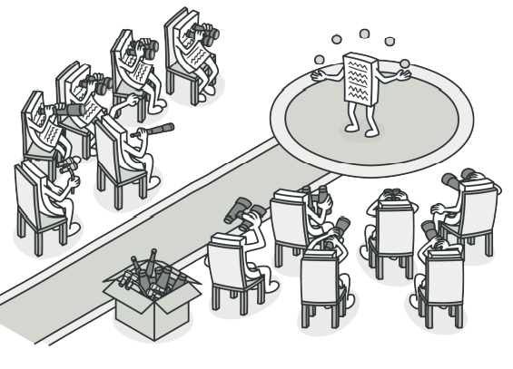
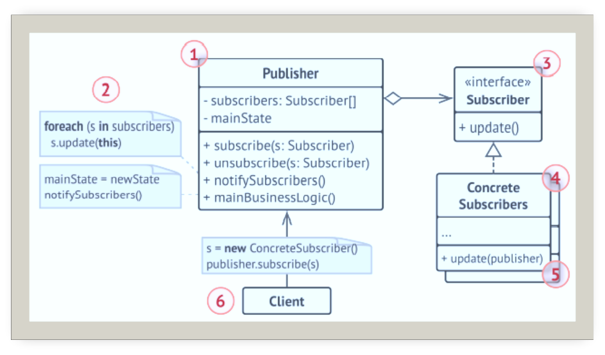
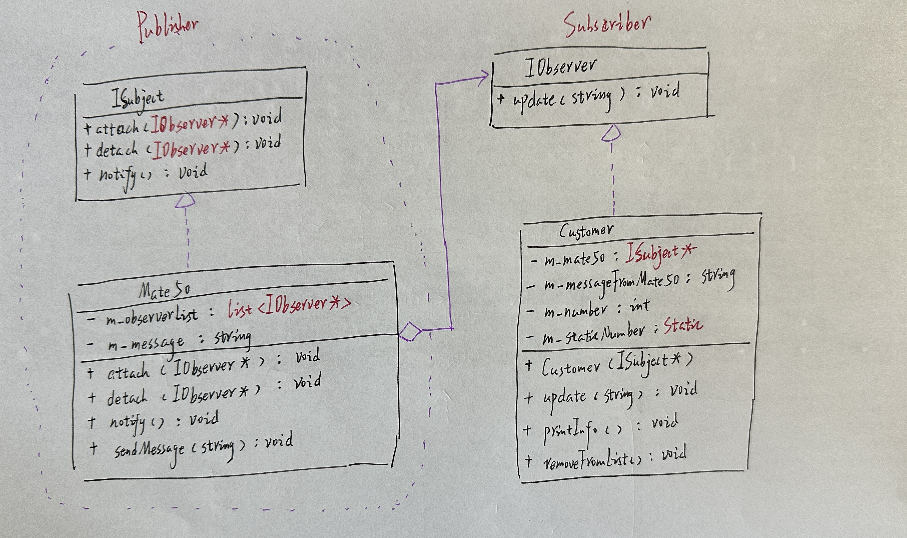
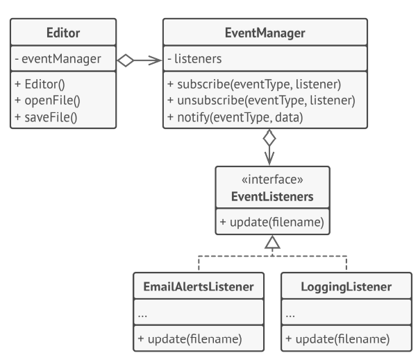

# 观察者

## 引入

分类：(对象)行为型

问题：开发一个购物平台，当商品缺货时如何处理？如果客户经常主动查看，无疑会浪费客户的时间。如果平台主动发送到货通知给所有客户，那么对于不需要的客户来说并不友好，缺货商品一多消息也容易泛滥。

解决方案：定义对象间的一种一对多关系，当一个对象的状态发生改变时，所有依赖于它的对象都得到通知并自动更新。

 

## 设计图

 

## 自己实现的代码

 

```c++
#include <iostream>
#include <string>
#include <list>

//Subscriber
class IObserver {
public:
    virtual void update(const std::string& messageFromSubject) = 0;
};

//Publisher
class ISubject {
public:
    virtual void attach(IObserver* observer) = 0;
    virtual void detach(IObserver* observer) = 0;
    virtual void notify() = 0;
};

class Mate50 :public ISubject {
private:
    std::list<IObserver*> m_observerList;
    std::string m_message;
public:
    virtual void attach(IObserver* observer) override{
        m_observerList.push_back(observer);
    }

    virtual void detach(IObserver* observer)override {
        m_observerList.remove(observer);
    }
    virtual void notify() override {
        std::list<IObserver*>::iterator iter = m_observerList.begin();
        while (iter != m_observerList.end()) {
            (*iter++)->update(m_message);
        }
    }

    void sendMessage(std::string message = "") {
        m_message = message;
        notify();
    }
};

class Customer :public IObserver {
private:
    ISubject* m_mate50;
    std::string m_messageFromMate50;
    int m_number;
    static int m_staticNumber;
public:
    Customer(ISubject* subject) :m_mate50(subject) {
        m_mate50->attach(this);
        std::cout << "我是\"" << ++Customer::m_staticNumber << "\"号订购者。\n";
        m_number = Customer::m_staticNumber;
    }
    void update(const std::string& messageFromSubject) override {
        m_messageFromMate50 = messageFromSubject;
        printInfo();
    }
    void printInfo() {
        std::cout << "\"" << m_number << "\"号订购者：接收到新的消息："
           <<m_messageFromMate50<<"\n";
    }
    void removeFromList() {
        m_mate50->detach(this);
        std::cout << "\"" << m_number << "\"号订购者：从列表中移除。\n";
    }
};
int Customer::m_staticNumber=0;
int main()
{
    Mate50* mate50 = new Mate50();

    Customer* c1 = new Customer(mate50);
    Customer* c2 = new Customer(mate50);
    Customer* c3 = new Customer(mate50);
    Customer* c4;
    Customer* c5;

    mate50->sendMessage("Mate50即将到店......");
    c4= new Customer(mate50);

    mate50->sendMessage("Mate50明天到店......");
    c5 = new Customer(mate50);

    c2->removeFromList();
    mate50->sendMessage("Mate50即将售罄......");
    delete mate50;
    delete c1;
    delete c2;
    delete c3;
    delete c4;
    delete c5;
}
```

## 扩展

观察者模式允许文本编辑器对象将自身的状态改变通知给其他服务对象。

 

+ 开闭原则：你无需修改发布者代码就能引入新的订阅者类（如果是发布者接口则可轻松引入发布者类）。
+ 可以在运行时建立对象之间的联系

## 缺点

订阅者的通知顺序是随机的。

