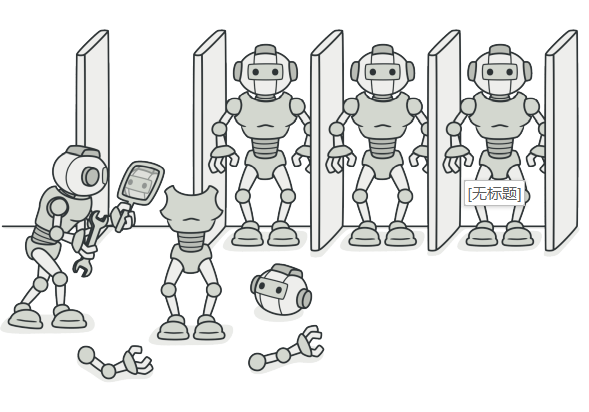
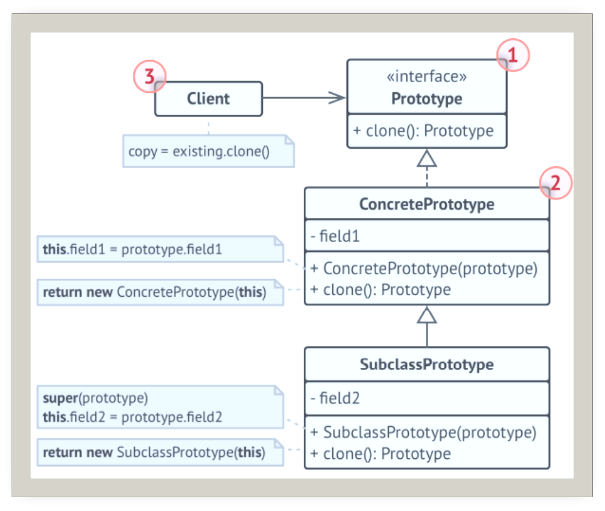
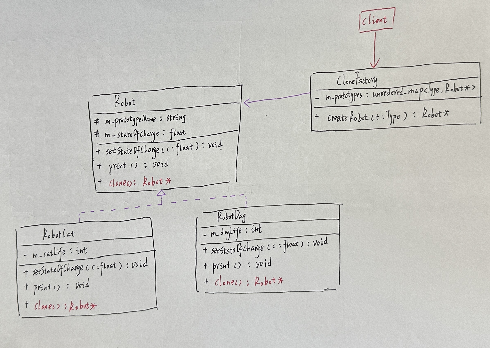
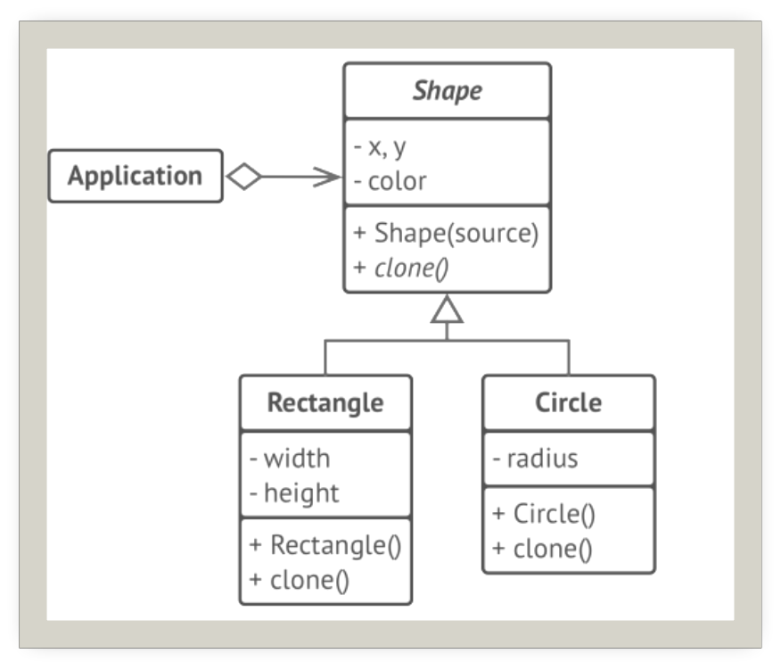

# 原型

## 引入

分类：(对象)创建型

问题：希望复制一个状态完全相同的对象。首先，新建一个相同类的对象，然后，复制所有成员变量。但是，有时候不知道具体类型，而且成员变量有可能是私有的

解决方案：用原型实例指定创建对象的种类，并且通过拷贝这些原型创建新的对象。即复制已有对象，而无需使代码依赖它们所属的类。

 

## 设计图

 

1. 原型(Prototype)：接口将对克隆方法进行声明
2. 具体原型(Concrete Prototype)：类将实现克隆方法。除了将原始对象的数据复制到克隆体中之外，该方法有时还需处理克隆过程中的极端情况，例如克隆关联对象和梳理递归依赖等
3. 客户端(Client)：可以复制实现了原型接口的任何对象

## 自己实现的代码

 

```c++
#include<iostream>
#include<unordered_map>

using std::string;

enum Type {
    ROBOT_CAT = 0,
    ROBOT_DOG
};

class Robot {
protected:
    string m_prototypeName = "";
    float m_stateOfCharge = 0.0;
public:
    Robot() = default;
    Robot(string prototypeName)
        : m_prototypeName{ prototypeName } { }

    virtual ~Robot() { }
    virtual Robot* clone() const = 0;
    virtual void setStateOfCharge(float charge) = 0;
    virtual void print() const = 0;
};

class RobotCat : public Robot {
private:
    int m_catLife = 0;
public:
    RobotCat(string prototypeName, int catLife)
        : Robot{ prototypeName }, m_catLife{ catLife } { }
    RobotCat(const RobotCat& robotCat) = default;
    virtual ~RobotCat() { }

    Robot* clone() const override {
        return new RobotCat(*this);
    }
    void setStateOfCharge(float charge) override {
        m_stateOfCharge = charge;
    }
    void print() const override {
        std::cout<<"RobotCat charge:  "<<m_stateOfCharge<<" Life: "<<m_catLife<<"\n";
    }
};

class RobotDog : public Robot {
private:
    int m_dogLife = 0;
public:
    RobotDog(string prototypeName, int life)
        : Robot{ prototypeName }, m_dogLife{ life } { }
    RobotDog(const RobotDog& robotDog) = default;
    ~RobotDog() { }

    Robot* clone() const override {
        return new RobotDog(*this);
    }
    void setStateOfCharge(float charge) override {
        m_stateOfCharge = charge;
    }
    void print() const override {
        std::cout<<"RobotDog charge: "<<m_stateOfCharge<<" Life: "<<m_dogLife<<"\n";
    }
};

class CloneFactory {
private:
    std::unordered_map<Type, Robot*> m_prototypes;
public:
    CloneFactory() {
        m_prototypes[ROBOT_CAT] = new RobotCat("机器猫", 10);
        m_prototypes[ROBOT_DOG] = new RobotDog("机器狗", 20);
    }
    ~CloneFactory() {
        delete m_prototypes[ROBOT_CAT];
        m_prototypes[ROBOT_CAT] = nullptr;
        delete m_prototypes[ROBOT_DOG];
        m_prototypes[ROBOT_DOG] = nullptr;
    }
    Robot* createRobot(Type type) {
        return m_prototypes[type]->clone();
    }
};

void client(CloneFactory& cloneFactory) {
    std::cout<<"机器猫\n";
    Robot* cloneRobotCat = cloneFactory.createRobot(ROBOT_CAT);
    cloneRobotCat->setStateOfCharge(50);
    cloneRobotCat->print();
    delete cloneRobotCat;
    cloneRobotCat = nullptr;

    std::cout<<"机器狗\n";
    Robot* cloneRobotDog = cloneFactory.createRobot(ROBOT_DOG);
    cloneRobotDog->setStateOfCharge(100);
    cloneRobotDog->print();
    delete cloneRobotDog;
    cloneRobotDog = nullptr;
}

int main()
{
    CloneFactory cloneFactory;
    client(cloneFactory);
}
```

## 扩展

克隆形状：生成完全相同的几何对象副本，同时无需代码与对象所属类耦合。

 

+ 可以克隆对象无需与它们所属的具体类耦合
+ 可以克隆预生成原型，避免反复运行初始化代码

## 缺点

克隆包含循环引用的复杂对象可能会非常麻烦。