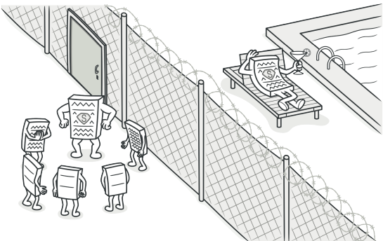
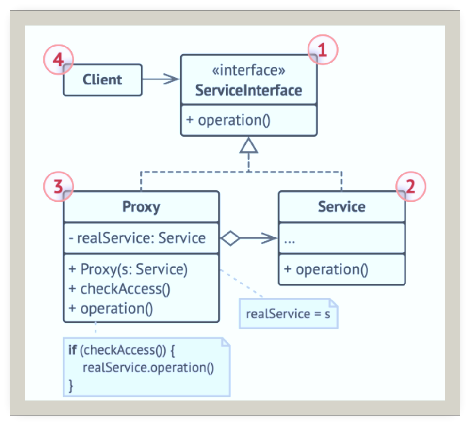
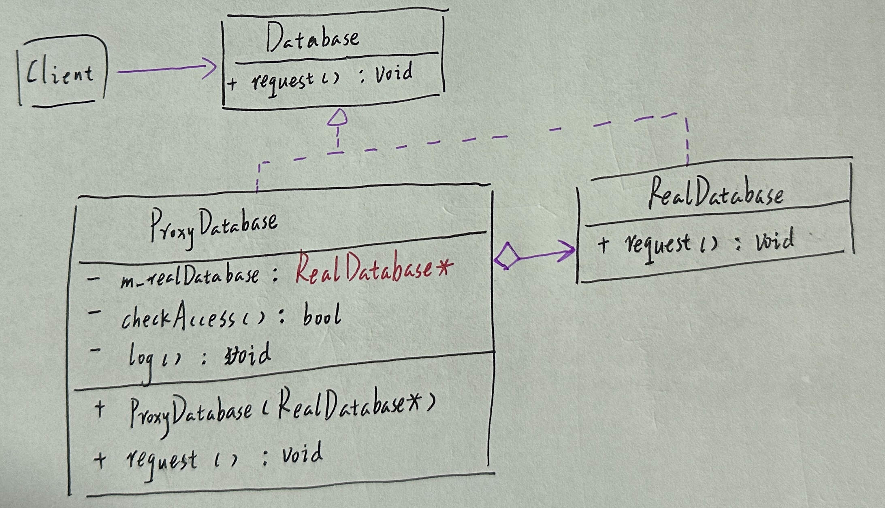
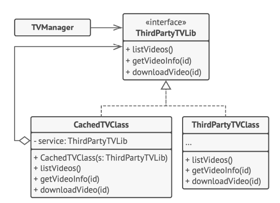

# 代理

## 引入

分类：(对象)结构型

问题：系统需要访问数据库，但需要对数据的访问做一些优化，例如缓存查询结果、生成访问日志、访问控制。

解决方案：为其他对象提供一种代理以控制这个对象的访问。即新建一个与原服务器对象接口相同的代理类，代理将自己伪装成数据库对象，对客户而言是透明的。

 

## 设计图

 

1. 服务接口(Service Interface)声明服务接口。代理必须遵循该接口进行伪装。
2. 服务(Service)类提供了一些实用的业务逻辑。
3. 代理(Proxy)类包含一个指向服务对象的引用成员变量。代理完成其任务（例如延迟初始化、记录日志、访问控制和缓存等）后会将请求传递给服务对象。
4. 客户端(Client)能通过同一接口与服务或代理进行交互，可在一切需要服务对象的代码中使用代理。

## 自己实现的代码

 

```c++
#include <iostream>

//接口：真实的数据库和代理数据都依赖这个接口
class Database {
public:
    virtual void request() const = 0;
};
//
class RealDatabase:public Database {
public:
    void request() const override {
        std::cout << "--真实数据库：处理业务请求。\n";
    }
};
//
class ProxyDatabase :public Database {
private:
    RealDatabase* m_realDatabase;
    bool checkAccess() const {
        std::cout << "ProxyDatabase：在发出请求之前，检查一下。\n";
        return true;
    }
    void log() const {
        std::cout<<"ProxyDatabase：处理日志。\n";
    }
public:
    ProxyDatabase(RealDatabase* realDatabase):m_realDatabase(realDatabase){}

    void request() const override {
        if(checkAccess()){
            std::cout << "ProxyDatabase：通过代理处理数据库请求。\n";
            m_realDatabase->request();
            log();
        }
        else {
            std::cout << "ProxyDatabase：数据库访问请求被驳回。\n";
        }
    }
};

void clientCode(const Database& database) {
    database.request();
}
int main()
{
    std::cout << "Client:直接使用真实数据库处理请求：\n";
    RealDatabase realDatabase;
    clientCode(realDatabase);
    std::cout << "Client:通过代理处理数据库请求：\n";
    ProxyDatabase proxy(&realDatabase);
    clientCode(proxy);
}
```

## 扩展

使用代理模式在第三方视频程序中添加延迟初始化和缓存。

 

+ 可以在客户端毫无察觉的情况下控制服务对象。
+ 如果客户端对服务对象的生命周期没有特殊要求，可以对生命周期进行管理。
+ 即使服务对象还未准备好或不存在，代理也可以正常工作。

## 缺点

+ 代码可能会变得很复杂，因为需要新建很多类。
+ 服务响应可能会延迟。