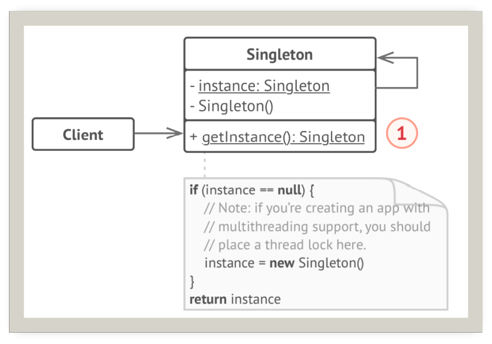

# 单例

## 引入

分类：(对象)创建型

问题：对于一些类来说，只有一个实例是很重要的。例如数据库或其共享资源的访问权限。并且这个实例需要易于被访问。

解决方案：保证一个类只有一个实例，并提供一个访问它的全局访问点。

 

## 设计图

 

## 自己实现的代码

```c++
#include <iostream>
#include <thread>
#include <mutex>

class Singleton {
private:
    Singleton(const std::string value) :m_value(value) {

    }
    ~Singleton(){}
    std::string m_value;
public:
   // Singleton(Singleton& other) = delete;
    Singleton(const Singleton& other) = delete;
    Singleton& operator=(const Singleton&) = delete;
    std::string value() const { return m_value; }

    static Singleton* getInstance(const std::string& value);
private:
    static Singleton* m_instance;
    static std::mutex m_mutex;
};
std::mutex Singleton::m_mutex;
Singleton* Singleton::m_instance = nullptr;
Singleton* Singleton::getInstance(const std::string& value) {
    std::lock_guard<std::mutex> lock(m_mutex);
    if (m_instance == nullptr) {
        m_instance = new Singleton(value);
    }
    return m_instance;
    //static Singleton* instance = new Singleton(value);
    //return instance;
}

void Cat() {
    Singleton* singleton = Singleton::getInstance("Cat");
    std::cout << singleton->value() << '\n';
}
void Dog() {
    Singleton* singleton = Singleton::getInstance("Dog");
    std::cout << singleton->value() << '\n';
}
int main()
{
    std::thread t1(Cat);

    std::thread t2(Dog);

    t1.join();
    t2.join();
}
```


