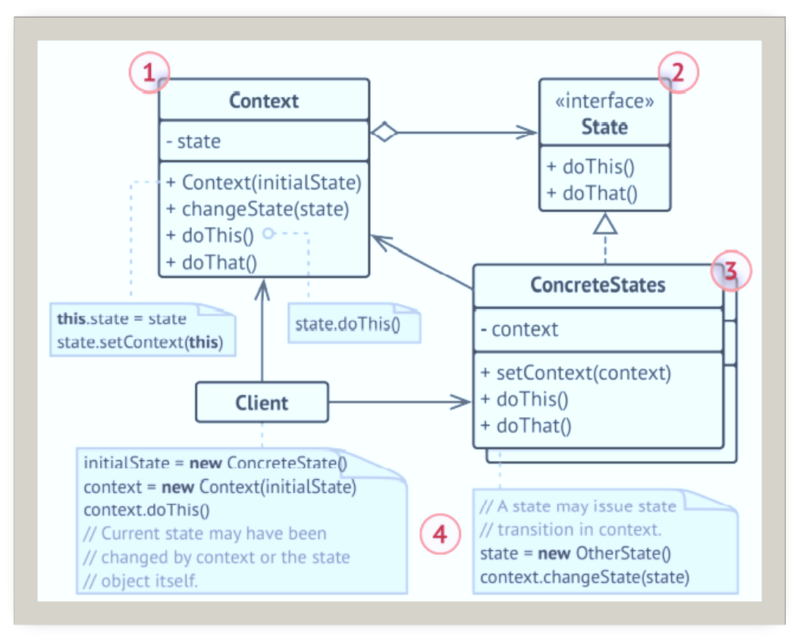
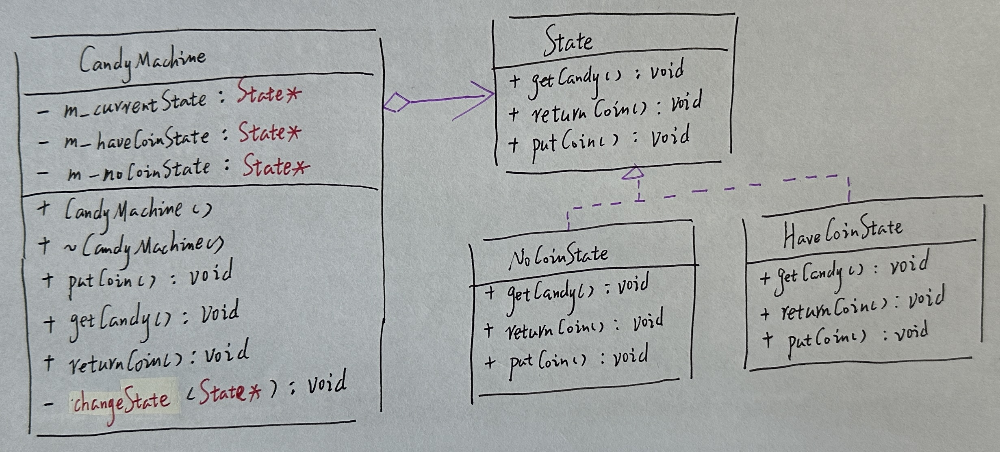
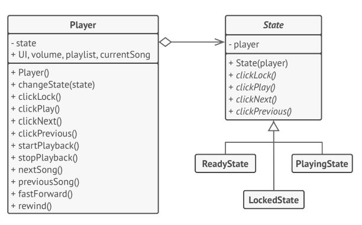

# 状态

## 引入

分类：(对象)行为型

问题：开发一个糖果售卖机，当投入硬币按下按钮，糖果机将掉落一枚硬币。当没有投入硬币时，直接按下按钮，将会得到请投币的提示。

解决方案：允许一个对象在其内部状态改变时改变它的行为。对象看起来适合改变了它的类。

 

## 设计图

 

## 自己实现的代码

 

```c++
#include <iostream>

//class CandyMachine;
class State {
protected:
   // CandyMachine* m_candyMachine;
public:
    //void setContext(CandyMachine* candyMachine) {
    //    m_candyMachine = candyMachine;
    //}
    //virtual ~State(){}

    virtual void getCandy() = 0;
    virtual void returnCoin() = 0;
    virtual void putCoin() = 0;
};

class NoCoinState :public State {
    virtual void getCandy() override {
        std::cout << "请先投币。\n";
    }
    virtual void returnCoin() override {
        std::cout << "你并没有投币。\n";
    }
    virtual void putCoin()override {
        std::cout << "投币成功。\n";
    }
};
class HaveCoinState :public State {
    virtual void getCandy() override {
        std::cout << "糖果投放中......\n";
    }
    virtual void returnCoin() override {
        std::cout << "硬币退回中......\n";
    }
    virtual void putCoin()override {
        std::cout << "重复投币。\n";
    }
};

//Context
class CandyMachine {
private:
    State* m_currentState;
    State* m_haveCoinState;
    State* m_noCoinState;
public:
    CandyMachine() {
        m_haveCoinState = new HaveCoinState();
        m_noCoinState = new NoCoinState();
        m_currentState = m_noCoinState;
        std::cout << "糖果机：当前状态为--->" << typeid(*m_currentState).name() << "。\n\n";
    }
    ~CandyMachine() {
        delete m_haveCoinState;
        delete m_noCoinState;
    }
    void putCoin() {
        std::cout << "糖果机：putCoin。\n";
        m_currentState->putCoin();
        changeState(m_haveCoinState);
    }
    void getCandy() {
        std::cout << "糖果机：getCandy。\n";
        m_currentState->getCandy();
        changeState(m_noCoinState);
    }
    void returnCoin() {
        std::cout << "糖果机：returnCoin。\n";
        m_currentState->returnCoin();
        changeState(m_noCoinState);
    }
private:
    void changeState(State* state) {
        m_currentState = state;
        std::cout << "糖果机：当前状态为--->" << typeid(*m_currentState).name() << "。\n\n";
    }
};
int main()
{
    CandyMachine* candyMachine = new CandyMachine;
    candyMachine->getCandy();
    candyMachine->returnCoin();
    candyMachine->putCoin();
    candyMachine->getCandy();
    candyMachine->returnCoin();
    delete candyMachine;
}
```

## 扩展

状态模式将根据当前回放状态，让媒体播放器中的相同控件完成不同的行为。

 

+ 单一职责原则：将与特定状态相关的代码放在单独的类中。
+ 开闭原则：无需修改已有状态类和上下文就能引入新状态。
+ 通过消除臃肿的状态机条件语句简化上下文代码。

## 缺点

如果状态机只有很少的几个状态，或者很少发生变化，那么应用该模式可能会显得小题大做。

