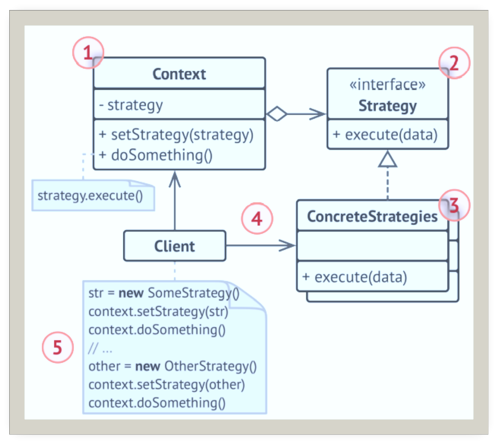
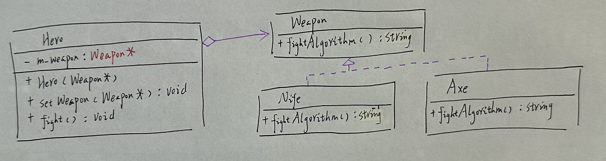
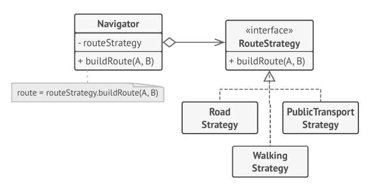

# 策略

## 引入

分类：(对象)行为型

问题：做一款打斗游戏，玩家使用的英雄使用不同的武器将会产生不同的损伤效果。

解决方案：定义一系列的算法，把他们一个一个的封装起来。并且使他们可以相互替换。本模式使得算法可独立于使用它的客户而变化。

 

## 设计图

 

## 自己实现的代码

 

```c++
#include <iostream>
#include <string>

//Strategy
class Weapon {
public:
    virtual std::string fightAlgorithm() const = 0;
};

class Nife : public Weapon {
public:
    std::string fightAlgorithm() const override {
        return "使用匕首计算损伤。";
    }
};
class Axe : public Weapon {
public:
    std::string fightAlgorithm() const override {
        return "使用斧子计算损伤。";
    }
};
//Context
class Hero {
private:
    Weapon* m_weapon;
public:
    Hero(Weapon* weapon = nullptr) :m_weapon(weapon) {}
    void setWeapon(Weapon* weapon) { m_weapon = weapon; }

    void fight() {
        std::cout << m_weapon->fightAlgorithm() << "\n";
    }
};
int main()
{
    std::cout << "客户端：英雄使用匕首攻击。\n";
    Nife nife;
    Hero hero(&nife);
    hero.fight();
    std::cout << "客户端：英雄使用斧子攻击。\n";
    Axe axe;
    hero.setWeapon(&axe);
    hero.fight();
}
```

## 扩展

在导航系统中，不同的出现方式会有不同的导航结果，使用策略模式封装不同的路径规划算法。

 

+ 可在运行时切换对象内的算法。
+ 可将算法的实现和使用算法的代码隔离开来。
+ 可使用组合代替继承。
+ 开闭原则：无需对上下文进行修改就可以引入新的策略。

## 缺点

如果算法很少发生变化，那么没有任何理由引入新的类和接口。使用该模式只会让程序过于复杂。

