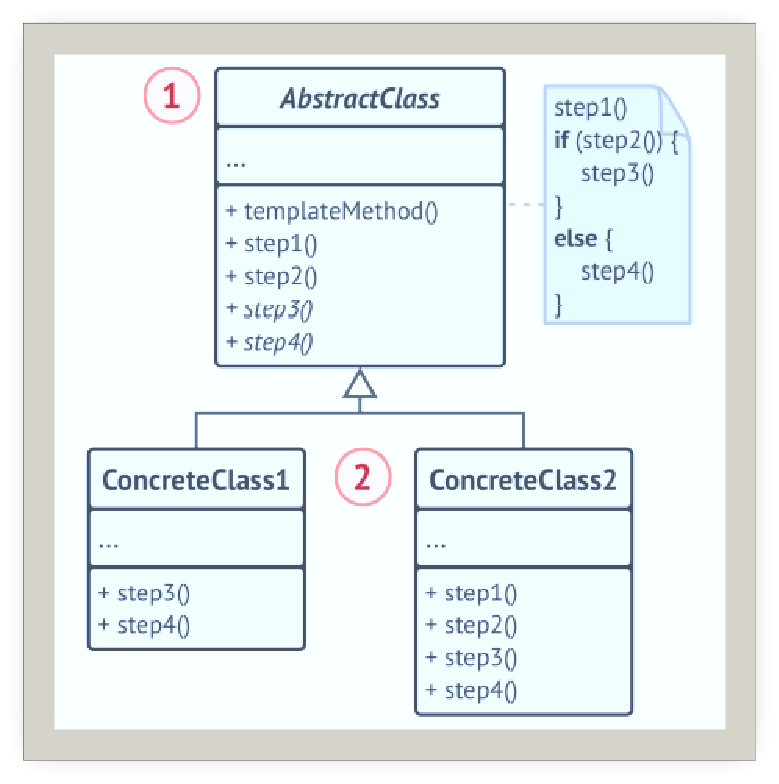
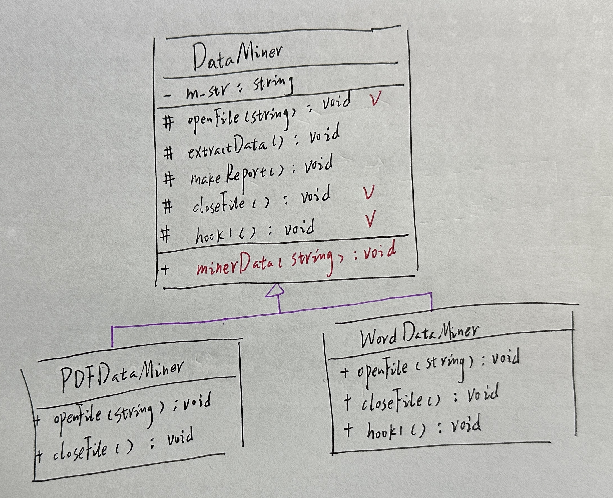
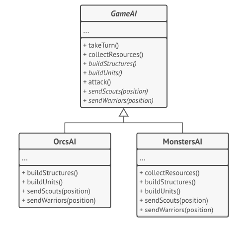

# 模版方法

## 引入

分类：(对象)行为型

问题：做一款数据挖掘的程序，需要支持不同格式的数据文件，虽然文件格式不同，实现步骤基本一致。

解决方案：定义一个算法骨架，而将一些步骤延迟到子类。模版方法使得子类可以不改变一个算法的结构即可重定义该算法的某些特殊步骤。

## 设计图

 

## 自己实现的代码

 

```c++
#include <iostream>
#include <string>
class DataMiner {
public:
    //template method
    void minerData(std::string path)  {
        openFile(path);
        extractData();
        makeReport();
        hook1();
        closeFile();
    }
protected:
    virtual void openFile(std::string path) =0;
    void extractData() const {
        std::cout << "DataMiner:从字符串中提取相关数据。\n";
    }
    void makeReport() const {
        std::cout << "DataMiner:生成数据分析报告。\n";
    }
    virtual void closeFile() const = 0;
    virtual void hook1() const {}
protected:
    std::string m_str="";
};

class PDFDataMiner :public DataMiner {
public:
    virtual void openFile(std::string path) {
        m_str = "openfile(path)";
        std::cout << "PDFDataMiner:打开PDF文件，转换为字符串序列。\n";
    }
    virtual void closeFile() const {
        std::cout << "PDFDataMiner:关闭PDF文件。\n";
    }
};

class WordDataMiner :public DataMiner {
public:
    virtual void openFile(std::string path) {
        m_str = "openfile(path)";
        std::cout << "WordDataMiner:打开Word文件，转换为字符串序列。\n";
    }
    virtual void closeFile() const {
        std::cout << "WordDataMiner:关闭Word文件。\n";
    }
    virtual void hook1() const {
        std::cout << "WordDataMiner:给word文件添加水印。\n";
    }
};

void clientCode(DataMiner* dataMiner,std::string path) {
    dataMiner->minerData(path);
}
int main()
{
    PDFDataMiner pdfDataMiner;
    clientCode(&pdfDataMiner, "aa.pdf");

    std::cout << std::endl;
    WordDataMiner wordDataMiner;
    clientCode(&wordDataMiner, "aa.doc");
}
```

## 扩展

模版方法模式为一款简单策略游戏中人工智能的不同分支提供框架。

 

+ 可仅允许客户端重写一个大型算法中的特定部分，使得算法其他部分修改对其所造成的影响减小
+ 可将重复代码提取到一个超类中

## 缺点

模版方法中的步骤越多，其维护工作就可能会越困难。

