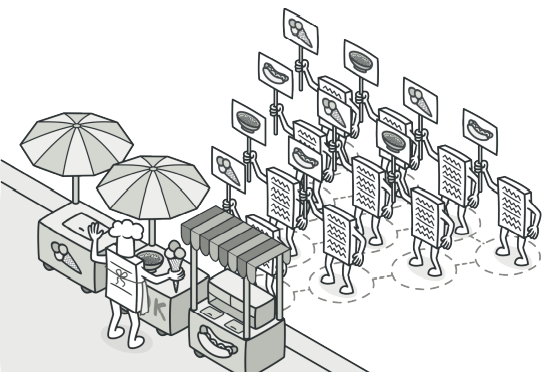
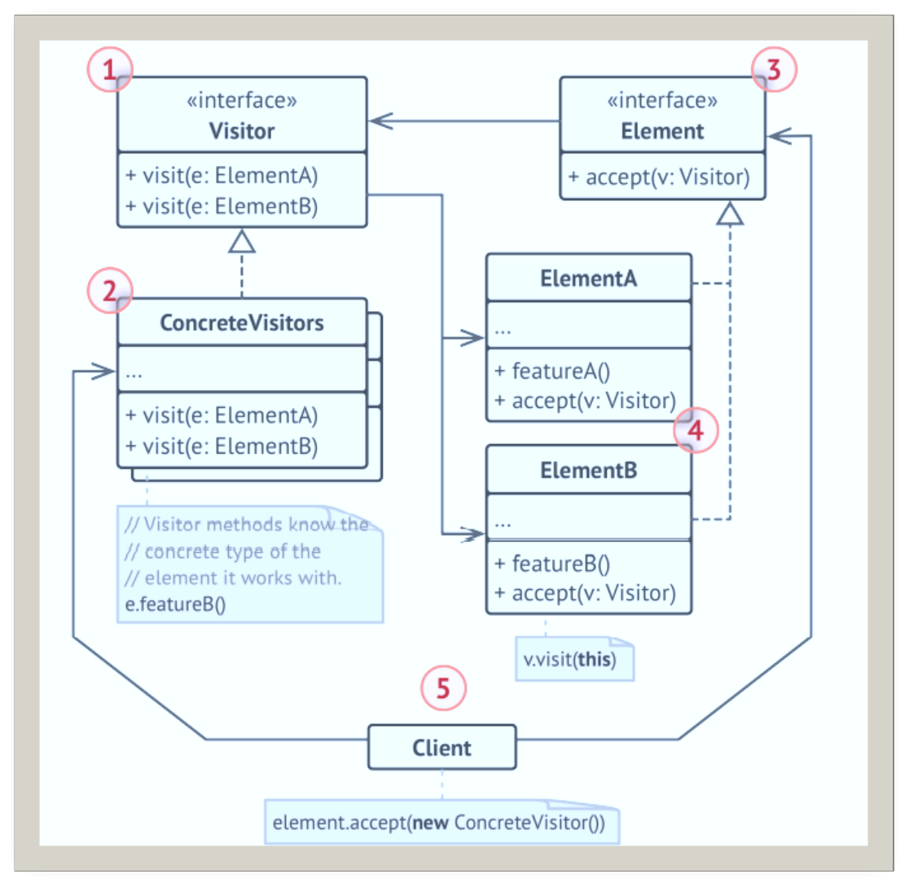
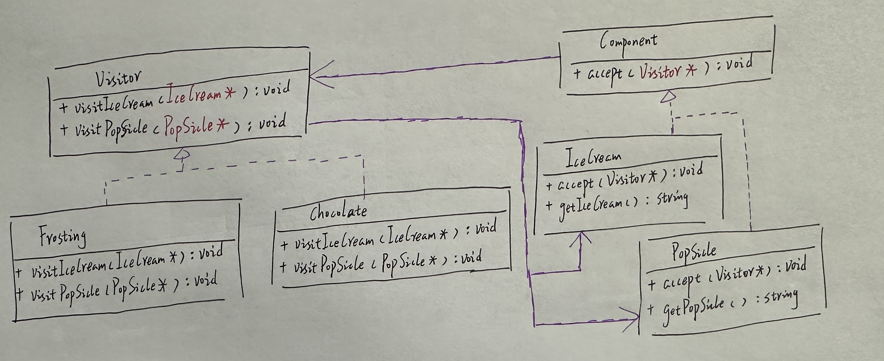
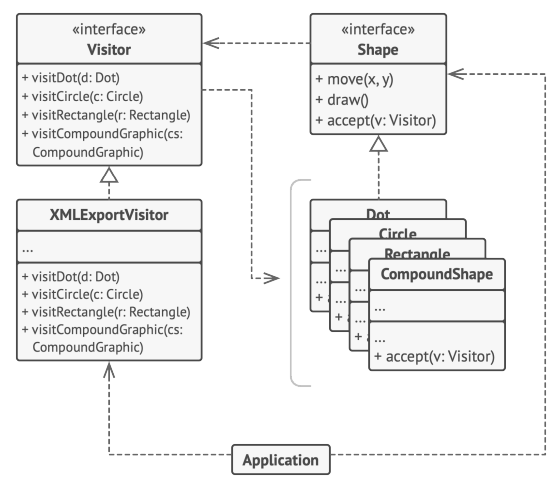

# 访问者

## 引入

分类：(对象)行为型

问题：做一款生成冰淇淋和雪糕的程序，现在希望为其添加糖霜，巧克力粉

解决方案：表示一个作用于某对象结构中的各元素的操作。它使你可以在不改变各元素的类的前提下定义作用于这些元素的新操作。

 

## 设计图

 

## 自己实现的代码

 

```c++
#include <iostream>
#include <vector>
#include <string>

class IceCream;
class Popsicle;

class Visitor {
public:
    virtual void visitIceCream(const IceCream* element) const = 0;
    virtual void visitPopsicle(const Popsicle* element) const = 0;
};

class Component {
public:
    virtual void accept(Visitor* visitor) const =0;
};

class IceCream :public Component {
public:
    virtual void accept(Visitor* visitor) const {
        visitor->visitIceCream(this);
    }
    std::string getIceCream() const {
        return "冰激凌";
    }
};

class Popsicle :public Component {
public:
    virtual void accept(Visitor* visitor) const {
        visitor->visitPopsicle(this);
    }
    std::string getPopsicle() const {
        return "雪糕";
    }
};

class Frosting :public Visitor {
public:
    virtual void visitIceCream(const IceCream* element) const {
        std::cout << element->getIceCream() << "+糖霜\n";
    }
    virtual void visitPopsicle(const Popsicle* element) const {
        std::cout << element->getPopsicle() << "+糖霜\n";
    }
};

class Chocolate :public Visitor {
public:
    virtual void visitIceCream(const IceCream* element) const {
        std::cout << element->getIceCream() << "+巧克力\n";
    }
    virtual void visitPopsicle(const Popsicle* element) const {
        std::cout << element->getPopsicle() << "+巧克力\n";
    }
};

void clintCode(std::vector<Component*> components, Visitor* visitor) {
    for (auto item : components) {
        item->accept(visitor);
    }
}
int main()
{
    std::vector<Component*> components = { new IceCream,new Popsicle,new Popsicle };
    Frosting frosting;
    clintCode(components, &frosting);
    std::cout << std::endl;
    Chocolate chocolate;
    clintCode(components, &chocolate);
    for (auto item : components) {
        delete item;
    }
}
```

## 扩展

访问者模式为几何图形层次结构添加了对于XML文件导出功能的支持。

 

+ 访问者对象可以在与各种对象交互时收集到一些复杂的对象结构，例如对象树，并在结构中的每个对象上应用访问者时，这些信息可能会有所帮组。

## 缺点

每次在元素层次结构中添加或移除一个类时，你都需要更新所有的访问者。

