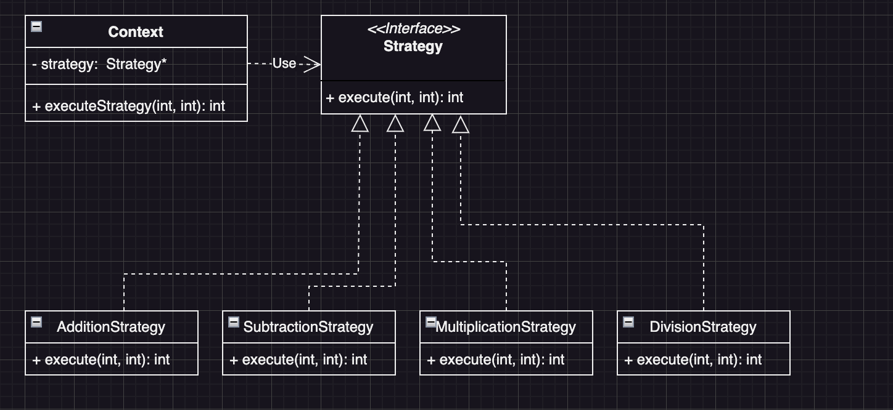
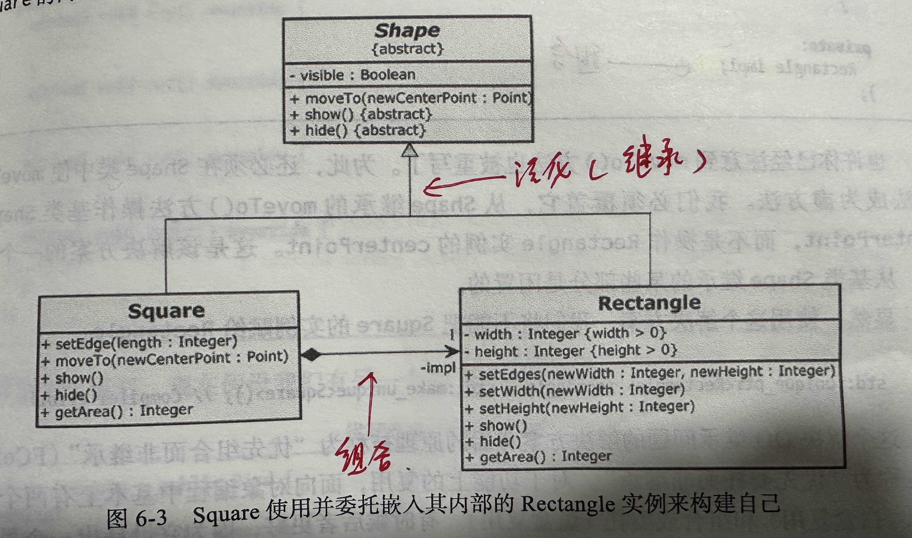

# 类的设计原则

## 1. 单一职责原则（SRP）

[LoggerSRP.cpp](https://github.com/niu0217/Documents/blob/main/C%2B%2B/standard/Code/LoggerSRP.cpp)

在上面的代码中，`Logger`类有一个明确定义的职责：记录日志。它提供了几个公共方法，允许用户记录不同级别的日志（如信息、警告和错误），而实际的日志记录逻辑被封装在私有的`log`方法中。这个类满足了单一职责原则，因为它只有一个引起变化的原因：日志记录的方式或格式。如果将来需要改变日志记录的方式（例如，将日志写入文件而不是输出到控制台），我们只需要修改`log`方法，而不会影响类的其他部分。

## 2. 开闭原则（OCP）

[StrategyOCP.cpp](https://github.com/niu0217/Documents/blob/main/C%2B%2B/standard/Code/StrategyOCP.cpp)

[开闭原则.html](https://github.com/niu0217/Documents/blob/main/C%2B%2B/standard/Code/开闭原则.html)

 

## 3. 里氏替换原则（LSP）

[DrawPictureLSP.cpp](https://github.com/niu0217/Documents/blob/main/C%2B%2B/standard/Code/DrawPictureLSP.cpp)

 

## 4. 接口隔离原则（ISP）

