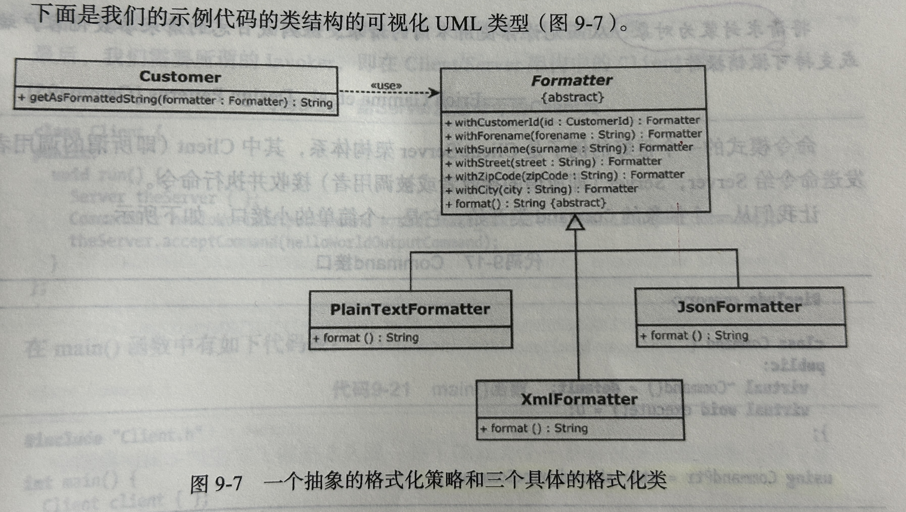
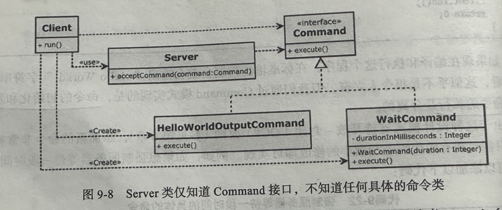
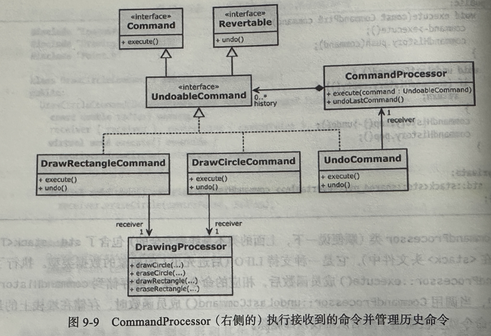
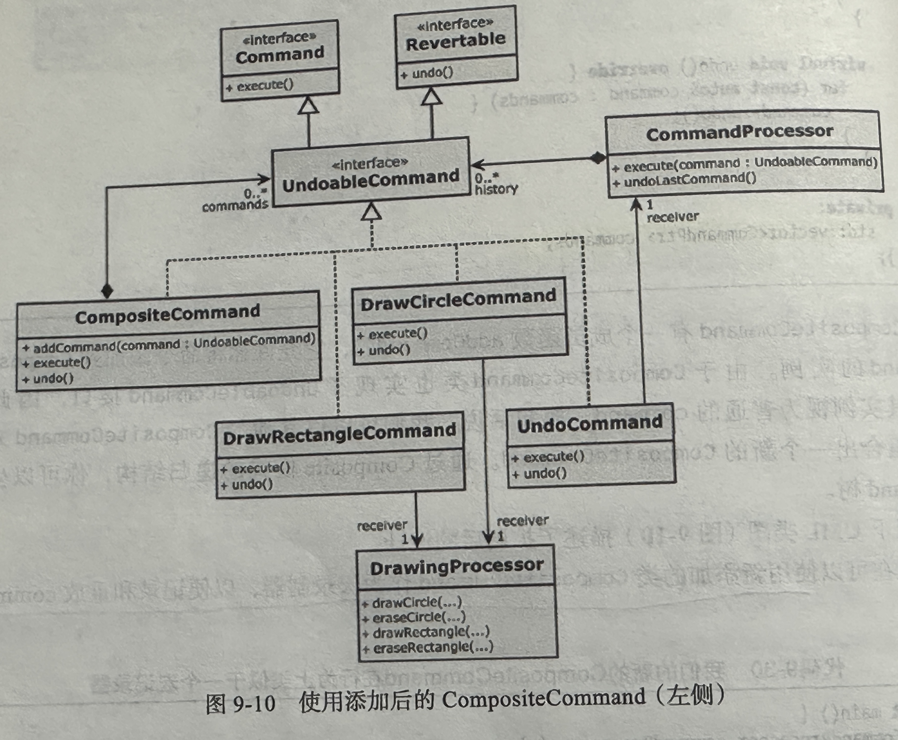
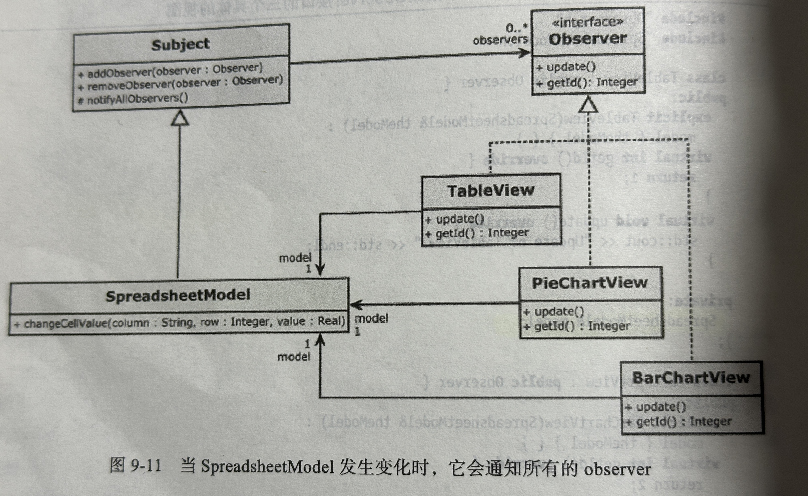

# 设计模式

## 1. 依赖注入模式

[DependencyInjection.cpp](https://github.com/niu0217/Documents/blob/main/C%2B%2B/standard/Code/DependencyInjection.cpp)

 

## 2. Adapter模式

 

## 3. Strategy模式

[Strategy.cpp](https://github.com/niu0217/Documents/blob/main/C%2B%2B/standard/Code/Strategy.cpp)

 

## 4. Command模式

简介：将请求封装为对象，从而允许你使用不同的请求、队列或日志的请求参数化客户端，或支持可撤销操作。

[Command.cpp](https://github.com/niu0217/Documents/blob/main/C%2B%2B/standard/Code/Command.cpp)

 

## 5. Command处理器模式

[CommandProcessor.cpp](https://github.com/niu0217/Documents/blob/main/C%2B%2B/standard/Code/CommandProcessor.cpp)

 

## 6. Composite模式

简介：将对象组合成树结构来表示“部分---整体”的层次结构。组合允许客户端统一地处理单个对象和对象的组合。

[Composite.cpp](https://github.com/niu0217/Documents/blob/main/C%2B%2B/standard/Code/Composite.cpp)

 

## 7. Observer模式

简介：定义对象之间的一对多的依赖关系，以便在一个对象更改状态时，自动通知并更新其所有的依赖关系。

[Observer.cpp](https://github.com/niu0217/Documents/blob/main/C%2B%2B/standard/Code/Observer.cpp)

 

## 8. Factory模式

## 9. Facade模式

## 10. Money Class模式

## 11. 特例模式

