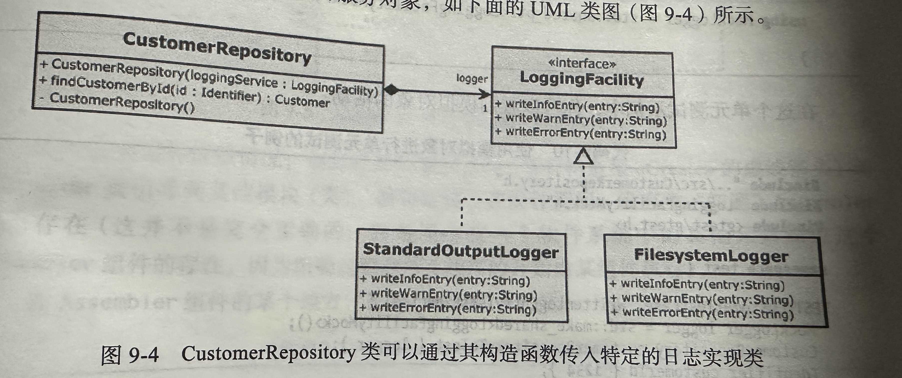

# 设计模式

## 1. 依赖注入模式

 

## 2. Adapter模式

## 3. Strategy模式

## 4. Command模式

## 5. Command处理器模式

## 6. Composite模式

## 7. Observer模式

## 8. Factory模式

## 9. Facade模式

## 10. Money Class模式

## 11. 特例模式

