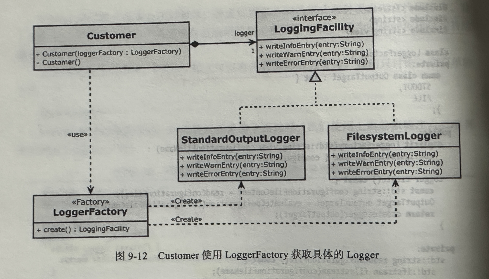
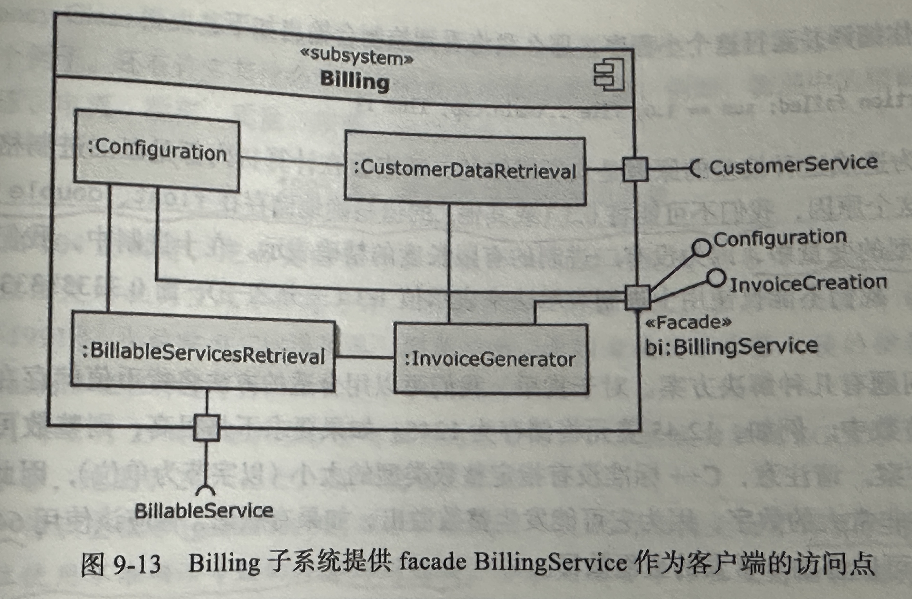

# 设计模式

## 1. 依赖注入模式

[DependencyInjection.cpp](https://github.com/niu0217/Documents/blob/main/C%2B%2B/standard/Code/DependencyInjection.cpp)

 

## 2. Adapter模式

 

## 3. Strategy模式

[Strategy.cpp](https://github.com/niu0217/Documents/blob/main/C%2B%2B/standard/Code/Strategy.cpp)

 

## 4. Command模式

简介：将请求封装为对象，从而允许你使用不同的请求、队列或日志的请求参数化客户端，或支持可撤销操作。

[Command.cpp](https://github.com/niu0217/Documents/blob/main/C%2B%2B/standard/Code/Command.cpp)

 

## 5. Command处理器模式

[CommandProcessor.cpp](https://github.com/niu0217/Documents/blob/main/C%2B%2B/standard/Code/CommandProcessor.cpp)

 

## 6. Composite模式

简介：将对象组合成树结构来表示“部分---整体”的层次结构。组合允许客户端统一地处理单个对象和对象的组合。

[Composite.cpp](https://github.com/niu0217/Documents/blob/main/C%2B%2B/standard/Code/Composite.cpp)

 

## 7. Observer模式

简介：定义对象之间的一对多的依赖关系，以便在一个对象更改状态时，自动通知并更新其所有的依赖关系。

[Observer.cpp](https://github.com/niu0217/Documents/blob/main/C%2B%2B/standard/Code/Observer.cpp)

 

## 8. Factory模式

[Factory.cpp](https://github.com/niu0217/Documents/blob/main/C%2B%2B/standard/Code/Factory.cpp)

 

## 9. Facade模式

简介：为子系统中的一组接口提供统一的接口。Facade定义了一个更高级的接口，使得子系统更容易使用。

 

## 10. Money Class模式

简介：提供一个类来表示确切的金额。Money类处理不同的货币和它们之间的转换。

```c++
#include <iostream>
#include <iomanip>

class Money {
public:
    // 构造函数，接受元、角、分作为参数
    Money(int yuan = 0, int jiao = 0, int fen = 0) 
        : yuan_(yuan), jiao_(jiao), fen_(fen) {}

    // 提供设置金额的方法
    void setAmount(int yuan, int jiao = 0, int fen = 0) {
        yuan_ = yuan;
        jiao_ = jiao;
        fen_ = fen;
        normalize();
    }

    // 加法运算符重载
    Money operator+(const Money& other) const {
        int totalYuan = yuan_ + other.yuan_;
        int totalJiao = jiao_ + other.jiao_;
        int totalFen = fen_ + other.fen_;

        return Money(totalYuan, totalJiao, totalFen).normalize();
    }

    // 其他必要的运算符重载，如减法、乘法、除法...

    // 显示方法
    friend std::ostream& operator<<(std::ostream& os, const Money& money) {
        return os << money.yuan_ << '.' << money.jiao_ << money.fen_;
    }

private:
    // 正规化金额，确保分不会超过100，如果超过则进位到角或元
    Money& normalize() {
        while (fen_ >= 100) {
            jiao_ += fen_ / 100;
            fen_ %= 100;
            if (jiao_ >= 10) {
                yuan_ += jiao_ / 10;
                jiao_ %= 10;
            }
        }
        return *this;
    }

    int yuan_{0}; // 元
    int jiao_{0}; // 角
    int fen_{0};  // 分

    // 可能还需要提供私有方法来处理各种货币转换逻辑，例如不同货币之间的汇率转换等
};

int main() {
    Money m1(100, 50, 30);
    Money m2(50, 20);

    Money sum = m1 + m2;
    std::cout << "Total: " << sum << std::endl;

    return 0;
}
```

## 11. 特例模式

