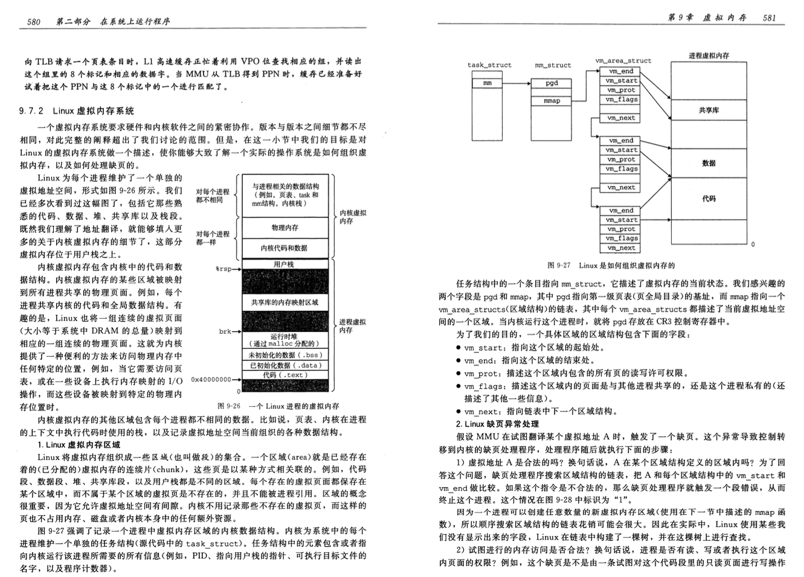

# 操作系统-虚拟内存

## 1. 问题

### 1.1 C++的动态库加载在虚拟内存中的哪个位置

 

## 2. 虚拟内存

虚拟内存是计算机系统中的一种内存管理技术，它为每个运行的程序提供了一个独立且连续的地址空间，即使实际的物理内存并不连续或者不足以容纳所有程序的数据和代码。

以下是一些关于虚拟内存的关键特性：

1. **地址空间隔离**：
   - 虚拟内存为每个进程创建了一个独立的地址空间，使得进程之间的内存相互隔离，增强了系统的安全性。
2. **虚拟地址与物理地址**：
   - 程序使用虚拟地址进行内存访问，这些虚拟地址由操作系统通过内存管理单元（MMU）转换为实际的物理地址。
3. **分页机制**：
   - 虚拟内存通常采用分页机制，即将虚拟地址空间划分为固定大小的页（例如4KB），物理内存也以同样的方式划分。
4. **页表**：
   - 操作系统维护一张页表，用于将虚拟地址映射到物理地址。这个映射过程对应用程序是透明的。
5. **页面替换策略**：
   - 当物理内存不足时，操作系统会使用页面替换策略（如LRU、LFU等）将当前不常访问或不再需要的页面换出到磁盘上的交换文件（swap file），以便为新的页面腾出空间。
6. **内存保护**：
   - 虚拟内存提供了内存保护机制，确保进程只能访问其被分配的虚拟地址空间，防止非法访问和数据破坏。
7. **虚拟内存的优势**：
   - 允许程序使用超过物理内存大小的地址空间。
   - 提高了内存的利用率和系统的整体性能。
   - 支持多任务和多进程环境中的内存管理。
   - 通过页面替换和交换文件，可以在一定程度上缓解内存不足的问题。
8. **操作系统管理**：
   - 虚拟内存的管理和调度主要由操作系统负责，包括页面的分配、映射、替换和回收等操作。
9. **程序视角**：
   - 从程序的角度看，虚拟内存提供了一个统一且连续的内存视图，简化了编程模型，程序员无需关心物理内存的具体细节。
10. **共享内存**：
    - 虚拟内存还可以支持多个进程共享同一块物理内存区域，这对于进程间通信和数据共享非常有用。

总的来说，虚拟内存是一种重要的内存管理技术，它通过抽象和虚拟化物理内存，使得操作系统能够更高效、安全地管理多个进程的内存需求。在现代计算机系统中，虚拟内存是操作系统不可或缺的一部分。

## 3. C++的虚拟内存

在C++中，虚拟内存是一种由操作系统提供的内存管理技术，它为每个进程提供了一个独立的、统一的地址空间视图。以下是一些关于C++虚拟内存的关键点：

1. **地址空间隔离**：
   - 操作系统为每个进程分配一个独立的虚拟地址空间，这样不同进程之间的内存是相互隔离的，提高了系统的安全性。
2. **虚拟地址与物理地址**：
   - 虚拟地址是程序中使用的内存地址，它们是由CPU的内存管理单元（MMU，Memory Management Unit）转换为实际的物理地址的。
3. **内存映射**：
   - 操作系统维护一张页表，将虚拟地址映射到物理地址。这个映射过程是透明的，程序无需关心具体的物理地址。
4. **分页机制**：
   - 虚拟内存通常采用分页机制，即将虚拟地址空间划分为固定大小的页（例如4KB），物理内存也以同样的方式划分。
5. **页面替换策略**：
   - 当物理内存不足时，操作系统会使用页面替换策略（如LRU，Least Recently Used）将当前不常访问的页面换出到磁盘上的交换文件（swap file），以便为新的页面腾出空间。
6. **内存保护**：
   - 虚拟内存提供了内存保护机制，确保进程只能访问其被分配的虚拟地址空间，防止非法访问和数据破坏。
7. **堆和栈**：
   - 在C++中，虚拟内存的一部分被用于存储程序的堆和栈数据。堆是用于动态内存分配的区域，而栈则用于存储函数调用的局部变量和返回地址等。
8. **内存分配**：
   - 当程序通过`new`或`malloc`等函数请求内存时，操作系统会在虚拟地址空间中找到一块未被使用的区域，并将其映射到物理内存。
9. **内存释放**：
   - 当程序通过`delete`或`free`等函数释放内存时，操作系统会解除该区域的虚拟地址到物理地址的映射，并可能将该物理内存返回给空闲内存池。
10. **共享内存**：
    - 虚拟内存还可以支持多个进程共享同一块物理内存区域，这对于进程间通信和数据共享非常有用。

虚拟内存使得程序可以使用比实际物理内存更大的地址空间，同时提供了内存保护和高效的内存管理机制。程序员在编写C++代码时，虽然可以直接操作虚拟内存，但通常情况下，这些细节由操作系统和C++标准库处理，程序员主要关注的是逻辑层面的内存管理和数据结构设计。

## 4. C++中的虚拟内存地址段

在C++中，虚拟内存地址段通常是由操作系统管理和分配的。以下是一些常见的虚拟内存地址段：

1. **代码段**：
   - 也称为文本段或只读段，存储程序的机器指令。这部分通常是只读的，以防止程序意外修改其自身的代码。
2. **数据段**：
   - 存储全局变量和静态变量的初始值。这些变量在程序开始运行时就被初始化，并在整个程序运行期间保持不变。
3. **BSS段**：
   - 代表"Block Started by Symbol"，用于存储未初始化或初始化为0的全局变量和静态变量。BSS段不占用磁盘空间，因为未初始化的数据默认为0，不需要在磁盘上存储。
4. **堆段**：
   - 用于动态内存分配，如通过`new`操作符分配的内存。堆段的大小在程序运行时是可变的，随着`malloc`和`free`等函数的调用而增长和收缩。
5. **栈段**：
   - 用于存储函数调用时的局部变量、函数参数和返回地址等信息。每当一个函数被调用时，一个新的栈帧会在栈顶创建，当函数返回时，对应的栈帧会被销毁。
6. **共享库段**：
   - 如果程序链接了共享库（如DLLs或.so文件），那么这些库的代码和数据也会有自己的虚拟内存段。
7. **内核空间**：
   - 操作系统保留的一部分虚拟地址空间，包含内核代码和数据结构。用户态进程通常无法直接访问内核空间。
8. **用户空间**：
   - 提供给用户进程使用的虚拟地址空间，包括上述的代码段、数据段、BSS段、堆段和栈段。
9. **保留区域**：
   - 操作系统可能还会保留一些虚拟地址空间供特定用途，例如用于处理内存映射I/O或者作为陷阱区域来检测无效的内存访问。

这些虚拟内存地址段的具体布局和大小可能会因操作系统和体系结构的不同而有所差异。在C++编程中，程序员通常不需要直接管理这些地址段，而是通过使用标准库提供的内存管理函数（如`new`、`delete`、`malloc`、`free`等）以及遵循良好的编程实践来确保有效的内存使用。操作系统和硬件（如MMU）负责将虚拟地址转换为物理地址并管理这些地址段的分配和访问。

## 5. Linux虚拟内存

  

