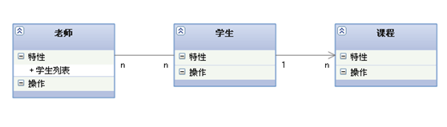
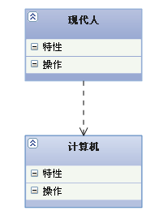

# C++UML类图详解

## 1. 基本概念

**类图（Class Diagram）**: 类图是面向对象系统建模中最常用和最重要的图，是定义其它图的基础。类图主要是用来显示系统中的类、接口以及它们之间的静态结构和关系的一种静态模型。

类图的3个基本组件：**类名、属性、方法**。

 

在UML类图中，常见的有以下几种关系: **泛化（Generalization）**, **实现（Realization）**，**关联（Association)**，**聚合（Aggregation**，**组合(Composition)**，**依赖(Dependency)**

## 2. 泛化(Generalization)

**【泛化关系】**：是一种继承关系，表示一般与特殊的关系，它指定了子类如何特化父类的所有特征和行为。例如：老虎是动物的一种，即有老虎的特性也有动物的共性。
**【箭头指向】**：带三角箭头的实线，箭头指向父类

 

## 3. 实现(Realization)

**【实现关系】**：是一种类与接口的关系，表示类是接口所有特征和行为的实现.
**【箭头指向】**：带三角箭头的虚线，箭头指向接口

 

## 4. 关联(Association)

**【关联关系】**：是一种拥有的关系，它使一个类知道另一个类的属性和方法；如：老师与学生，丈夫与妻子关联可以是双向的，也可以是单向的。双向的关联可以有两个箭头或者没有箭头，单向的关联有一个箭头。
**【代码体现】**：成员变量
**【箭头及指向】**：带普通箭头的实心线，指向被拥有者

 

上图中，老师与学生是双向关联，老师有多名学生，学生也可能有多名老师。但学生与某课程间的关系为单向关联，一名学生可能要上多门课程，课程是个抽象的东西他不拥有学生。

**下图为自身关联：**

 

## 5. 聚合(Aggregation)

【聚合关系】：是整体与部分的关系，且部分可以离开整体而单独存在。如车和轮胎是整体和部分的关系，轮胎离开车仍然可以存在。

聚合关系是关联关系的一种，是强的关联关系；关联和聚合在语法上无法区分，必须考察具体的逻辑关系。

【代码体现】：成员变量
【箭头及指向】：带空心菱形的实心线，菱形指向整体
 

## 6. 组合(Composition)

【组合关系】：是整体与部分的关系，但部分不能离开整体而单独存在。如公司和部门是整体和部分的关系，没有公司就不存在部门。

组合关系是关联关系的一种，是比聚合关系还要强的关系，它要求普通的聚合关系中代表整体的对象负责代表部分的对象的生命周期。

【代码体现】：成员变量

【箭头及指向】：带实心菱形的实线，菱形指向整体
 

## 7. 依赖(Dependency)

**依赖关系】**：是一种使用的关系，即一个类的实现需要另一个类的协助，所以要尽量不使用双向的互相依赖.
**【代码表现】**：局部变量、方法的参数或者对静态方法的调用
**【箭头及指向】**：带箭头的虚线，指向被使用者

 

各种关系的强弱顺序：
**泛化 = 实现 > 组合 > 聚合 > 关联 > 依赖**

下面这张UML图，比较形象地展示了各种类图关系：

 

 **多重性(Multiplicity) :** 通常在**关联、聚合、组合**中使用。就是代表有多少个关联对象存在。使用数字…星号（数字）表示。如下图，一个割接通知可以关联0个到N个故障单。

## 8. UML实例分析

 

+ 通知分为一般通知、割接通知、重保通知。这个是继承关系。
+ NoticeService和实现类NoticeServiceImpl是实现关系。
+ NoticeServiceImpl通过save方法的参数引用Notice,是依赖关系。同时调用了BaseDao完成功能，也是依赖关系。
+ 割接通知和故障单之间通过中间类(通知电路)关联，是一般关联。
+ 重保通知和预案库间是聚合关系。因为预案库可以事先录入，和重保通知没有必然联系，可以独立存在。在系统中是手工从列表中选择。删除重保通知，不影响预案。
+ 割接通知和需求单之间是聚合关系。同理，需求单可以独立于割接通知存在。也就是说删除割接通知，不影响需求单。
+ 通知和回复是组合关系。因为回复不能独立于通知存在。也就是说删除通知，该条通知对应的回复也要级联删除。
  经过以上的分析，相信大家对类的关系已经有比较好的理解了。大家有什么其它想法或好的见解，欢迎拍砖。