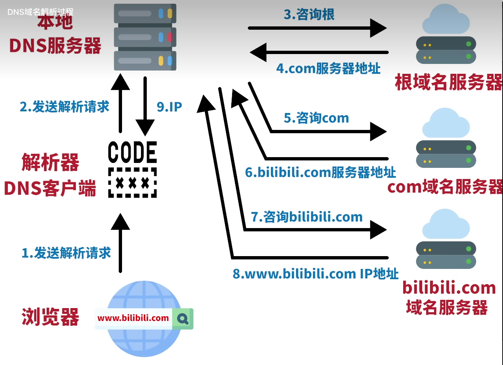

# DNS解析过程

 

```shell
ubuntu@niu0217:~$ nslookup
> set type=ns
> .  #查询根服务器
Server:		127.0.0.53
Address:	127.0.0.53#53

Non-authoritative answer:
.	nameserver = k.root-servers.net.
.	nameserver = l.root-servers.net.
.	nameserver = m.root-servers.net.
.	nameserver = a.root-servers.net.
.	nameserver = b.root-servers.net.
.	nameserver = c.root-servers.net.
.	nameserver = d.root-servers.net.
.	nameserver = e.root-servers.net.
.	nameserver = f.root-servers.net.
.	nameserver = g.root-servers.net.
.	nameserver = h.root-servers.net.
.	nameserver = i.root-servers.net.
.	nameserver = j.root-servers.net.

Authoritative answers can be found from:
> set type=a  #查询根服务器b.root-servers.net.的IP地址
> b.root-servers.net.
Server:		127.0.0.53
Address:	127.0.0.53#53

Non-authoritative answer:
Name:	b.root-servers.net
Address: 199.9.14.201
>
>
> server 199.9.14.201 #连接根服务器
Default server: 199.9.14.201
Address: 199.9.14.201#53
> set type=ns  #查询顶级域名服务器com.
> com.
Server:		199.9.14.201
Address:	199.9.14.201#53

Non-authoritative answer:
*** Can't find com.: No answer

Authoritative answers can be found from:
com	nameserver = a.gtld-servers.net.
com	nameserver = b.gtld-servers.net.
com	nameserver = c.gtld-servers.net.
com	nameserver = d.gtld-servers.net.
com	nameserver = e.gtld-servers.net.
com	nameserver = f.gtld-servers.net.
com	nameserver = g.gtld-servers.net.
com	nameserver = h.gtld-servers.net.
com	nameserver = i.gtld-servers.net.
com	nameserver = j.gtld-servers.net.
com	nameserver = k.gtld-servers.net.
com	nameserver = l.gtld-servers.net.
com	nameserver = m.gtld-servers.net.
a.gtld-servers.net	internet address = 192.5.6.30
a.gtld-servers.net	has AAAA address 2001:503:a83e::2:30
b.gtld-servers.net	internet address = 192.33.14.30
b.gtld-servers.net	has AAAA address 2001:503:231d::2:30
c.gtld-servers.net	internet address = 192.26.92.30
c.gtld-servers.net	has AAAA address 2001:503:83eb::30
d.gtld-servers.net	internet address = 192.31.80.30
d.gtld-servers.net	has AAAA address 2001:500:856e::30
e.gtld-servers.net	internet address = 192.12.94.30
e.gtld-servers.net	has AAAA address 2001:502:1ca1::30
f.gtld-servers.net	internet address = 192.35.51.30
f.gtld-servers.net	has AAAA address 2001:503:d414::30
>
>
> server 192.33.14.30  #连接顶级域名服务器com.
Default server: 192.33.14.30
Address: 192.33.14.30#53
> set type=ns  #查询权威域名服务器bilibili.com.
> bilibili.com.
Server:		192.33.14.30
Address:	192.33.14.30#53

Non-authoritative answer:
*** Can't find bilibili.com.: No answer

Authoritative answers can be found from:
bilibili.com	nameserver = ns3.dnsv5.com.
bilibili.com	nameserver = ns4.dnsv5.com.
ns3.dnsv5.com	internet address = 1.12.0.17
ns3.dnsv5.com	internet address = 1.12.0.18
ns3.dnsv5.com	internet address = 1.12.0.20
ns3.dnsv5.com	internet address = 108.136.87.44
ns3.dnsv5.com	internet address = 125.94.59.200
ns3.dnsv5.com	internet address = 163.177.5.75
ns3.dnsv5.com	has AAAA address 2402:4e00:1430:1102:0:9136:2b2b:ba61
ns3.dnsv5.com	internet address = 35.165.107.227
ns3.dnsv5.com	internet address = 36.155.149.211
ns3.dnsv5.com	internet address = 49.234.175.103
ns4.dnsv5.com	internet address = 1.12.0.16
ns4.dnsv5.com	internet address = 1.12.0.19
ns4.dnsv5.com	internet address = 106.55.82.76
ns4.dnsv5.com	internet address = 112.80.181.106
ns4.dnsv5.com	internet address = 117.89.178.200
ns4.dnsv5.com	internet address = 120.241.130.93
ns4.dnsv5.com	internet address = 13.37.58.163
ns4.dnsv5.com	internet address = 150.109.248.236
ns4.dnsv5.com	internet address = 183.47.126.155
ns4.dnsv5.com	has AAAA address 2402:4e00:111:fff::8
>
>
> server 1.12.0.17  #连接权威域名服务器bilibili.com.
Default server: 1.12.0.17
Address: 1.12.0.17#53
> set type=a  #查询域名
> www.bilibili.com.
Server:		1.12.0.17
Address:	1.12.0.17#53

www.bilibili.com	canonical name = a.w.bilicdn1.com.  #别名
> a.w.bilicdn1.com. #直接输入查询
Server:		1.12.0.17
Address:	1.12.0.17#53

a.w.bilicdn1.com	canonical name = ct.w.bilicdn1.com.
Name:	ct.w.bilicdn1.com
Address: 183.131.147.28
Name:	ct.w.bilicdn1.com
Address: 183.131.147.29
Name:	ct.w.bilicdn1.com
Address: 183.131.147.30
Name:	ct.w.bilicdn1.com
Address: 183.131.147.48
Name:	ct.w.bilicdn1.com
Address: 114.230.222.138
Name:	ct.w.bilicdn1.com
Address: 114.230.222.139
Name:	ct.w.bilicdn1.com
Address: 114.230.222.140
Name:	ct.w.bilicdn1.com
Address: 114.230.222.141
Name:	ct.w.bilicdn1.com
Address: 114.230.222.142
Name:	ct.w.bilicdn1.com
Address: 117.21.179.18
Name:	ct.w.bilicdn1.com
Address: 117.21.179.19
Name:	ct.w.bilicdn1.com
Address: 117.21.179.20
Name:	ct.w.bilicdn1.com
Address: 117.23.60.12
Name:	ct.w.bilicdn1.com
Address: 117.23.60.13
Name:	ct.w.bilicdn1.com
Address: 117.23.60.14
Name:	ct.w.bilicdn1.com
Address: 117.23.60.15
Name:	ct.w.bilicdn1.com
Address: 119.84.174.66
Name:	ct.w.bilicdn1.com
Address: 119.84.174.67
Name:	ct.w.bilicdn1.com
Address: 119.84.174.68
Name:	ct.w.bilicdn1.com
Address: 124.239.244.15
>
```

