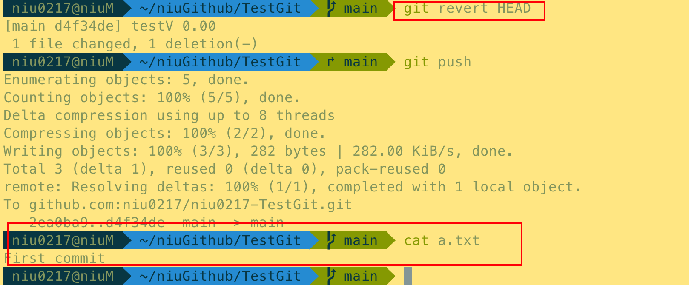

# Git基础知识

## 1. Git 维护的三棵树

+ workingDir 工作目录，持有的实际文件，修改代码都是在这里发生的

+ index 缓存目录，临时保存你的改动，add 之后就是进入这个缓存目录

+ HEAD 一般是指向最新一次 commit 的引用，调用commit后就到这里

 

## 2. 保存修改

+ 查看更改状态

```shell
git status
```

 

+ 将更改添加到缓存中，即Index

  + 添加所有文件

    ```shell
    git add .
    ```

     

  + 添加单个文件

    ```shell
    git add <filename>
    ```

     

  + 添加指定文件夹

    ```shell
    git add <directory>
    ```

     

+ 将缓存区添加到HEAD中

```shell
git commit -m "提交内容描述"
```

 


## 3. 查看状态

查看状态分为两种方式

- `git status`查看工作区和缓存区的状态
- `git log `显示已经commit的记录

`git log`这个命令帮组我们查看历史提交信息，根据不同的命令组合可以查看更加详细的提交信息.

**目录：**

```shell
git log  
//输出所有提交历史信息  

git log -n <limit>  
//输出limit条提交历史信息。  

git log --oneline  
//将每个提交压缩到一行。当你需要查看项目历史的上层情况时这会很有用。  

git log --stat  
//这个命令显示更详细的信息，包含哪些文件被更改了。  

git log -p  
//这个命令显示了更为详细的信息。显示每个提交全部的差异  

git log --author="<pattern>"  
git log --grep="<pattern>"  
//前者搜索特定作者的提交  
//后者搜索提交信息匹配特定 <pattern> 的提交。<pattern> 都可以是字符串或正则表达  
//式。  

git log <since>..<until>  
//搜索<since> 和 <until> 之间的提交。两个参数可以是提交 ID、分支名、HEAD   
//或是任何一种引用。  

git log <file>  
//搜索指定文件的历史提交信息。 

git reflog
//这个命令可以显示我们git执行了那些操作，并且可以配合git reset  来恢复到指定操作的状态，非常有用。
```

+ `git log  `输出所有提交历史信息

 

+ `git log -n 2  ` 输出2条提交历史信息。  

 

+ `git log --oneline  `将每个提交压缩到一行。当你需要查看项目历史的上层情况时这会很有用。 

 

 

+ `git log -p `显示了更为详细的信息。显示每个提交全部的差异

 

+ `git log --author niu0217`查看作者为niu0217的提交记录

 

 

+ `git reflog`这个命令可以显示我们git执行了那些操作，并且可以配合git reset  来恢复到指定操作的状态，非常有用。

 

 


## 4. Git中reset, restore and revert指令的区别

在日常git[工作流](https://so.csdn.net/so/search?q=工作流&spm=1001.2101.3001.7020)中，经常涉及到回退暂存区、回退工作区等撤销操作。

+ `git-revert` 是进行新的提交，以还原其他提交所做的更改。
+ `git-restore `使得在工作空间但是不在暂存区的文件撤销更改(内容恢复到没修改之前的状态)
+ `git restore --staged` 是将暂存区的文件从暂存区撤出，但不会更改文件的内容
+ `git-reset`是关于更新分支，移动顶端(tip)以便从分支中添加或删除提交。 此操作更改提交历史记录。
  `git reset`也可以用来还原索引，与git restore重叠。

### 4.1 git reset

通过把分支记录回退几个提交记录来实现撤销改动。你可以将这想象成“改写历史”。git reset 向上移动分支，原来指向的提交记录就跟从来没有提交过一样。

<font color=red>**非必要绝对不要使用，使用前一定要确认清楚**</font>

注：这种只对本地分支有效，对远程分支无效。

 

**场景：撤销commit**

本地git add 之后，git commit了，但需要撤销本次commit动作
`git reset --soft HEAD^`
这样就成功的撤销了你的commit

注意， 仅仅是撤回commit操作，您写的代码仍然保留。
HEAD^的意思是上一个版本，也可以写成HEAD~1
如果你进行了2次commit，想都撤回，可以使用HEAD~2

 

**reset 其他参数**
`–mixed`
不删除工作空间改动代码，撤销commit，并且撤销git add . 操作
这个为默认参数,git reset --mixed HEAD^ 和 git reset HEAD^ 效果是一样的。

`–soft`
不删除工作空间改动代码，撤销commit，不撤销git add .

`–hard`
删除工作空间改动代码，撤销commit，撤销git add .
注意完成这个操作后，就恢复到了上一次的commit状态。

### 4.2 git revert

如下图所示，我们通过git revert HEAD命令进行撤销

 

```shell
* git revert HEAD                  撤销前一次 commit
* git revert HEAD^               撤销前前一次 commit
* git revert commit （比如：fa042ce57ebbe5bb9c8db709f719cec2c58ee7ff）撤销指定的版本，撤销也会作为一次提交进行保存。
```

 没修改之前：

a.txt

```
First commit
```

修改之后：

```
First commit
Second commit
```

然后提交修改：2ea0ba9 (HEAD -> main, origin/main) testV1.00

 

 但是我想回退到上一次修改。

执行命令`git revert HEAD`

 

 

回退成功：d4f34de (HEAD -> main, origin/main) testV 0.00

**结论：** 在我们要撤销的提交记录后面居然多了一个新提交！这是因为新提交记录 C2’ 引入了更改 —— 这些更改刚好是用来撤销 C2 这个提交的。也就是说 C2’ 的状态与 C1 是相同的。
revert 之后就可以把你的更改推送到远程仓库与别人分享。

**git revert 和 git reset的区别**

+ git revert是用一次新的commit来回滚之前的commit，git reset是直接删除指定的commit。
+ 在回滚这一操作上看，效果差不多。但是在日后继续merge以前的老版本时有区别。因为git revert是用一次逆向的commit“中和”之前的提交，因此日后合并老的branch时，导致这部分改变不会再次出现，但是git reset是之间把某些commit在某个branch上删除，因而和老的branch再次merge时，这些被回滚的commit应该还会被引入。
+ git reset 是把HEAD向后移动了一下，而git revert是HEAD继续前进，只是新的commit的内容和要revert的内容正好相反，能够抵消要被revert的内容。

### 4.3 git restore指令

 

**结论：**
`git restore`指令使得在工作空间但是不在暂存区的文件撤销更改(内容恢复到没修改之前的状态)
等同于`git checkout file` 一样的效果，将工作区修改的文件内容回撤掉

### 4.4 git restore --staged

使用git add a.c 之后，add到暂存区，使用git restore --staged之后，文件修改的内容并没有改变。

**结论：**
`git restore --staged`的作用是将暂存区的文件从暂存区撤出，但不会更改文件的内容，即本地工作区中文件被修改内容还在。


