# Git的版本回退

## 1. 回退删除之前的commit

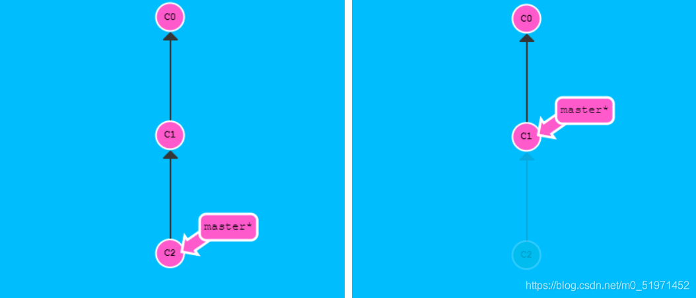 

### 1.1 reset 参数

`–mixed`
不删除工作空间改动代码，撤销commit，并且撤销git add . 操作
这个为默认参数,git reset --mixed HEAD^ 和 git reset HEAD^ 效果是一样的。

`–soft`
不删除工作空间改动代码，撤销commit，不撤销git add .

`–hard`
删除工作空间改动代码，撤销commit，撤销git add .
注意完成这个操作后，就恢复到了上一次的commit状态。

### 1.2 需要用的命令

穿梭前，用`git log`可以查看提交历史，以便确定要回退到哪个版本

要重返未来，用`git reflog`查看命令历史，以便确定要回到未来的哪个版本

`HEAD`指向的版本就是当前版本，因此，Git允许我们在版本的历史之间穿梭，使用命令`git reset --hard commit_id`

### 1.3 使用--mixed

查看提交记录：` git log --oneline`

步骤一：

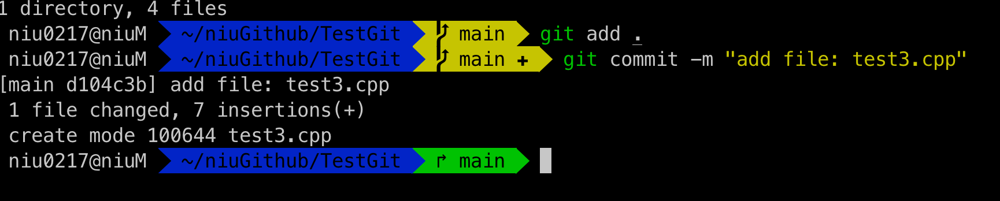 

此时的提交记录：

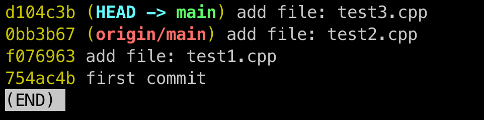 

步骤二：

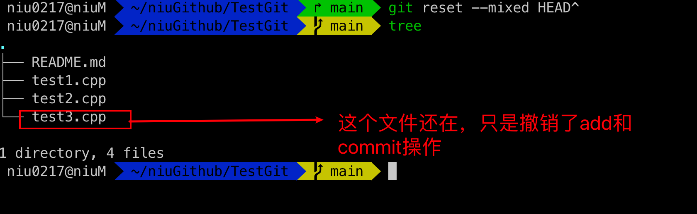 

此时的提交记录：

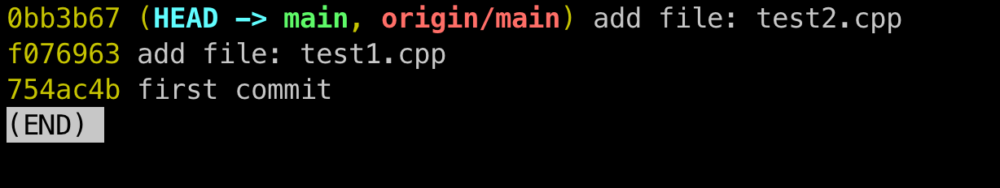 


### 1.4 使用--soft

步骤一：

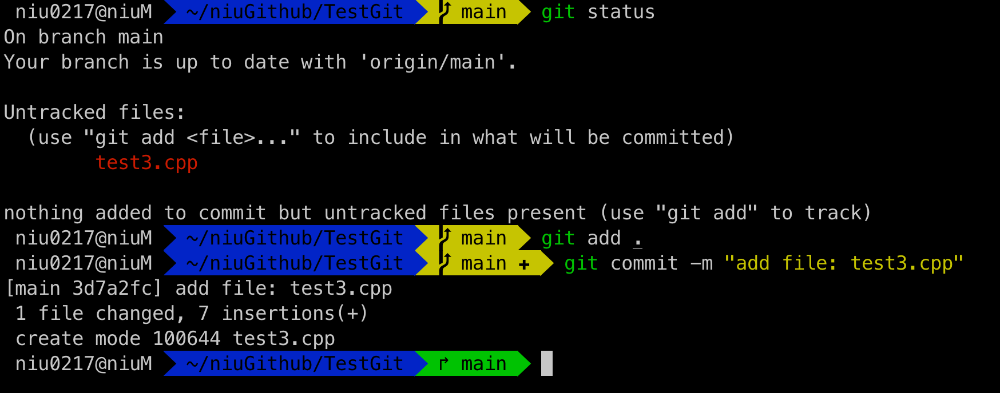 

此时的提交记录：

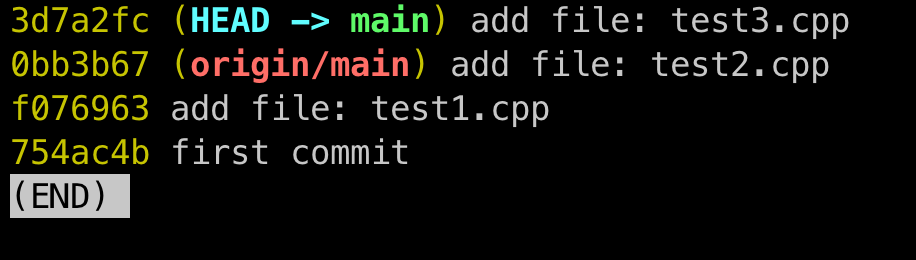 

步骤二：

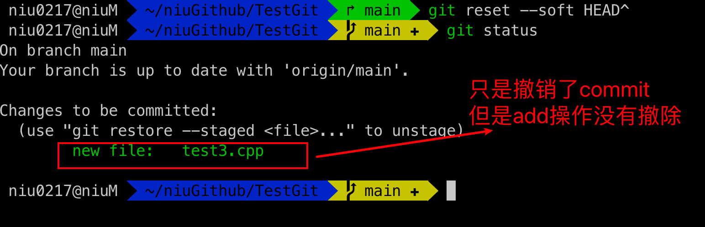 

此时的提交记录：

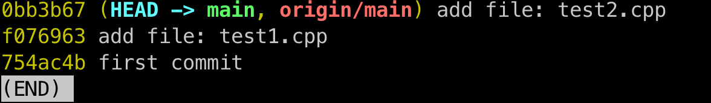 

### 1.5 使用--hard

开始的提交记录：

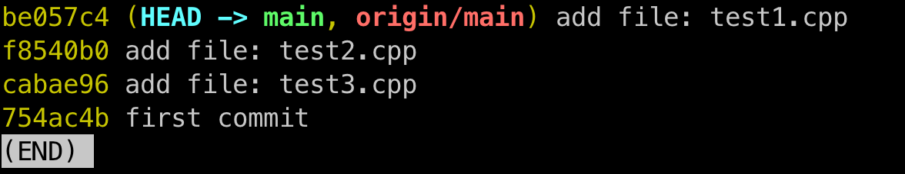 

存在的文件：

```
.
├── README.md
├── test1.cpp
├── test2.cpp
└── test3.cpp

1 directory, 4 files
```

让我们进行回退，回退到第一个版本，即first commit的版本。

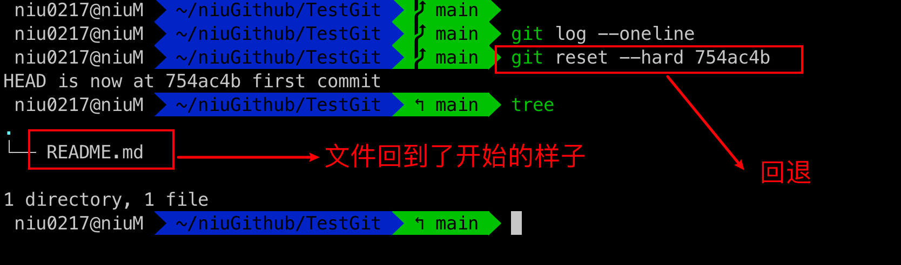 

此时的提交记录：

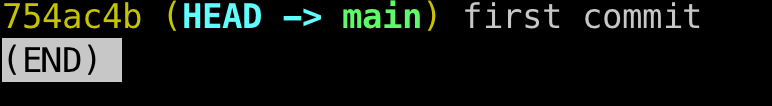 

然后强制提交，保持Github和本地的一致：

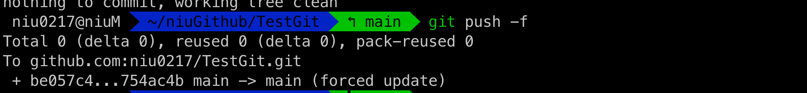 


## 2. 回退不删除之前的commit

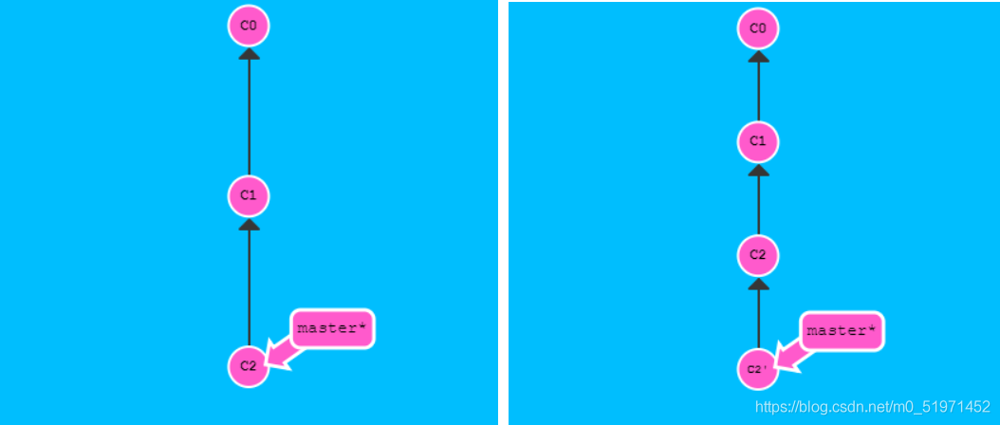 

git revert是用一次新的commit来回滚之前的commit，git reset是直接删除指定的commit。

```
* git revert HEAD                  撤销前一次 commit
* git revert HEAD^               撤销前前一次 commit
* git revert commit （比如：fa042ce57ebbe5bb9c8db709f719cec2c58ee7ff）撤销指定的版本，撤销也会作为一次提交进行保存。
```

### 2.1 撤销前一次commit

初始的提交记录：

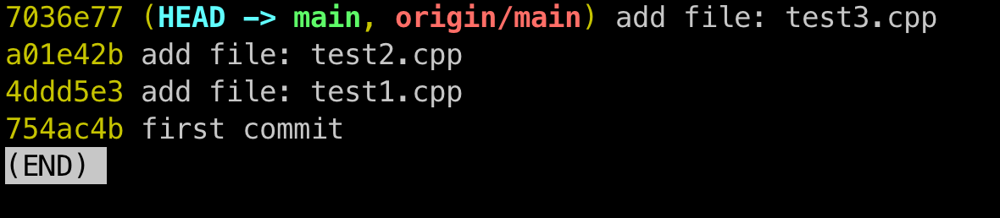 

此时的文件结构：

```
.
├── README.md
├── test1.cpp
├── test2.cpp
└── test3.cpp

1 directory, 4 files
```

回退：

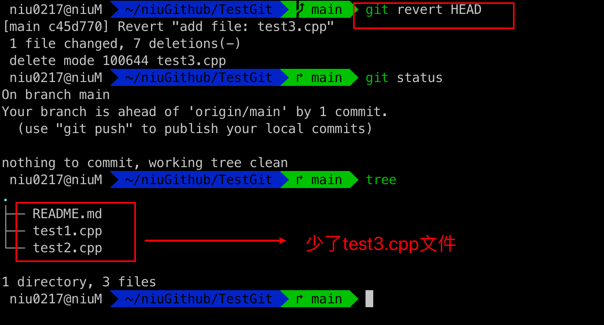 

然后提交：

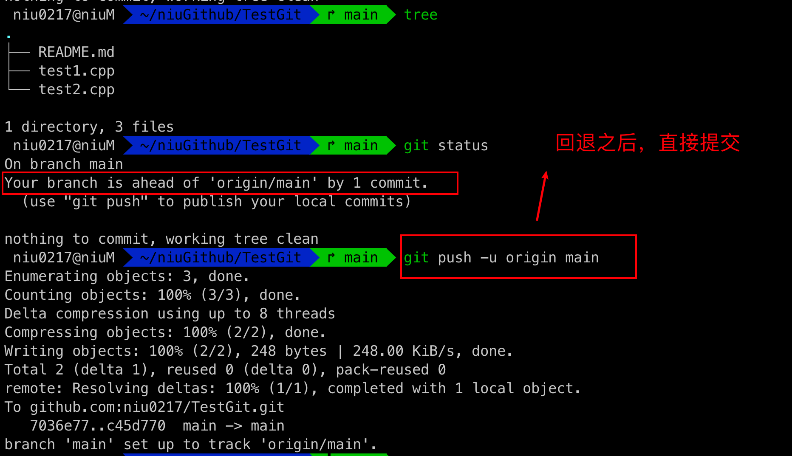 

此时的提交日志：

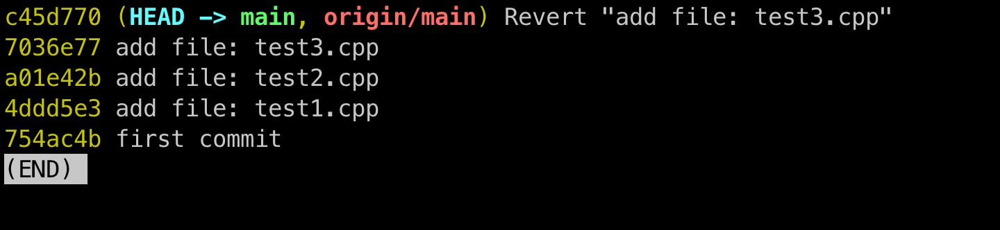 

可以看到重新生成了一个新的提交记录。


### 2.2 回退到任意版本

初始的提交日志：

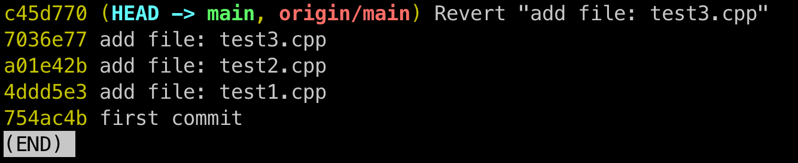 

此时的文件结构：

```
.
├── README.md
├── test1.cpp
└── test2.cpp
```

回退到版本：754ac4b

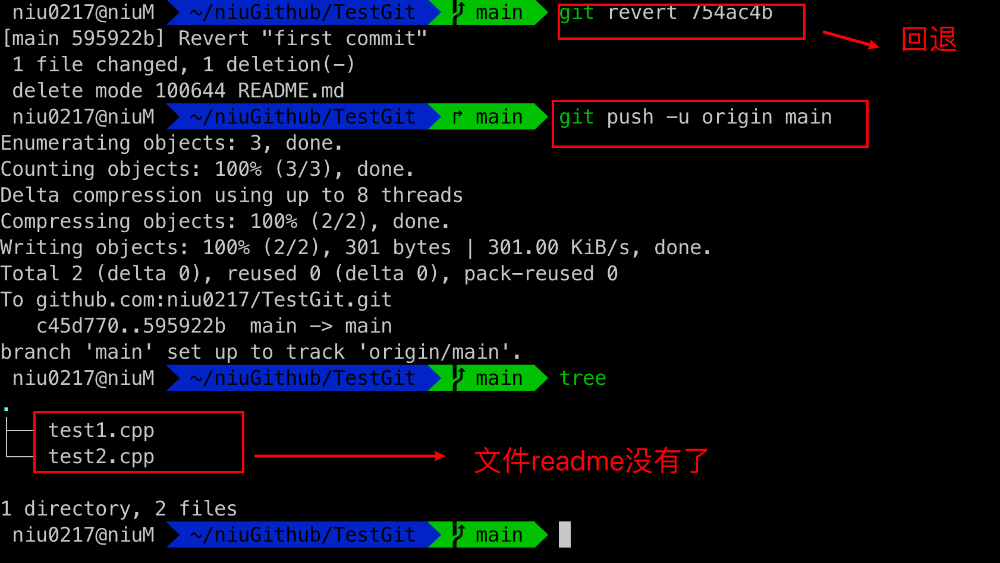 

此时的提交记录：

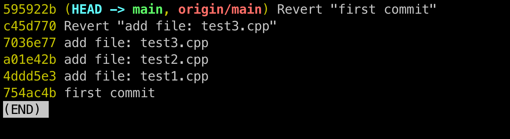 


