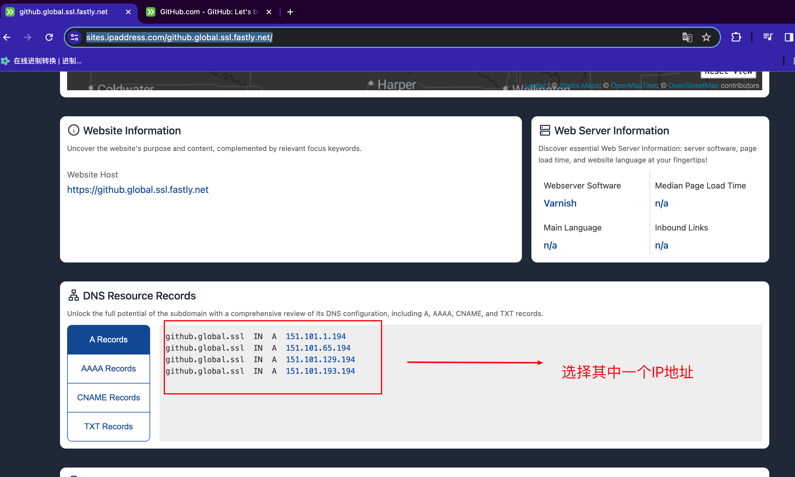

# Git提交慢

## 参考网站

https://blog.csdn.net/qq_50909707/article/details/127787091

https://juejin.cn/post/7093331183756869662

## 步骤

打开网站：https://sites.ipaddress.com/github.global.ssl.fastly.net/

 

打开网站：https://sites.ipaddress.com/github.com/#ipinfo

 

然后打开MAC中的终端输入命令：

```bash
sudo vi /etc/hosts
```

然后在文件末尾加入：

```bash
# 加快github速度
151.101.1.194 github.global.ssl.fastly.net
140.82.112.3 github.com
```

这两个IP地址来自上面两个网站。至此完成了问题的解决。

