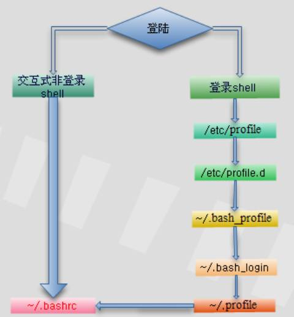

# Shell

## 1. 基础

### 1.1 命令执行顺序

1、以相对/绝对路径执行命令，例如【/bin/ls】或【./ls】

2、由alias找到该命令来执行

3、由bash内置的（builtin）命令来执行

4、通过$PATH这个变量的顺序查找到的第一个命令来执行

同时，我们可以通过命令`type -a 命令`来查看命令的的执行顺序。比如：

```bash
ubuntu@niu0217:~$ type -a ls
ls is aliased to `ls --color=auto'
ls is /usr/bin/ls
ls is /bin/ls
ubuntu@niu0217:~$
ubuntu@niu0217:~$ type -a echo
echo is a shell builtin
echo is /usr/bin/echo
echo is /bin/echo
ubuntu@niu0217:~$
```

### 1.2 快速编辑与执行

```bash
ubuntu@niu0217:~/Dev/test$ cp comp/data1.txt comp/data2.txt \
> comp/data3.txt ./
```

中间用`\`后面跟`enter`来实现执行长命令。

| 组合键     | 功能                   |
| ---------- | ---------------------- |
| [ctrl] + u | 从光标处向前删除字符串 |
| [ctrl] + k | 从光标处向后删除字符串 |
| [ctrl] + a | 让光标移动到命令最前面 |
| [ctrl] + e | 让光标移动到命令最后面 |

### 1.3 别名

设置别名：

```bash
ubuntu@niu0217:~/Dev/Test$ alias grep='grep --color=auto'
ubuntu@niu0217:~/Dev/Test$ alias
alias grep='grep --color=auto'
ubuntu@niu0217:~/Dev/Test$
```

取消别名：

```bash
ubuntu@niu0217:~/Dev/Test$ unalias grep
```

此时的别名只是暂时有效，想让别名永久生效：

+ 打开`/etc/profile`文件
+ 在文件最后添加你想要的别名，比如`alias grep='grep --color=auto'`
+ 然后`source /etc/profile`

此时就是永久生效。

解释：

> profile（/etc/profile），**用于设置系统级的环境变量和启动程序，在这个文件下配置会对所有用户生效**。 当用户登录（login）时，文件会被执行，并从/etc/profile. d目录的配置文件中查找shell设置

当登入系统时候获得一个shell进程时，其读取环境设定档如下:

 

图片来源：https://cloud.tencent.com/developer/article/1116370

### 1.4 通配符和特殊符号

通配符：

| 符号  | 意义                                                         |
| ----- | ------------------------------------------------------------ |
| `*`   | 代表【0个到无穷多个】任意字符                                |
| `?`   | 代表【一定有一个】任意字符                                   |
| `[]`  | 代表【一定有一个在括号内】的字符（非任意字符）；<br>比如：`[abcd]`则代表在a/b/c/d中任意选择一个 |
| `[-]` | 代表范围；<br>比如：`[1-9]`代表1和9之间的所有数字            |
| `[^]` | 代表反向选择；<br>比如：`[^abc]`代表不是a/b/c的字符          |

特殊符号：

| 符号    | 内容                                             |
| ------- | ------------------------------------------------ |
| `#`     | 注释符号                                         |
| `\`     | 转义符；将【特殊字符或通配符】还原成一般字符     |
| `|`     | 管道命令                                         |
| `;`     | 连续命令执行分隔符                               |
| `~`     | 用户的家目录                                     |
| `$`     | 使用变量前导符：亦即是变量之前需要加的变量替换值 |
| `&`     | 任务管理：将命令变成后台运行                     |
| `!`     | 逻辑运算意义上的【非】not的意思                  |
| `/`     | 目录符号：路径分隔的符号                         |
| `>、>>` | 数据流重定向：输出定向，分别是【替换】和【累加】 |
| `<、<<` | 数据流重定向：输入定向                           |
| `''`    | 单引号，不具有变量替换的功能（$变为纯文本）      |
| `""`    | 双引号、具有变量替换的功能（$可保留相关功能）    |
| ``      | 两个【`】中间为可以先执行的命令，也可使用$()     |
| `()`    | 在中间为子shell的开始与结束                      |
| `{}`    | 在中间为命令区块的组合                           |

### 1.5 shell脚本的默认变量

| 符号   | 含义                                                         |
| ------ | ------------------------------------------------------------ |
| `$#`   | 代表后接的参数【个数】                                       |
| `$@`   | 代表所有变量；<br>举例：`sh how_paras.sh theone haha qout`<br>含义：`$@`代表`theone haha qout` |
| `$*`   | 代表【"$1c$2c$3c"】,c代表分隔符                              |
| `${0}` | 代表脚本名字：<br/>举例：`sh how_paras.sh theone haha qout`<br/>含义：`${0}`代表`how_paras.sh` |
| `${1}` | 代表第1个参数                                                |
| `${2}` | 代表第2个参数                                                |

### 1.6 shell中的判断符号[]

shell中的`[]`也有其他的特殊含义：如果要在bash的语法当中使用中括号作为shell的判断式时，必须要注意中括号的两端需要有空格符来分隔。中括号的两端需要有空格符来分隔。中括号的两端需要有空格符来分隔。中括号的两端需要有空格符来分隔。

```sh
[ "${yn}" == "Y" -o "${yn}" == "y" ] && echo "OK, continue" && exit 0
```

### 1.7 变量的设置和取消

```bash
ubuntu@niu0217:~$ path=${PATH}
ubuntu@niu0217:~$ echo $path
/usr/local/sbin:/usr/local/bin:/usr/sbin:/usr/bin:/sbin:/bin:/usr/games:/usr/local/games:/snap/bin
ubuntu@niu0217:~$ unset path
ubuntu@niu0217:~$ echo $path

ubuntu@niu0217:~$
```

### 1.8 变量内容的删除、取代与替换

| 变量设置方式               | 说明                                                         |
| -------------------------- | ------------------------------------------------------------ |
| ${变量#关键词}             | 若变量内容从头开始的数据符合【关键词】，则将符合的最短数据删除 |
| ${变量##关键词}            | 若变量内容从头开始的数据符合【关键词】，则将符合的最长数据删除 |
| ${变量%关键词}             | 若变量内容从尾向前的数据符合【关键词】，则将符合的最短数据删除 |
| ${变量%%关键词}            | 若变量内容从尾向前的数据符合【关键词】，则将符合的最长数据删除 |
| ${变量/旧字符串/新字符串}  | 若变量内容符合【旧字符串】则【第一个旧字符串会被新字符串替换】 |
| ${变量//旧字符串/新字符串} | 若变量内容符合【旧字符串】则【全部的旧字符串会被新字符串替换】 |

| 变量设置方式       | str没有设置           | str为空字符串         | str已设置非为空字符串 |
| ------------------ | --------------------- | --------------------- | --------------------- |
| `var=${str-expr}`  | var=expr              | var=                  | var=$str              |
| `var=${str:-expr}` | var=expr              | var=expr              | var=$str              |
| `var=${str+expr}`  | var=                  | var=expr              | var=expr              |
| `var=${str:+expr}` | var=                  | var=                  | var=expr              |
| `var=${str=expr}`  | str=expr<br>var=expr  | str不变<br>var=       | str不变<br/>var=$str  |
| `var=${str:=expr}` | str=expr<br/>var=expr | str=expr<br/>var=expr | str=expr<br/>var=$str |
| `var=${str?expr}`  | expr输出至stderr      | var=                  | var=$str              |
| `var=${str:?expr}` | expr输出至stderr      | expr输出至stderr      | var=$str              |

举例：

```bash
#最短匹配删除，从前到后
ubuntu@niu0217:~$ echo ${path}
/usr/local/sbin:/usr/local/bin:/usr/sbin:/usr/bin:/sbin:/bin:/usr/games:/usr/local/games:/snap/bin
ubuntu@niu0217:~$ echo ${path#/*local/sbin:}
/usr/local/bin:/usr/sbin:/usr/bin:/sbin:/bin:/usr/games:/usr/local/games:/snap/bin
ubuntu@niu0217:~$
```

```bash
#最长匹配删除，从前到后
ubuntu@niu0217:~$ echo ${path}
/usr/local/sbin:/usr/local/bin:/usr/sbin:/usr/bin:/sbin:/bin:/usr/games:/usr/local/games:/snap/bin
ubuntu@niu0217:~$ echo ${path##/*:}
/snap/bin
ubuntu@niu0217:~$
```

```bash
#最短匹配删除，从后向前
ubuntu@niu0217:~$ echo ${path}
/usr/local/sbin:/usr/local/bin:/usr/sbin:/usr/bin:/sbin:/bin:/usr/games:/usr/local/games:/snap/bin
ubuntu@niu0217:~$ echo ${path%:*bin}
/usr/local/sbin:/usr/local/bin:/usr/sbin:/usr/bin:/sbin:/bin:/usr/games:/usr/local/games
ubuntu@niu0217:~$
```

```bash
#最长匹配删除，从后向前
ubuntu@niu0217:~$ echo ${path}
/usr/local/sbin:/usr/local/bin:/usr/sbin:/usr/bin:/sbin:/bin:/usr/games:/usr/local/games:/snap/bin
ubuntu@niu0217:~$ echo ${path%%:*bin}
/usr/local/sbin
ubuntu@niu0217:~$
```

```bash
#将path中的匹配到第一个sbin替换成SBIN
ubuntu@niu0217:~$ echo ${path}
/usr/local/sbin:/usr/local/bin:/usr/sbin:/usr/bin:/sbin:/bin:/usr/games:/usr/local/games:/snap/bin
ubuntu@niu0217:~$ echo ${path/sbin/SBIN}
/usr/local/SBIN:/usr/local/bin:/usr/sbin:/usr/bin:/sbin:/bin:/usr/games:/usr/local/games:/snap/bin
ubuntu@niu0217:~$
```

```bash
#将path中的匹配到所有sbin替换成SBIN
ubuntu@niu0217:~$ echo ${path}
/usr/local/sbin:/usr/local/bin:/usr/sbin:/usr/bin:/sbin:/bin:/usr/games:/usr/local/games:/snap/bin
ubuntu@niu0217:~$ echo ${path//sbin/SBIN}
/usr/local/SBIN:/usr/local/bin:/usr/SBIN:/usr/bin:/SBIN:/bin:/usr/games:/usr/local/games:/snap/bin
ubuntu@niu0217:~$
```

```bash
#对应：var=${str-expr}
ubuntu@niu0217:~$ echo ${username} #username可能没有设置，也可能为空

ubuntu@niu0217:~$ username=${username-root}
ubuntu@niu0217:~$ echo ${username}
root
ubuntu@niu0217:~$ username="niu0217 test" #主动设置username
ubuntu@niu0217:~$ username=${username-root}
ubuntu@niu0217:~$ echo ${username}
niu0217 test
ubuntu@niu0217:~$
```

```bash
#对应：var=${str:expr}
ubuntu@niu0217:~$ username=""
ubuntu@niu0217:~$ username=${username-root}
ubuntu@niu0217:~$ echo ${username}

ubuntu@niu0217:~$ username=${username:-root}
ubuntu@niu0217:~$ echo ${username}
root
ubuntu@niu0217:~$
```

## 2. 简单脚本

### 2.1 注意事项

+ 第一行`#!/bin/bash`，作用是声明这个脚本使用的shell名称，非常重要！！！
+ 程序内容的说明：
  + 1、内容与功能
  + 2、版本信息
  + 3、作者与联系方式
  + 4、建文件日期
  + 5、历史记录
+ 脚本的文件头处记录：
  + 1、脚本的功能
  + 2、脚本的版本信息
  + 3、脚本的作者与联系方式
  + 4、脚本的版权声明方式
  + 5、脚本的历史记录
  + 6、脚本内比较特殊的命令，使用【绝对路径】的方式来执行
  + 7、脚本运行时需要的环境变量预先声明与设置

### 2.2 hello

```sh
#!/bin/bash
# Program
#   This program shows "Hello World!" in your screen.
# History
# 2023/11/30 niu0217 First release
PATH=/usr/local/sbin:/usr/local/bin:/usr/sbin:/usr/bin:/sbin:/bin:/usr/games:/usr/local/games:/snap/bin:/home/ubuntu/bin
export PATH
echo -e "Hello World! \a \n"
exit 0
```

执行：

```bash
chmod a+x hello.sh
./hello.sh
```

### 2.3 showname

```sh
#!/bin/bash
# Program
#   User input his first name and last name. Program shoe his full name
# History
# 2023/11/30 niu0217 First release
PATH=/usr/local/sbin:/usr/local/bin:/usr/sbin:/usr/bin:/sbin:/bin:/usr/games:/usr/local/games:/snap/bin:/home/ubuntu/bin
export PATH
read -p "Please input your first name: " firstname #提示用户输入
read -p "Please input your last name: " lastname
echo -e "\nYour full name is: ${firstname} ${lastname}" #结果由屏幕输出
exit 0
```

执行：

```bash
sh showname.sh
```

### 2.4 create3file

```sh
#!/bin/bash
# Program
#  Program creates three files, which name by user's input and date command.
# History
# 2023/12/01 niu0217 First release
PATH=/usr/local/sbin:/usr/local/bin:/usr/sbin:/usr/bin:/sbin:/bin:/usr/games:/usr/local/games:/snap/bin:/home/ubuntu/bin
export PATH
echo -e "I will use 'touch' command to create 3 files."
read -p "Please input your filename: " fileuser #提示用户输入

#fileuser为空或者没有设置值时，filename="filename"
#fileuser以及设置值了，则filename=$fileuser
filename=${fileuser:-"filename"}

date1=$(date --date='2 days ago' +%Y%m%d) #前两天的日期
date2=$(date --date='1 days ago' +%Y%m%d) #前一天的日期
date3=$(date +%Y%m%d) #今天的日期
file1=${filename}${date1}
file2=${filename}${date2}
file3=${filename}${date3}

touch "${file1}"
touch "${file2}"
touch "${file3}"
```

### 2.5 multiplying

```sh
#!/bin/bash
# Program
#   Users inputs 2 integer numbers;Program will cross these two numbers.
# History
# 2023/12/01 niu0217 First release
PATH=/usr/local/sbin:/usr/local/bin:/usr/sbin:/usr/bin:/sbin:/bin:/usr/games:/usr/local/games:/snap/bin:/home/ubuntu/bin
export PATH
echo -e "You should input 2 numbers, I will multiplying them!\n"
read -p "first number: " firstnu
read -p "second number: " secondnu
total=$((${firstnu}*${secondnu}))
echo -e "\nThe result of ${firstnu}x${secondnu} is ==> ${total}"
```

### 2.6 calpi

```sh
#!/bin/bash
# Program
#  Users input a scale number to calculate pi number.
# History
# 2023/12/01 niu0217 First release
PATH=/usr/local/sbin:/usr/local/bin:/usr/sbin:/usr/bin:/sbin:/bin:/usr/games:/usr/local/games:/snap/bin:/home/ubuntu/bin
export PATH
echo -e "This program will calculate pi value. \n"
echo -e "You should input a float number to calculate pi value. \n"
read -p "The scale number (10~10000) ?" checking

#如果checking为空或者未设置，num=10
#如果checking不为空，num=$checking
num=${checking:-"10"}

echo -e "Starting calculate pi value. Be patient."
time echo "scale=${num}; 4*a(1)" | bc -lq
```

### 2.7 testperm

```sh
#!/bin/bash
# Program
#   User input a filename,program will check the following:
#   (1)exist? (2)file/directory? (3)file permissions
# History
# 2023/12/01 niu0217 First release
PATH=/usr/local/sbin:/usr/local/bin:/usr/sbin:/usr/bin:/sbin:/bin:/usr/games:/usr/local/games:/snap/bin:/home/ubuntu/bin
export PATH
echo -e "Please input a filename, I will check the filename's type and permissions. \n\n"
read -p "Input a filename: " filename #用户输入名字
# 判断用户是不是真的输入了文件名，如果没有，则直接退出
test -z ${filename} && echo "You must input a filename." && exit 0
# 判断用户输入的文件名是否存在，不存在则直接退出
test ! -e ${filename} && echo "The filename '${filename}' DO NOT exist" && exit 0

test -f ${filename} && filetype="regulare file" #文件名是否存在且为文件
test -d ${filename} && filetype="directory" #文件名是否存在且为目录
test -r ${filename} && perm="readable" #文件名是否存在且具有【可读】的权限
test -w ${filename} && perm="${perm} writable" #文件名是否存在且有【可写】的权限
test -x ${filename} && perm="${perm} executable" #文件名是否存在且有【可执行】的权限

echo "The filename: ${filename} is a ${filetype}"
echo "And the permissions for you are: ${perm}"
```

### 2.8 ansyn

```sh
#!/bin/bash
# Program
#   This program shows the user's choice
# History
# 2023/12/01 niu0217 First release
PATH=/usr/local/sbin:/usr/local/bin:/usr/sbin:/usr/bin:/sbin:/bin:/usr/games:/usr/local/games:/snap/bin:/home/ubuntu/bin
export PATH
read -p "Please input (Y/N): " yn
[ "${yn}" == "Y" -o "${yn}" == "y" ] && echo "OK, continue" && exit 0
[ "${yn}" == "N" -o "${yn}" == "n" ] && echo "Oh,interrupt!" && exit 0
echo "I don't know what your choice is" && exit 0
```

### 2.9 howparas

```sh
#!/bin/bash
# Program
#   Program shows the script name,parameters..
# History
# 2023/12/01 niu0217 First release
PATH=/usr/local/sbin:/usr/local/bin:/usr/sbin:/usr/bin:/sbin:/bin:/usr/games:/usr/local/games:/snap/bin:/home/ubuntu/bin
export PATH
echo "The script name is    ==>${0}"
echo "Total parameter number is ==> $#"
[ "$#" -lt 2 ] && echo "The number of parameter is less than 2. Stop here." && exit 0
echo "Your whole parameter is ==> '$@'"
echo "The 1st parameter  ==>${1}"
echo "The 2st parameter  ==>${2}"
```

```bash
ubuntu@niu0217:~/bin$ sh how_paras.sh theone haha qout
The script name is    ==>how_paras.sh
Total parameter number is ==> 3
Your whole parameter is ==> 'theone haha qout'
The 1st parameter  ==>theone
The 2st parameter  ==>haha
ubuntu@niu0217:~/bin$
```

## 3. 条件判断式

### 3.1 ansyn2

```sh
#!/bin/bash
# Program
#   This program shows the user's choice
# History
# 2023/12/01 niu0217 First release
PATH=/usr/local/sbin:/usr/local/bin:/usr/sbin:/usr/bin:/sbin:/bin:/usr/games:/usr/local/games:/snap/bin:/home/ubuntu/bin
export PATH
read -p "Please input (Y/N): " yn
if [ "${yn}" == "Y" ] || [ "${yn}" == "y" ]; then
    echo "OK,continue"
    exit 0
fi
if [ "${yn}" == "N" ] || [ "${yn}" == "n" ]; then
    echo "Oh,interrupt!"
    exit 0
fi
echo "I don't know what your choice is" && exit 0
```

### 3.2 ansyn3

```sh
#!/bin/bash
# Program
#   This program shows the user's choice
# History
# 2023/12/01 niu0217 First release
PATH=/usr/local/sbin:/usr/local/bin:/usr/sbin:/usr/bin:/sbin:/bin:/usr/games:/usr/local/games:/snap/bin:/home/ubuntu/bin
export PATH
read -p "Please input (Y/N): " yn
if [ "${yn}" == "Y" ] || [ "${yn}" == "y" ]; then
    echo "OK,continue"
elif [ "${yn}" == "N" ] || [ "${yn}" == "n" ]; then
    echo "Oh,interrupt!"
else
    echo "I don't know what your choice is" && exit 0
fi
```

### 3.3 hello2

```sh
#!/bin/bash
# Program
#   Check $1 is equal to "Hello"
# History
# 2023/12/01 niu0217 First release
PATH=/usr/local/sbin:/usr/local/bin:/usr/sbin:/usr/bin:/sbin:/bin:/usr/games:/usr/local/games:/snap/bin:/home/ubuntu/bin
export PATH
if [ "${1}" == "hello" ]; then
    echo "Hello, how are you?"
elif [ "${1}" == "" ]; then
    echo "You must input parameters, ex> {${0} someword}"
else
    echo "The only parameter is 'hello', ex> {${0} hello}"
fi
```

### 3.4 netstat

```sh
#!/bin/bash
# Program
#   Using netstat and grep to detect WWW,SSH,FTP and Mail service.
# History
# 2023/12/01 niu0217 First release
PATH=/usr/local/sbin:/usr/local/bin:/usr/sbin:/usr/bin:/sbin:/bin:/usr/games:/usr/local/games:/snap/bin:/home/ubuntu/bin
export PATH

echo "Now, I will detect your linux server's services!"
echo -e "The www,ftp,ssh and mail(smtp) will be detect! \n"

testfile=/home/ubuntu/bin/checking.txt
netstat -tuln >${testfile}
testing=$(grep ":80" ${testfile})
if [ "${testing}" != "" ]; then
    echo "WWW is running in your system."
fi
testing=$(grep ":22" ${testfile})
if [ "${testing}" != "" ]; then
    echo "SSH is running in your system."
fi
testing=$(grep ":21" ${testfile})
if [ "${testing}" != "" ]; then
    echo "FTP is running in your system."
fi
testing=$(grep ":25" ${testfile})
if [ "${testing}" != "" ]; then
    echo "Mail is running in your system."
fi
```

### 3.5 calretired

```sh
#!/bin/bash
# Program
#   You input your demobilization date, I calculate how many days before you demobilize.
# History
# 2023/12/01 niu0217 First release
PATH=/usr/local/sbin:/usr/local/bin:/usr/sbin:/usr/bin:/sbin:/bin:/usr/games:/usr/local/games:/snap/bin:/home/ubuntu/bin
export PATH

echo "This program will try to calculate:"
echo "How many days before your demobilization date..."
read -p "Please input your demobilization date (YYYYMMDD ex>20231123): " date2

date_d=$(echo ${date2} | grep '[0-9]\{8\}') #是不是有8个数字？
if [ "${date_d}" == "" ]; then
    echo "You input thw wrong date format..."
    exit 1
fi

declare -i date_dem=$(date --date="${date2}" +%s) #退伍日期秒数
declare -i date_now=$(date +%s) #现在日期秒数
declare -i date_total_s=$((${date_dem}-${date_now})) #剩余秒数统计
declare -i date_d=$((${date_total_s}/60/60/24)) #转为日数
if [ "${date_total_s}" -lt "0" ]; then #判断是不是已经退伍
    echo "You had been demobilization before: " $((-1*${date_d})) "ago"
else
    declare -i date_h=$(($((${date_total_s}-${date_d}*60*60*24))/60/60))
    echo "You will demobilization after ${date_d} days and ${date_h} hours."
fi
```

### 3.6 hello3

```sh
#!/bin/bash
# Program
#   Show "Hello" from $1...by using case...esac
# History
# 2023/12/01 niu0217 First release
PATH=/usr/local/sbin:/usr/local/bin:/usr/sbin:/usr/bin:/sbin:/bin:/usr/games:/usr/local/games:/snap/bin:/home/ubuntu/bin
export PATH
case ${1} in
    "hello")
        echo "Hello, how are you?"
        ;;
    "")
        echo "You must input parameters, ex> {${0} someword}"
        ;;
    *) #其实相当于通配符*，0～无穷多个任意字符之意
        echo "Usage ${0} {hello}"
        ;;
esac
```

### 3.7 show123

```sh
#!/bin/bash
# Program
#   This script only accepts the following parameters:one,two,three
# History
# 2023/12/01 niu0217 First release
PATH=/usr/local/sbin:/usr/local/bin:/usr/sbin:/usr/bin:/sbin:/bin:/usr/games:/usr/local/games:/snap/bin:/home/ubuntu/bin
export PATH
echo "This program will print your selection!"
read -p "Input your choice: " choice
case ${choice} in
    "one")
        echo "Your choice is ONE"
        ;;
    "two")
        echo "Your choice is TWO"
        ;;
    "three")
        echo "Your choice is THREE"
        ;;
    *)
        echo "Usage ${0} {one|two|three}"
        ;;
esac
```

### 3.8 show123-2

```sh
#!/bin/bash
# Program
#   This script only accepts the following parameters:one,two,three
# History
# 2023/12/01 niu0217 First release
PATH=/usr/local/sbin:/usr/local/bin:/usr/sbin:/usr/bin:/sbin:/bin:/usr/games:/usr/local/games:/snap/bin:/home/ubuntu/bin
export PATH
function printit() {
    echo -n "Your choice is: " #-n表示可以不换行，在同一行显示
}

echo "This program will print your selection!"
read -p "Input your choice: " choice
case ${choice} in
    "one")
        printit; echo ${choice} | tr 'a-z' 'A-Z'
        ;;
    "two")
        printit; echo ${choice} | tr 'a-z' 'A-Z'
        ;;
    "three")
        printit; echo ${choice} | tr 'a-z' 'A-Z'
        ;;
    *)
        echo "Usage ${0} {one|two|three}"
        ;;
esac
```

### 3.9 show123-3

```sh
#!/bin/bash
# Program
#   This script only accepts the following parameters:one,two,three
# History
# 2023/12/01 niu0217 First release
PATH=/usr/local/sbin:/usr/local/bin:/usr/sbin:/usr/bin:/sbin:/bin:/usr/games:/usr/local/games:/snap/bin:/home/ubuntu/bin
export PATH
function printit() {
    echo "Your choice is ${1} "
}

echo "This program will print your selection!"
case ${1} in
    "one")
        printit 1
        ;;
    "two")
        printit 2
        ;;
    "three")
        printit 3
        ;;
    *)
        echo "Usage ${0} {one|two|three}"
        ;;
esac
```

## 4. 循环

### 4.1 yestostop

```sh
#!/bin/bash
# Program
#   Repeat question until user input correct answer.
# History
# 2023/12/01 niu0217 First release
PATH=/usr/local/sbin:/usr/local/bin:/usr/sbin:/usr/bin:/sbin:/bin:/usr/games:/usr/local/games:/snap/bin:/home/ubuntu/bin
export PATH
while [ "${yn}" != "yes" -a "${yn}" != "YES" ]
do
    read -p "Please input yes/YES to stop this program: " yn
done
echo "OK! you input the correct answer."
```

### 4.2 yestostop-2

```sh
#!/bin/bash
# Program
#   Repeat question until user input correct answer.
# History
# 2023/12/01 niu0217 First release
PATH=/usr/local/sbin:/usr/local/bin:/usr/sbin:/usr/bin:/sbin:/bin:/usr/games:/usr/local/games:/snap/bin:/home/ubuntu/bin
export PATH
until [ "${yn}" == "yes" -o "${yn}" == "YES" ]
do
    read -p "Please input yes/YES to stop this program: " yn
done
echo "OK! you input the correct answer."
```

### 4.3 cal1-100

```sh
#!/bin/bash
# Program
#   Use loop to calculate "1+2+3...+100" result.
# History
# 2023/12/01 niu0217 First release
PATH=/usr/local/sbin:/usr/local/bin:/usr/sbin:/usr/bin:/sbin:/bin:/usr/games:/usr/local/games:/snap/bin:/home/ubuntu/bin
export PATH
s=0
i=0
while [ "${i}" != "100" ]
do
    i=$(($i+1))
    s=$(($s+$i))
done
echo "The result of '1+2+3..+100' is ==> $s"
```

### 4.4 showanimal

```sh
#!/bin/bash
# Program
#   Using for ... loop to print 3 animals
# History
# 2023/12/01 niu0217 First release
PATH=/usr/local/sbin:/usr/local/bin:/usr/sbin:/usr/bin:/sbin:/bin:/usr/games:/usr/local/games:/snap/bin:/home/ubuntu/bin
export PATH
for animal in dog cat elephant
do
    echo "There are ${animal}s..."
done
```

### 4.5 userid

```sh
#!/bin/bash
# Program
#   Use id, finger command to check system account's information.
# History
# 2023/12/01 niu0217 First release
PATH=/usr/local/sbin:/usr/local/bin:/usr/sbin:/usr/bin:/sbin:/bin:/usr/games:/usr/local/games:/snap/bin:/home/ubuntu/bin
export PATH
users=$(cut -d ':' -f1 /etc/passwd) #选取账号名称
for username in $(users)
do
    id ${username}
done
```

### 4.6 pingip

```sh
#!/bin/bash
# Program
#   Use ping command to check the network's PC state.
# History
# 2023/12/01 niu0217 First release
PATH=/usr/local/sbin:/usr/local/bin:/usr/sbin:/usr/bin:/sbin:/bin:/usr/games:/usr/local/games:/snap/bin:/home/ubuntu/bin
export PATH
network="10.0.0"
for sitenu in $(seq 1 100)
do
    ping -c 1 -w 1 ${network}.${sitenu} &> /dev/null && result=0 || result=1
    if [ "${result}" == "0" ]; then
        echo "Server ${network}.${sitenu} is UP."
    else
        echo "Server ${network}.${sitenu} is DOWN."
    fi
done
```

### 4.7 dirperm

```sh
#!/bin/bash
# program
#   User input dir name, I find the permission of files.
# history
# 2023/12/03 niu0217 first release
path=/usr/local/sbin:/usr/local/bin:/usr/sbin:/usr/bin:/sbin:/bin:/usr/games:/usr/local/games:/snap/bin:/home/ubuntu/bin
export path
read -p "Please input a directory: " dir
if [ "${dir}" == "" -o ! -d "${dir}" ]; then
    echo "The ${dir} is NOT exist in your system."
    exit 1
fi

filelist=$(ls ${dir})
for filename in ${filelist}
do
    perm=""
    test -r "${dir}/${filename}" && perm="${perm} readable"
    test -w "${dir}/${filename}" && perm="${perm} writable"
    test -x "${dir}/${filename}" && perm="${perm} executable"
    echo "The file ${dir}/${filename}'s permission is ${perm} "
done
```

### 4.8 cal1-100-2

```sh
#!/bin/bash
# Program
#   Use loop to calculate "1+2+3...+your input" result.
# History
# 2023/12/03 niu0217 First release
PATH=/usr/local/sbin:/usr/local/bin:/usr/sbin:/usr/bin:/sbin:/bin:/usr/games:/usr/local/games:/snap/bin:/home/ubuntu/bin
export PATH
read -p "Please input a number, I will count for 1+2+...+your_input: " nu
s=0
for (( i=1; i<=${nu}; i=i+1 ))
do
    s=$((${s}+${i}))
done
echo "The result of '1+2+...${nu}' is ==> ${s}"
```

### 4.9 whattoeat

```sh
#!/bin/bash
# Program
#   Try to tell you what you may eat.
# History
# 2023/12/03 niu0217 First release
PATH=/usr/local/sbin:/usr/local/bin:/usr/sbin:/usr/bin:/sbin:/bin:/usr/games:/usr/local/games:/snap/bin:/home/ubuntu/bin
export PATH
eat[1]="卖当当汉堡"
eat[2]="肯爷爷炸鸡"
eat[3]="彩虹日式便当"
eat[4]="太师父便当"
eat[5]="泡面"
eatnum=5
check=$(( ${RANDOM} * ${eatnum} / 32767 + 1 ))
echo "You may eat ${eat[${check}]}"
```

## 5. Shell脚本的调试和跟踪

命令：

```
sh -[nvx] scripts.sh
选项和参数：
-n:不要执行脚本，仅查询语法的问题
-v:在执行脚本前，先将脚本文件的内容输出到屏幕上
-x:将使用到的脚本内容显示到屏幕上。非常有用
```

举例：

```sh
ubuntu@niu0217:~/bin$ sh -n dir_perm.sh
ubuntu@niu0217:~/bin$
```

```sh
ubuntu@niu0217:~/bin$ sh -v show_animal.sh
#!/bin/bash
# Program
#   Using for ... loop to print 3 animals
# History
# 2023/12/01 niu0217 First release
PATH=/usr/local/sbin:/usr/local/bin:/usr/sbin:/usr/bin:/sbin:/bin:/usr/games:/usr/local/games:/snap/bin:/home/ubuntu/bin
export PATH
for animal in dog cat elephant
do
    echo "There are ${animal}s..."
done
There are dogs...
There are cats...
There are elephants...
ubuntu@niu0217:~/bin$
```

```sh
ubuntu@niu0217:~/bin$ sh -x show_animal.sh
+ PATH=/usr/local/sbin:/usr/local/bin:/usr/sbin:/usr/bin:/sbin:/bin:/usr/games:/usr/local/games:/snap/bin:/home/ubuntu/bin
+ export PATH
+ for animal in dog cat elephant
+ echo 'There are dogs...'
There are dogs...
+ for animal in dog cat elephant
+ echo 'There are cats...'
There are cats...
+ for animal in dog cat elephant
+ echo 'There are elephants...'
There are elephants...
ubuntu@niu0217:~/bin$
```

