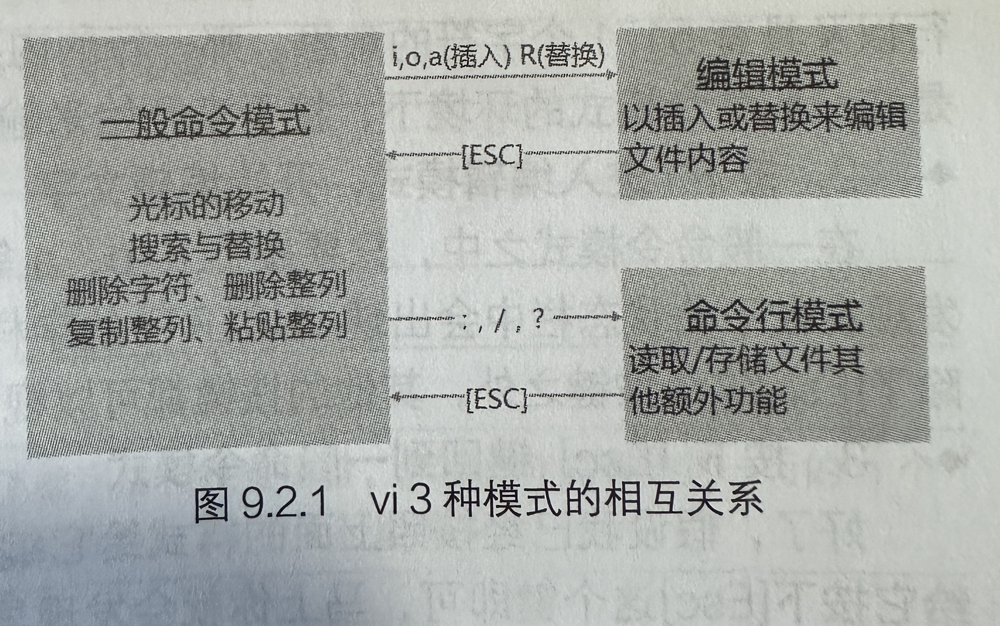

# VIM

## 1. 三种模式

  

一般命令模式可与编辑模式和命令行模式进行切换。但是编辑模式与命令行模式之间不能切换。

### 1.1 一般命令模式

解释：用vi打开一个文件时，默认就是进入一般命令模式。

### 1.2 编辑模式

解释：按`i I o O a A r R`其中的一个即可进入，此时可以对文本进行编辑。

### 1.3 命令行模式

解释：按`: / ?`其中的一个即可进入。可以在此模式下进行查找替换等操作。

## 2. 命令

### 2.1 移动光标

| 命令     | 功能                                  |
| -------- | ------------------------------------- |
| 0        | 这是数字0，移动到这一行的最前面字符处 |
| $        | 移动到这一行的最后面字符处            |
| nG       | 20G代表移动到文件的第20行             |
| gg       | 移动到文件的第一行                    |
| G        | 移动到文件的最后一行                  |
| n<enter> | 4<enter>代表光标向下移动4行           |

### 2.2 查找替换

| 命令                  | 功能                                                         |
| --------------------- | ------------------------------------------------------------ |
| /word                 | 比如：/niu，表示查找niu。向下查找                            |
| ?word                 | 比如：?niu，表示查找niu。向上查找                            |
| n                     | 用于【重复前一个查找的操作】，比如输入/niu<enter>之后，然后按下n会继续查找下一个和niu匹配的字符 |
| N                     | 和n相反，会向上查找下一个匹配的字符                          |
| :s/word1/word2/g      | 替换当前行中的文字                                           |
| :%s/word1/word2/g     | 替换所有行中的文字                                           |
| :n1,n2s/word1/word2/g | 比如：100,200s/hello/byebye/g，表示将100～200行的hello替换   |
| :1,$s/word1/word2/g   | 替换从第一行到最后一行范围用word2替换word1                   |
| :1,$s/word1/word2/gc  | 替换从第一行到最后一行范围用word2替换word1，待用户确认       |
| :noh                  | 取消查找之后的高亮                                           |

### 2.3 删除、复制和粘贴

| 命令           | 功能                                 |
| -------------- | ------------------------------------ |
| ggvG之后输入yy | 复制文件所有内容                     |
| ggdG           | 删除文件所有内容                     |
| x（小写）      | 删除光标处的一个字符                 |
| X（大写）      | 删除光标前的一个字符                 |
| nx             | 删除光标处的n个字符                  |
| dd             | 删除光标处的一行                     |
| ndd            | 删除光标处的n行                      |
| d1G            | 删除光标所在到第一行的所有数据       |
| dG             | 删除光标所在到最后一行的所有数据     |
| d0             | 删除光标所在处，到该行的第一个字符   |
| d$             | 删除光标所在处，到该行的最后一个字符 |
| yy             | 复制光标所在的那一行                 |
| nyy            | 从光标处开始，复制n行                |
| y1G            | 复制光标处到第一行的所有数据         |
| yG             | 复制光标处到最后一行的所有数据       |
| y0             | 复制光标所在处，到该行的第一个字符   |
| y$             | 复制光标所在处，到该行的最后一个字符 |
| p（小写）      | 将已复制的数据粘贴到光标的下一行     |
| P（大写）      | 将已复制的数据粘贴到光标的上一行     |
| J              | 将光标所在行和下一行合并为一行       |
| u（小写）      | 恢复前一个操作                       |
| [control] + r  | 重做前一个操作（和u相反）            |

### 2.4 进入插入或替换的编辑模式

| 命令         | 功能                                                       |
| ------------ | ---------------------------------------------------------- |
| i（小写）    | 进入插入模式，【从光标处编辑】                             |
| I（大写的i） | 进入插入模式，【从目前所在行的第一个非空格符处开始插入】   |
| a            | 进入插入模式，【从目前光标所在处的下一个字符处开始插入】   |
| A            | 进入插入模式，【从目前光标所在处的最后一个字符处开始插入】 |
| o（小写）    | 进入插入模式，【在目前光标的下一行插入】                   |
| O（大写）    | 进入插入模式，【在目前光标的上一行插入】                   |
| Esc          | 退出编辑模式，回到一般命令模式                             |

### 2.5 命令行模式的保存、退出等命令

| 命令          | 功能                                                         |
| ------------- | ------------------------------------------------------------ |
| :w            | 将编辑的数据写入硬盘文件中                                   |
| :q            | 退出vi                                                       |
| :wq           | 保存然后退出                                                 |
| ZZ            | 大写的Z，若文件没有修改，则不保存退出；若文件被修改过，则保存后退出 |
| :w [filename] | 将编辑的数据保存成另一个文件（类似另存为）                   |
| :! [command]  | 暂时退出vi到命令行模式下执行command的显示结果。比如【:! ls】退回到终端输出结果，但是没有退出vi |

### 2.6 可视区块

| 命令          | 功能                                                 |
| ------------- | ---------------------------------------------------- |
| v（小写）     | 字符选择，会将光标经过的地方反白选择                 |
| V（大写）     | 行选择，会将光标经过的地方进行反白选择               |
| [control] + v | 可视区块，可以用矩形的方式选择数据（个人觉得不好用） |
| y             | 将反白的地方复制起来                                 |
| d             | 将反白的地方删除                                     |
| p             | 把刚刚复制的区块，在光标处粘贴                       |

## 3. PowerVIM

安装教程：

[Ubuntu20.04安装VIM.md](https://github.com/niu0217/Documents/blob/main/SoftwareInstall/Ubuntu20.04安装VIM.md)

使用：

```
正常模式下的快捷键（非插入模式）
;n              // 打开文件目录树显示在屏幕左侧
;m              // 打开当前函数和变量目录树显示在屏幕右侧
;h              // 光标移动到左窗口 
;l              // 光标移动到右窗口
;k              // 光标移动到上窗口
;j              // 光标移动到下窗口 以上四个快捷键特别是打开多个窗口情况下。使用这个快捷键组合非常实用
;w              // 保存文件
;u              // 向上翻半屏
;d              // 向下翻半屏
;1              // 光标快速移动到行首
;2              // 光标快速移动到行末
;a              // 快速切换.h和cpp文件，写C++的时候很方便
;e              // 打开一个新文件
;z              // 切回shell交互命令，输入fg在切回vim，非常实用
;s              // 水平分屏，并打开文件目录选取想打开的文件，如果想新建文件，;e 就好 
;v              // 竖直分屏，并打开文件目录选取想打开的文件，如果想新建文件，;e 就好 
;fw             // 查找项目内关键字，前提是你的系统已经按照了ACK 
;ff             // 查找项目内文件名 
;gt             // 跳转到变量或者函数定义的地方，前提是安装ctags，并且在在PowerVim输入 ;tg命令 Jump to the definition of the keyword where the cursor is located, but make sure you have make ctags
;gr             // 跳回，对应着;gt
;tg             // 对当前目录打ctag 
;y              // 保存当前选中的目录到系统剪切板，前提是vim支持系统剪切板的寄存器
;gg             // 按顺序光标跳转各个窗口

// 一下快捷键是不用;的，直接在 非插入模式 下输入
e               // 快速删除光标所在的词 
tabc            // 关闭当前tab，可以用:tabnew来打开一个新的tab Close tab, of course you should :tabnew a file first. 
F1              // 编译并运行C++文件，自己写的C++例子的时候一键编译。前提手动在当前目录建一个bin文件夹，这是用来存放编译产生的执行文件 
F1              // 编译Java文件
F2              // 运行Java编译的class文件，一般如果要编译并运行Java文件 按F1编译，在按F2运行
gc              // 快速注释选中的块（是visual模式下选中的块） 
gcc             // 快速当前行
{               // 光标向上移动一个代码块
}               // 光标向下移动一个代码块
di(             // 删除括号里的内容
di{             // 删除花括号里的内容
```

