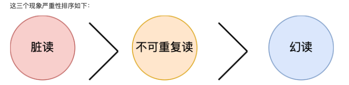
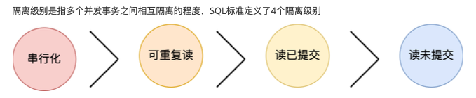
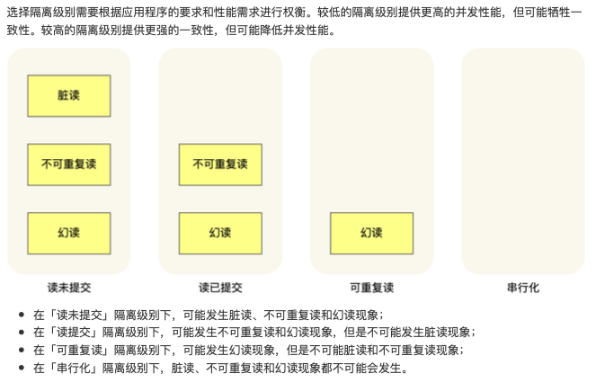
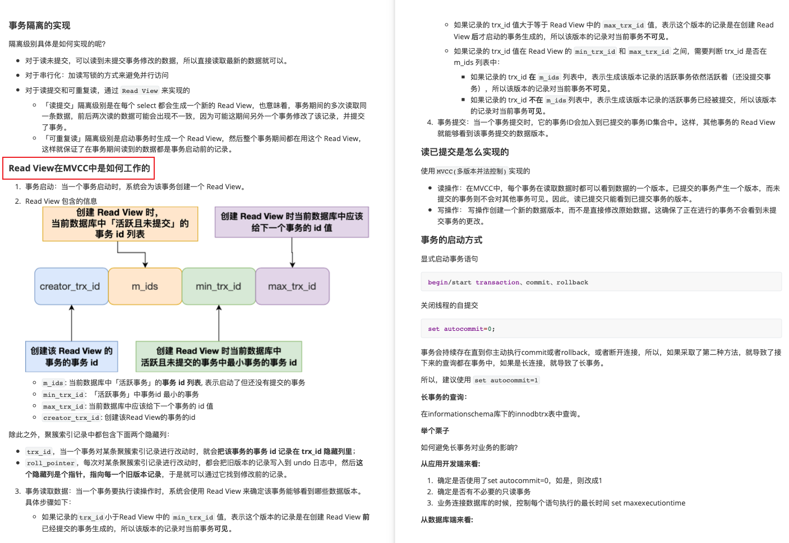

# 事务

MySQL原生引擎MyISAM不支持事务，所以被InnoDB取代。

## 1. 事务的四大特性ACID

ACID（Atomicity, Consistency, Isolation, Durability）

原子性、一致性、隔离性、持久性。

+ 原子性
  + 事务是一个不可分割的工作单元，要么完全执行，要么完全不执行。如果在事务执行的过程中发生了错误，系统会撤销事务中已经执行的操作，将数据库恢复到事务开始前的状态。原子性通过`undo log`（回滚日志）来保证的。
+ 一致性
  + 确保事务将数据库从一个一致的状态转变为另一个一致的状态。事务执行的结果必须满足数据库的完整性约束和规则，保持数据库的一致性。一致性则是通过持久性+原子性+隔离性来保证的。
+ 隔离性
  + 多个事务并发执行时，每个事务都不能看到其他事务的中间状态。每个事务都应该感觉就像它是唯一在数据库上运行的事务一样。防止了多个事务之间的相互干扰。隔离性是通过MVCC（多版本并发控制）或锁机制来保证的。
+ 持久性
  + 一旦事务被提交，其结果将永久保存在数据库中，即使系统发生故障。即使系统发生崩溃，事务的结果也不应该丢失，持久性是通过`redo log`（重做日志）来保证的。

## 2. 并行事务会出现什么问题

1. 脏读：读到其他事务未提交的数据

一个事务读取了另一个事务未提交的数据，如果另一个事务后来回滚，读取的数据就是无效的。读到了不一定最终存在的数据，这就是脏读。

2. 不可重复读：前后读取的数据不一致

在一个事务内，同一查询可能返回不同的结果，因为在事务执行期间其他事务可能修改了数据。

3. 幻读：前后读取的记录数量不一致

在一个事务内多次查询符合查询条件的【记录数量】，如果出现前后两次查询到的记录数量不一致的情况，就意味着发生了【幻读】现象。

 

## 3. 隔离级别

 

1. 读未提交

最低等级的隔离级别。在这个级别下，一个事务可以读取到另一个事务未提交的数据。这可能导致脏读和不可重复读、幻读等问题。

2. 读已提交

在这个级别下，一个事务只能读到已经提交的其他事务的数据。这解决了脏读的问题，但是仍可能遇到不可重复读的问题。

3. 可重复读

在这个级别下，一个事务在其生命周期内多次执行相同的查询，将始终看到相同的数据，但是，仍可能发生幻读。也是MySQL InnoDB引擎的默认隔离等级。

4. 可串行化

提供了最高的隔离级别。会对记录加上读写锁，在多个事务对这条记录进行读写操作时，如果发生了读写冲突的时候，后访问的事务必须等到前一个事务执行完成，才能继续执行，在这个级别下，事务的执行效果就好像它们是按顺序执行的，事务之间没有并发。这可以防止脏读、不可重复读、幻读，但也可能导致性能下降，因为并发性降低。

 

## 4. 幻读是如何解决的

MySQL InnoDB引擎的默认隔离等级虽然是【可重复读】，但是它很大程度上可以避免幻读现象。

+ 针对快照读（普通select语句），是通过MVCC方式解决了幻读。
+ 针对当前读：（select ... for update 等语句），是通过next-key lock（记录锁+间隙锁）方式解决了幻读。因为当执行select ... for update 等语句的时候，会加上next-key lock（记录锁+间隙锁）。

## 5. 事务隔离的实现

+ 对于读未提交，可以读到未提交事务修改的数据，所以直接读取最新的数据就可以。
+ 对于串行化：加读写锁的方式避免并行访问。
+ 对于读提交和可重复读，通过`Read View`来实现
  + 【读提交】隔离级别是在每个select都会生成一个新的Read View，也意味着，事务期间的多次读取同一条数据，前后两次读的数据可能会出现不一致，因为可能这期间另外一个事务修改了该数据，并提交了事务。
  + 【可重复读】隔离级别是在启动事务时生成了一个Read View，然后整个事务都在用这个Read View，这样就保证了在事务期间读到的数据都是事务启动前的记录。

Read View在MVCC中是如何工作的：

 

 

