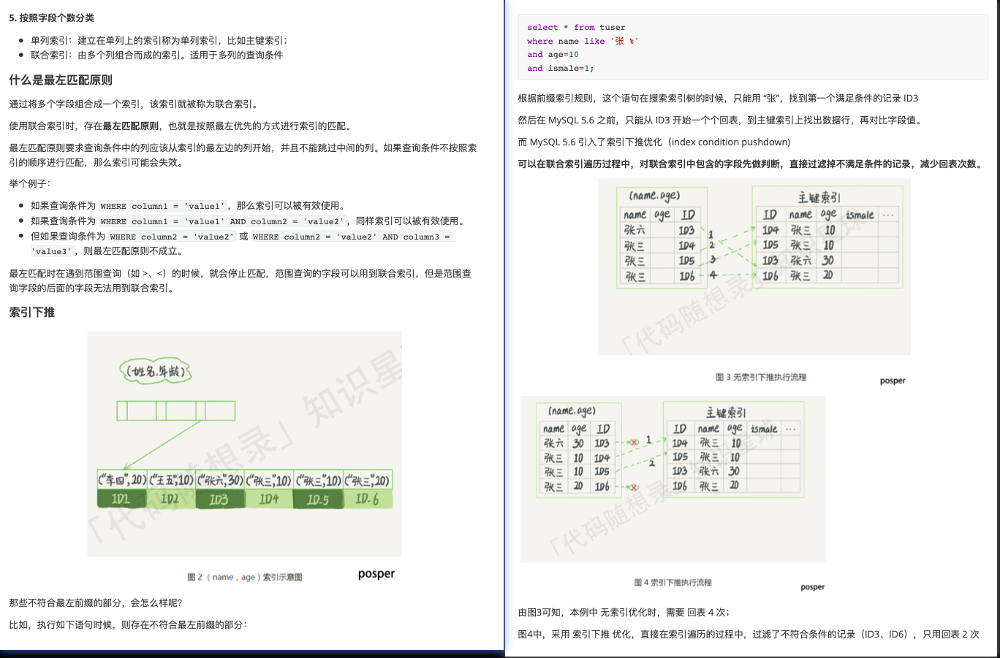

# 索引

## 1. 什么是索引

索引的出现就是为了提高数据查询的效率，就像书的目录一样。

MySQL在查询方面主要就是两种方式：

+ 全表扫描（一个一个挨个找）
+ 根据索引检索

## 2. 索引操作

创建索引：

```mysql
create index 索引名 on 表名（列名）;
# 也可以有多个列名构成索引（即：组合索引）
```

删除索引：

```mysql
drop index 索引名 on 表名;
```

## 3. 如何查看一个SQL语句是否使用了索引进行检索

在SQL语句前，添加`explian`关键字

+ `type=ALL`表示使用全表查询（未使用索引）
+ `type=RES`表示使用索引

## 4. 索引的类别

+ 按数据结构分类：
  + `B+tree`索引
  + `Hash`索引
  + `Full-text`索引
+ 按物理存储分类：
  + 聚簇索引（主键索引）
  + 二级索引（辅助索引）
+ 按字段特性分类：
  + 主键索引
  + 唯一索引
  + 普通索引
  + 前缀索引
+ 按字段个数分类：
  + 单列索引
  + 联合索引

### 4.1 按数据结构分类

+ 哈希表：使用key-value对，存储数据，可能存在hash冲突（多个value对应同一个key）
  + 优点：key无序，插入数据时无需维护顺序（直接在最后一个元素后追加即可），效率较高；
  + 缺点：因为不是有序的，所以哈希索引做区间查询的速度是很慢的；
  + 适合场景：适用于只有等值查询的场景，而不适合频繁区间查找；
+ 有序数组：
  + 优点：等值查询和区间查询性能都很6（有序数组适合查询）；
  + 缺点：有序数组不适合频繁的增/删记录的场景（但是有序数组不适合增/删）；
  + 等值查询使用二分（前提是有序+顺序存储），查询时间复杂度O（log N）；
  + 区间查询先用二分查找“左边界”（不存在时，则查找第一个比他大的记录），然后，在向右扫描，直到大于右边界；
  + 适合场景：有序数组只适合静态存储引擎，在等值查询和范围查询场景中的性能非常优秀。
+ 二叉搜索树：
  + BST是为了保留有序数组查询（二分 O（log N））性能好的优点，同时解决有序数组不适合增/删的缺点；
  + BST查询的时间复杂度（O（log N）），但是为了维护O（log N）的查询复杂度，需要保持这颗树是平衡二叉树（维护BST是AVL的时间复杂度也是O（log N））；
  + 二叉搜索树搜索效率最高，但是实际上大多数的数据库存储却不是二叉树，其原因是：索引不止存在于内存中，还要写到磁盘上；
+ N叉树：
  + 引入
    + 想象一颗100万节点的平衡二叉树，树高20。一次查询需要访问20个数据块。在机械硬盘时代，从磁盘随机读一个数据块需要10ms左右的寻址时间。也就是说，对于一个100万行的表，如果使用二叉树来存储，单独访问一个行可能需要20个10ms的时间，这个结果不能让人接受。
    + 为了让一个查询尽可能少的读取磁盘，就必须让查询过程访问尽可能少的数据块。那么就不应该使用二叉树，而是要使用N叉树。这里N叉树的N取决于数据块的大小。
    + 以InnoDB的一个整数字段索引为例子，这个N差不多是1200。这颗树高是4的时候，就可以存1200的3次方个值，这已经是17亿了。考虑到树根的数据块总是存在内存中的，一个10亿行的表上一个整数字段的索引，查找一个值最多只需要访问3次磁盘。其实，树的第二层也有很大概率在内存中，这样访问磁盘的平均次数就更少了。
  + 小结：
    + 为了让一个查询尽可能少的读取磁盘，就必须让查询过程访问尽可能少的数据块。
    + 那么我们就不应该使用二叉树，而是要使用N叉树（N取决于数据块的大小）。
    + 通过使用N叉树来降低树的高度，即减少读取磁盘的次数（IO是非常非常慢的），提高查找效率。
  + 折中考虑了查询性能和读取磁盘的次数，广泛应用于数据库引擎中，MySQL中，索引是在存储引擎中实现的，而且不同存储引擎的索引的工作方式并不一样。而即使多个存储引擎支持同一类型的索引，其底层的实现也可能不同。
  + InnoDB的索引模型
    + InnoDB使用了B+树索引模型，每一个索引在InnoDB中对应一颗B+树

```mysql
create table T
(
	id int primary key, # 主键 自动创建索引
	k int not null,
	name varchar(16),
	index(k)
) # 给字段k条件 索引

engine=InnoDB;
```

 

### 4.2 按存储分类

根据叶子节点的内容，索引类型分为主键索引（聚簇索引）和二级索引（辅助索引）：

+ 主键索引的B+树的叶子节点存放的是实际数据，所有完整的用户记录都存放在主键索引的B+树的叶子节点中；
+ 二级索引的B+树的叶子节点存放的是主键值，而不是实际数据；

主键查询和二级索引查询：

+ 主键查询；直接在主键索引所在的B+树中查询，然后直接返回查询到的叶子节点（此时，叶子节点里面就是整行数据）。
+ 二级索引查询：首先，在普通索引所在的B+树中，查询到待查询记录的主键；然后再根据这些查到的主键进行“主键查询”（即：回表）。

基于非主键索引的查询需要多扫描一颗索引树。因此，我们在应用中应该尽量使用主键查询。

不过当查询的数据是能在二级索引的B+树的叶子节点中查询到，这时就不用查主键索引查，这种在二级索引的B+树就能查询到结果的过程就叫做【覆盖索引】。

### 4.3 按照字段特性分类

+ 主键索引：建立在主键字段上的索引，一张表最多只能有一个主键索引，不允许有空值；
+ 唯一索引：建立在`UNIQUE`字段上的索引，一张表可以有多个唯一索引，索引列的值必须唯一，但是允许有空值。
+ 普通索引：建立在普通字段上的索引。
+ 前缀索引：对字符类型字段的前几个字符建立的索引，而不是在整个字段上建立的索引，可以减小索引的大小，适用于较长列值的情况。

### 4.4 按字段个数分类

+ 单列索引：建立在单列上的索引称为单列索引，比如主键索引。
+ 联合索引：由多个列组合而成的索引。适用于多列的查询条件。

 

## 5. 问题

### 5.1 什么是索引区分度

索引区分度表示某个字段不同值的个数占整个表的比例，建立联合索引时，要把区分度大的字段排在前面。

### 5.2 建立索引的注意事项

+ 索引不是越多越好，虽然索引会提高select效率，但是也降低了insert和update的效率
+ 数据量小的表不需要建立索引，会增加额外的索引开销
+ 不经常使用的列不要建立索引
+ 频繁更新的列不要建立索引，会影响更新的效率

### 5.3 索引的优缺点

优点：

+ 使用索引可以大大加快数据的检索速度（大大减少检索的数据量），这也是创建索引的最主要原因。
+ 使用索引不一定能够提高查询性能，因为如果数据库的数量不大，那么使用索引也不定能够带来很大提升。其余大多数情况下，索引查询比全表扫描快。
+ 通过创建唯一性索引，可以保证数据库表中每一行数据的唯一性。

缺点：

+ 空间消耗，一个索引对应的就是一颗B+树，每一个节点都是一个16KB大小的页。占用的空间较大。
+ 创建索引和维护索引需要耗费许多时间，当对表中的数据进行增删改的时候，如果数据有索引，则索引也需要动态的修改，会降低SQL执行效率

### 5.4 什么时候需要创建索引

+ 频繁用于查询的列需要创建索引
+ 大表：对于很大的表，建立索引可以提高查询速度
+ 唯一性要求：主键列和唯一性约束的类会自动创建唯一索引，但如果查询中经常包含唯一性条件，可以额外创建唯一性索引
+ 连接表的外键列：为外键列创建索引可以提高连接的效率
+ 频繁使用排序和分组的列：如果某列经常用于ORDER BY或GROUP BY子句可以创建索引

### 5.5 什么时候不需要创建索引

+ 小表：在小表上，索引不会带来显著的性能提升，还会增加维护开销
+ 经常进行更新的字段不需要创建索引
+ 很少用于查询的字段
+ 字段中存在大量重复数据，不需要创建索引，比如性别字段

### 5.6 索引优化的方法

+ 前缀索引优化：使用某个字段中字符串的前几个字符创建索引，从而减小索引字段的大小
+ 覆盖索引优化：从二级索引可以查询到记录，避免回表
+ 主键索引最好是自增的：这样每次插入一条新记录，都是追加操作，不需要重新移动数据，而使用非自增主键会导致插入主键的索引值是随机的，这可能会插入到现有的数据页的某个位置，导致其他数据的移动，造成页分裂
+ 避免过多的索引

### 5.7 索引什么时候会失效

+ 使用左或者左右模糊匹配：比如`LIKE '%abc'`这样的查询会导致索引失效
+ 在索引列上使用函数或表达式：索引列上参与计算，索引失效

```mysql
SELECT * FROM table WHERE UPPER(column) = 'VALUE'
```

+ 在WHERE子句中，如果OR前的条件列是索引列，而在OR后的条件列不是索引列，那么索引会失效
+ 违背最左匹配原则，索引失效
+ 数据分布不均匀：如果数据分布不均匀，例如某个索引列的大多数数值相同，选择性降低，导致索引失效
+ 隐式类型转换：如果查询中的条件涉及到隐式类型转换，例如将字符串和数字比较，索引可能无法被使用

### 5.8 为什么使用B+树索引

+ B+树的非叶子节点不存放实际的记录数据，仅存放索引。所以数据量相同的情况下，相比存储既存索引又存记录的B树，B+树的非叶子节点可以存放更多的索引，因此B+树可以比B树更加【矮胖】。查询底层节点的磁盘I/O次数会更少。
+ B+树有【大量的冗余节点】（所有非叶子节点都是冗余索引），这些冗余索引让B+树在插入、删除的效率都更加好，比如删除根结点的时候，不会像B树那样会发生复杂的树的变化。
+ B+树叶子节点间用链表连接了起来，有利于范围查询，而B树要是想范围查询，只能通过树的遍历来完成范围查询，这回涉及多个节点的磁盘I/O操作，【范围查询效率不如B+树】。
