# 套接字接口

## 非常非常重要！

套接字接口是一组函数，它们和Unix I/O函数结合起来，用以创建网络应用。大多数现代系统上都实现了套接字接口，包括所有的Unix变种、Windows和Macintosh系统。

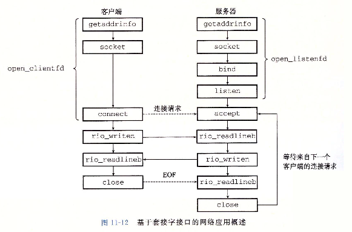 

## 1. 套接字地址结构

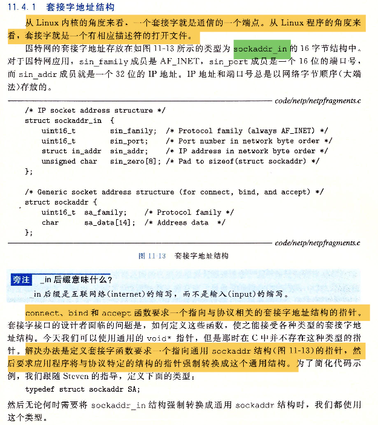 

## 2. socket函数

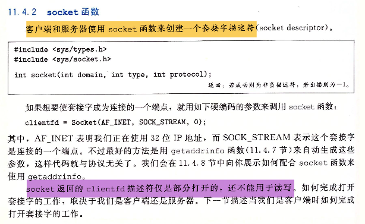 

## 3. connect函数

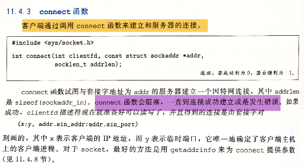 

## 4. bind函数

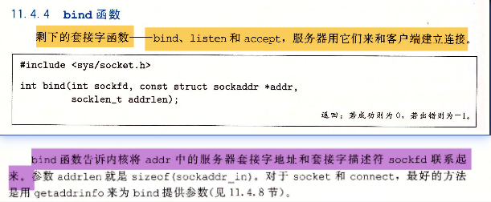 

## 5. listen函数

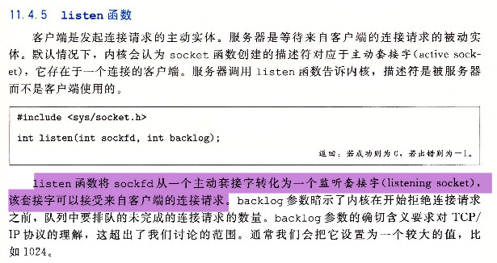 

## 6. accept函数

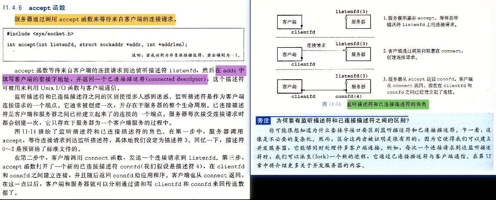 

## 7. 主机和服务的转换

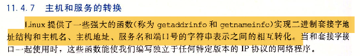 

### 7.1 getaddrinfo

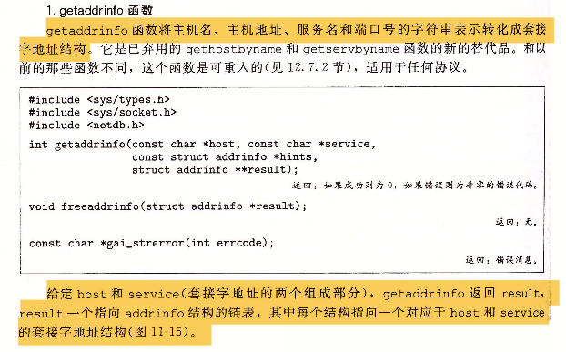 

 

### 7.2 getnameinfo

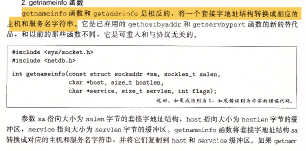 

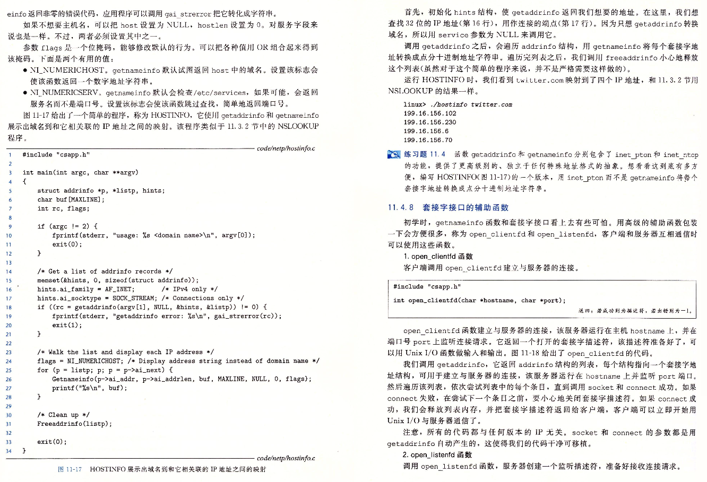 

### 7.3 示例程序

需要的文件：

+ [csapp.c](https://github.com/niu0217/Documents/blob/main/NetworkProgramming/base/code/csapp.c)

+ [csapp.h](https://github.com/niu0217/Documents/blob/main/NetworkProgramming/base/code/csapp.h)

+ [hostinfo.c](https://github.com/niu0217/Documents/blob/main/NetworkProgramming/base/code/hostinfo.c)

编译：

```bash
gcc -g -o hostinfo hostinfo.c csapp.c -lpthread
```

运行：

```bash
ubuntu@niu0217:~/GithubFile/Documents/NetWorkProgramming$ ./hostinfo twitter.com
104.244.42.65
104.244.42.1
104.244.42.129
104.244.42.193
```


